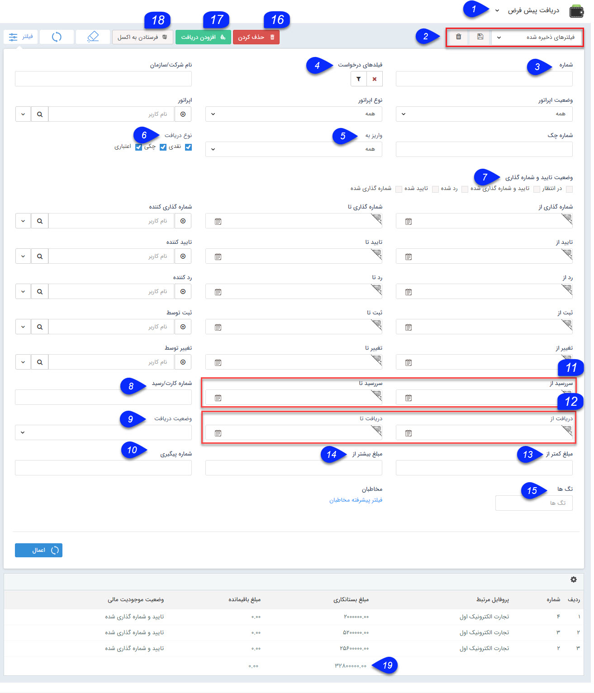

# دریافت/پرداخت    

**دریافت/پرداخت**

لیست تمام دریافت/پرداخت های ثبت شده در سیستم نمایش داده می شود و می توان اطلاعات جزئی هر کدام از دریافت ها را نیز مشاهده نمود.

نکته: هر کاربر می تواند تنها سوابقی (دریافت/پرداخت) که خود ثبت نموده است مشاهده نماید و تنها کاربر دارای مجوز "مشاهده لیست" مربوط به هر آیتم می تواند کلیه سوابق (دریافت/پرداخت) ثبت شده توسط سایر کاربران سیستم را مشاهده نماید.

  

نکته: لطفا ابتدا قسمت  [فیلترهای پیشرفته](../PayamGostarSyncBank/JobsForFirst/Background/AdvancedFilters.md) را مطالعه کنید.  

1\. **زیرنوع آیتم:** زیرنوع های دریافت/پرداخت از این قسمت قابل تغییر است.

2\. **نوع فیلتر:** میتوانید فیلترهای اعمال شده را به عنوان یک فیلتر اختصاصی خود ذخیره کنید.

3\. **شماره چک:** میتوانید شماره دریافت یا بخشی از شماره را وارد کنید.

4\. **فیلدهای دریافت:** می توانید با استفاده از دکمه فیلتر موجود در این فیلد، روی فیلدهای اضافه شده نیز فیلتر مورد نظر خود را اعمال کنید.

5\. **واریز به:** میتوانید نام یکی از حساب هایی که در قسمت [مدیریت حساب های مالی](../BaseInformatio/FinantialAccountingManagement.md) ایجاد کرده اید، را انتخاب کنید.

6\. **نوع دریافت:** می توانید نوع دریافت(های) مورد نظر را انتخاب کنید.

7\. **وضعیت تایید و شماره گذاری:** می توانید وضعیت تایید و شماره گذاری دریافت های مورد نظر خود را در این قسمت انتخاب کنید.

8\. **شماره کارت/رسید** : می توانید شماره کارت/رسید وارد شده در دریافت/پرداخت مورد نظر خود را در این قسمت وارد کنید.

9\. **وضعیت دریافت:** می توانید وضعیت دریافت (دریافت شده یا نشده) را تعیین کنید.

10\. **شماره پیگیری:** می توانید شماره پیگیری دریافت/پرداخت را درج کنید.

11\. **تاریخ سررسید:** می توانید در این قسمت یک حد پایین و یک حد بالا برای تاریخ سررسید دریافت های چکی و اعتباری تعیین کنید.

12\. **تاریخ دریافت:** می توانید در این قسمت یک حد پایین و یک حد بالا برای تاریخ دریافت وارد کنید.

13\. **مبلغ کمتر از:** می توانید یک سقف مبلغ برای دریافت/پرداخت های مورد نظر خود برای جستجو وارد کنید.

14\. **مبلغ بیشتر از:** می توانید یک کمینه مبلغ برای دریافت/پرداخت های مورد نظر خود برای جستجو وارد کنید.

15\. **تگ ها:** می توانید دریافت/پرداخت ها را بر اساس تگی که روی آن ها گذاشته اید جستجو کنید.

16\. **حذف کردن:** می توانید سابقه دریافت/پرداخت مورد نظر را حذف کنید.

17\. **افزودن دریافت/پرداخت:** می توانید یک سابقه دریافت/پرداخت جدید ثبت کنید.

18\. **فرستادن به اکسل:** می توانید سوابق فیلتر شده را در قالب فایل اکسل دریافت نمایید.

19\. **مجموع بستانکاری:** با استفاده از این دکمه می توانید مجموع مبالغ تمام دریافت های فیلتر شده را به سادگی محاسبه کنید.

نکته: همانطور که قابل ملاحظه است، امکان تعیین حد پایین یا بالا برای تاریخ های شماره گذاری، تایید و رد دریافت/پرداخت و همچنین تعیین کاربر شماره گذاری کننده، تایید کننده و رد کننده نیز وجود دارد.