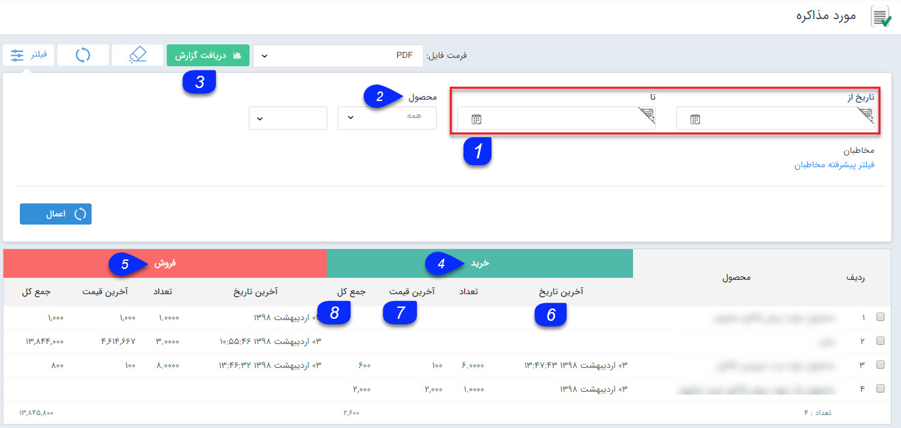

# مورد مذاکره    

**مورد مذاکره**

در این قسمت لیست تمامی کالاهایی که در پیش فاکتورها (خرید و فروش) هستند و احتمال فروش آنها هست را می توانید مشاهده کنید.

اقلام مورد مذاکره برای هر مخاطب در قسمت [معاملات](../../PayamGostarSyncBank/JobsForFirst/Transactions.md) سوابقش قابل مشاهده است.

1\. **فیلتر تاریخ:** با استفاده از این فیلتر می توانید گزارش میزان مذاکره محصولات را در بازه زمانی مورد نظر خود دراختیار داشته باشید.

2\. **فیلتر محصول:** می توانید یک گروه محصول یا یک محصول مشخص را از بین محصولات تعریف شده در قسمت مدیریت محصولات برای نمایش فیلتر کنید.

3. **دریافت گزارش:** پس از اعمال فیلترهای مورد نظر خود، می توانید با استفاده از این دکمه یک گزارش با فرمت فایل دلخواه خود دریافت نمایید.

4\. **خرید:** در این قسمت جزئیات اطلاعات مرتبط با مذاکره برای خرید این محصول (اطلاعات مرتبط با پیش فاکتورهای خرید) نمایش داده می شود.

5\. **فروش:** در این قسمت جزئیات اطلاعات مرتبط با مذاکره برای فروش این محصول (اطلاعات مرتبط با پیش فاکتورهای فروش) نمایش داده می شود.

6\. **آخرین تاریخ:** در این ستون، آخرین تاریخ مذاکره برای خرید/ فروش (تاریخ آخرین پیش فاکتور خرید/فروش که این محصول در آن درج شده است) نمایش داده می شود.

7\. **آخرین قیمت:** در این ستون آخرین قسمت ثبت شده برای هر محصول در پیش فاکتورهای خرید/فروش نمایش داده می شود.

8\. **جمع کل:** در این ستون جمع مبلغ مرتبط با هر محصول در تمامی پیش فاکتورهای ثبت شده نمایش داده می شود.