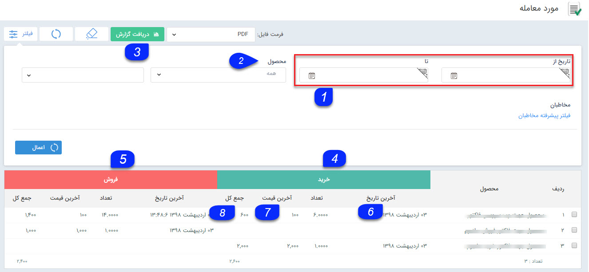

# مورد معامله    

**مورد معامله**

در این قسمت لیست تمامی کالاهایی که فروخته (ثبت شده در فاکتور فروش) و یا خریداری (ثبت شده در فاکتور خرید) شده اند را مشاهده میکنید و در صورت نیاز می توانید از آنها گزارش تهیه نمایید.

اقلام مورد معامله برای هر مخاطب در قسمت [معاملات](../../PayamGostarSyncBank/JobsForFirst/Transactions.md) پروفایلش قابل مشاهده است.

نکته: توجه داشته باشید محصولاتی که نام آن ها به صورت دستی در فاکتورها درج شده باشند و از بین محصولات تعریف شده در سیستم انتخاب نشوند، در این قسمت نمایش داده نمی شوند.

1\. **فیلتر تاریخ:** با استفاده از این فیلتر می توانید گزارش میزان فروش محصولات در بازه زمانی مورد نظر خود را دراختیار داشته باشید.

2. **فیلتر محصول:** می توانید یک گروه محصول یا یک محصول مشخص را از بین محصولات تعریف شده در قسمت مدیریت محصولات برای نمایش فیلتر کنید .

3\. **دریافت گزارش:** پس از اعمال فیلترهای مورد نظر خود، می توانید با استفاده از این دکمه یک گزارش با فرمت فایل دلخواه خود دریافت نمایید.

4\. **خرید:** در این قسمت جزئیات اطلاعات مرتبط با خرید این محصول (اطلاعات مرتبط با فاکتورهای خرید) نمایش داده می شود.

5\. **فروش:** در این قسمت جزئیات اطلاعات مرتبط با فروش این محصول (اطلاعات مرتبط با فاکتورهای فروش) نمایش داده می شود.

6\. **آخرین تاریخ:** در این ستون، آخرین تاریخ خرید/ فروش (تاریخ آخرین فاکتور خرید/فروش که این محصول در آن درج شده است) نمایش داده می شود.

7\. **آخرین قیمت:** در این ستون آخرین قسمت ثبت شده برای هر محصول در فاکتورهای خرید/فروش نمایش داده می شود.

8\. **جمع کل:** در این ستون جمع مبلغ خرید/فروش هر محصول در تمامی فاکتورهای ثبت شده نمایش داده می شود.