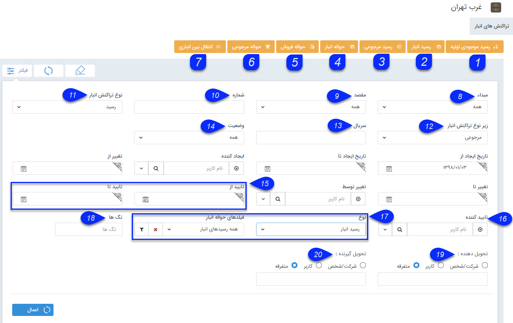

# انبار ها    

**انبارها**

در این قسمت مدیریت حواله ها و رسید های انبار را می توان انجام داد.

برای استفاده از انبارداری باید ابتدا محصولات در قسمت [مدیریت محصولات](../BaseInformatio/ProduceManagement.md) تعریف شده باشند و محصولات هر انبار در قسمت [مدیریت انبارها](../Setting/Warehousemanagement.md) به عنوان محصول مجاز تعیین گردند.

علاوه بر این برای تنظیم حواله ها و رسید های مرتبط با انبار می توانید از قسمت [مدیریت تراکنش های انبار](../Setting/Personalizing/Warehousedraftmanagement.md) اقدام کنید.

حواله: به معنی خروج کالا از انبار است.

رسید: به معنی ورود کالا به انبار است.

انواع تراکنش های انبار به شرح زیر می باشند:

1\. **رسید موجودی اولیه:** در هر انبار باید یکبار رسید موجودی اولیه صادر شود. این رسید موجودی سر شماری شده واقعی در انبار را به نرم افزار وارد می کند.

2\. **رسید انبار:** زمانی که کالا وارد انبار می شود، برای اضافه شدن آن به انبار از این رسید استفاده می شود.

3\. **رسید مرجوعی(رسید برگشت از فروش):** زمانی که کالا از انبار حواله شده (خارج شده است) و اکنون می خواهیم آن را دوباره به انبار بازگردانیم از این رسید استفاده می شود.

4\. **حواله انبار(حواله خروج):** زمانی که کالا به دلیلی غیر از فروش (مثلا به دلیل اسقاط شدن کالا، یا اینکه کالا قرار است هدیه شود) از انبار خارج می شود از این حواله استفاده می شود.

5\. **حواله فروش:** زمانی که برای کالا فاکتور فروش صادر شده است، برای تحویل آن به مشتری و کم شدن از موجودی انبار، از این حواله استفاده می شود.

6\. **حواله مرجوعی(حواله برگشت از فروش):** زمانی که کالا به انبار وارد شده (رسید شده است) و اکنون می خواهیم آن را از انبار خارج کنیم.

7\. **انجام انتقال:** زمانی که بخواهیم محصولاتی را از یک انبار به دیگری انتقال دهیم از این عملکرد استفاده می شود.

\_\_\_\_\_\_\_\_\_\_\_\_\_\_\_\_\_\_\_\_\_\_\_\_\_\_\_\_\_\_\_\_\_\_\_\_\_\_\_\_\_\_\_\_\_\_\_\_\_\_\_\_\_\_\_\_\_\_\_\_\_\_\_\_\_\_\_\_\_\_\_\_\_\_\_\_\_\_\_\_\_\_\_\_\_\_\_\_\_\_\_\_\_\_\_\_\_\_\_\_\_\_\_\_

نکته: ابتدا قسمت [فیلترهای پیشرفته](PayamGostarSyncBank\JobsForFirst\Background\AdvancedFilters.md) را مطالعه کنید.

8\. **مبداء:** از بین انبارهای تعریف شده، یک انبار را می توانید به عنوان انبار مبداء جهت نمایش تراکنش های مربوطه انتخاب کنید. این فیلتر برای تراکنش های از نوع انتقال بین انباری (تراکنش هایی که در آن انبار فعلی به عنوان انبار مقصد انتخاب شده است) کاربرد دارد.

9\. **مقصد:** از بین انبارهای تعریف شده، یک انبار را می توانید به عنوان انبار مقصد جهت نمایش تراکنش های مربوطه انتخاب کنید. این فیلتر برای تراکنش های از نوع انتقال بین انباری (تراکنش هایی که در آن انبار فعلی به عنوان انبار مبداء انتخاب شده است) کاربرد دارد.

10\. **شماره:** شماره یا بخشی از شماره تراکنش(های) انبار مورد نظر خود را وارد کنید.

11\. **نوع تراکنش انبار: **تراکنش های انبار به سه نوع رسید موجودی اولیه، رسید انبار و حواله انبار تقسیم می شوند. نوع تراکنش مورد نظر خود را مشخص کنید.

12. **زیر****نوع تراکنش انبار:** پس از انتخاب نوع تراکنش انبار در مرحله قبل، می توانید زیرنوع تراکنش مورد نظر خود را نیز انتخاب کنید.(رسید انبار سه زیر نوع و حواله انبار چهار زیرنوع دارد)

13\. **سریال:** سریال یا بخشی از سریال تراکنش(های) انبار مورد نظر خود را وارد کنید.

14\. **وضعیت:** وضعیت تایید، رد و قیمت گذاری تراکنش(های)انبار مورد نظر خود را مشخص کنید.

15\. **بازه تایید:** می توانید یک حد پایین و بالا برای تاریخ تایید تراکنش های انبار مورد نظر خود تعیین کنید.

16\. **تاییدکننده:** می توانید کاربر تایید کننده تراکنش های انبار مورد نظر خود را مشخص کنید.

17\. **فیلدهای تراکنش انبار:** در این قسمت می توانید یکی از زیرنوع های تراکنش انبار تعریف شده در شخصی سازی را فیلتر کنید. همچنین می توانید با استفاده از دکمه فیلتر موجود در این فیلد، پس از انتخاب یکی از زیرنوع های تراکنش انبار، روی فیلدهای اضافه شده به آن نیز فیلتر مورد نظر خود را اعمال کنید.

18\. **تگ ها:** می توانید آیتم ها را بر اساس تگ های درج شده روی آن ها جستجو کنید.

19\. **تحویل دهنده:** تحویل دهنده تراکنش انبار مورد نظر خود که می تواند یک کاربر، یک هویت از بانک اطلاعاتی یا یک شخص/شرکت متفرقه باشد را مشخص کنید.

20\. **تحویل گیرنده:** تحویل گیرنده تراکنش انبار مورد نظر خود که می تواند یک کاربر، یک هویت از بانک اطلاعاتی یا یک شخص/شرکت متفرقه باشد را مشخص کنید.