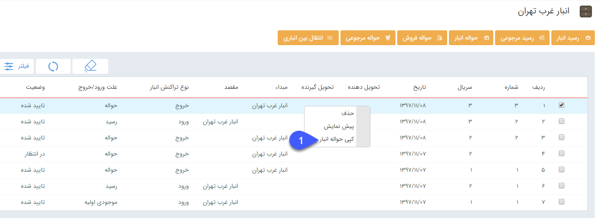

# ثبت حواله/رسید    

**ثبت حواله/رسید**

هر حواله یا رسید ابتدا ذخیره می شود، سپس باید به تایید رسیده و بعد از آن باید قیمت گذاری روی آن انجام شود. می توانید در رسید یا حواله های ثبت شده، سریال اقلام کالا را نیز وارد کنید.

[اطلاعات مشترک ثبت رسید/حواله](InventoryTransactions/Transactioncommon.md) 

[مدیریت اقلام کالا](InventoryTransactions/StockSerial.md)

\_\_\_\_\_\_\_\_\_\_\_\_\_\_\_\_\_\_\_\_\_\_\_\_\_\_\_\_\_\_\_\_\_\_\_\_\_\_\_\_\_\_\_\_\_\_\_\_\_\_\_\_\_\_\_\_\_\_\_\_\_\_\_\_\_\_\_\_\_\_\_\_\_\_\_\_\_\_\_\_\_\_\_\_\_\_\_\_\_\_\_\_\_\_\_\_\_\_

**قابلیت صدور حواله/رسید از روی اسناد دیگر**

برای جلوگیری از ثبت حواله یا رسید با محصولات تکراری، امکان صدور حواله یا رسید جدیدی از روی حواله یا رسیدی که قبلا ثبت شده وجود دارد. در این حالت تمامی محصولات از سند مبدا به سند مقصد انتقال می یابند.

عملکرد به این صورت می باشد که روی حواله یا رسید مورد نظر راست کلیک کرده و سند انبار را کپی می کنیم.

 

  

1. **کپی گرفتن از سند انبار:** با راست کلیک روی سند انبار، حواله یا رسید جدیدی از همان نوع برای کاربر باز می شود که شامل ردیف محصولات مبدا می باشد.

2. **زیر نوع سند انبار:** نوع رسید و حواله مقصد طبق سند مبدا مشخص می شود.

**3\. شماره سند انبار:**   شماره رسید و حواله باید توسط کاربر مشخص شود.

نکته:رسید یا حواله مقصد هیچ وابستگی ای به رسید و یا حواله مبدا ندارد و کاربر فقط روی رسید و حواله هایی که مجوز صدور آنها را دارد می تواند از این روش استفاده کند.