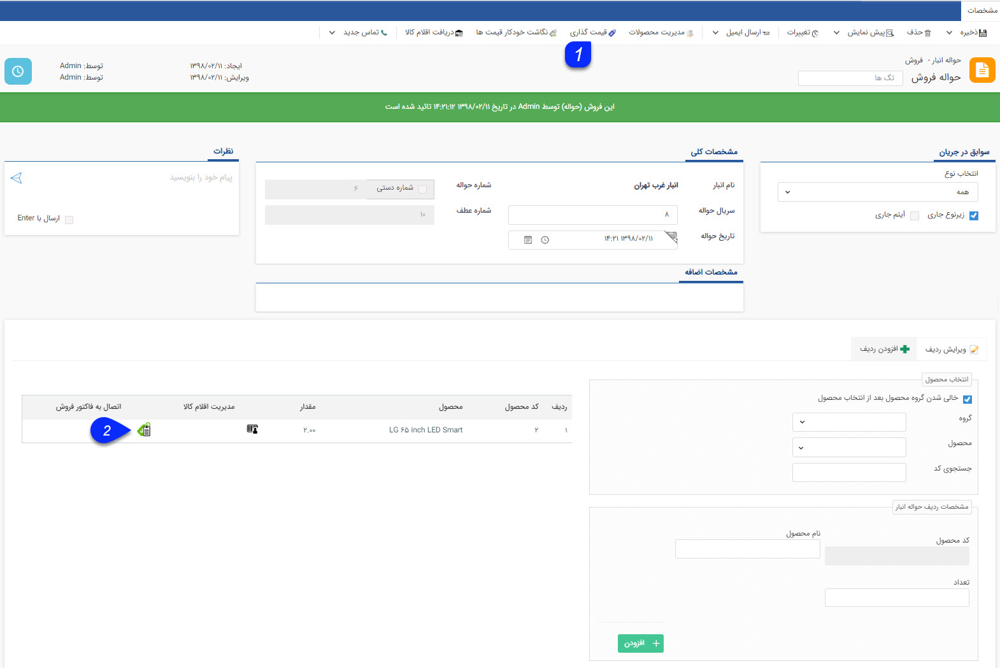
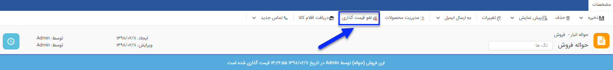
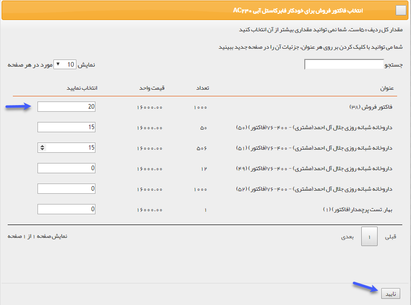

# قیمت گذاری و اتصال حواله فروش    

**قیمت گذاری و اتصال حواله فروش**

برای خارج کردن کالایی که فروش رفته از این نوع حواله استفاده می شود.

**قیمت گذاری:** از روی میانگین قیمت رسیدهایی که تا کنون ثبت شده است (رسیدهای شامل محصولات این حواله) محاسبه می شود.

به طور مثال اگر خودکار فابرکاستل آبی از طریق 2 رسید انبار وارد شده باشد و در یک رسید 5 خودکار با قیمت 10000 ریال وارد شده باشد و در رسید دوم 15 خودکار با قیمت 20000 ریال وارد شده باشد، فی میانگین به صورت زیر محاسبه خواهد شد:

فی میانگین = (5\*10000+ 15\*20000)/20= 17500  

**اتصال:** از آنجایی که حواله فروش در صورت خارج کردن محصولات به فروش رفته از انبار استفاده می شود، می توان مشخص کرد که هرکدام از محصولات حواله مرتبط با کدام فاکتور فروش می باشد. این اتصال در [گزارشات افتراق](../../../ManagementAndReports/SalesReport/DifferentReports.md) نرم افزار تاثیر گذار است. 

1\. **دکمه قیمت گذاری:** پس از قیمت گذاری برای تمام ردیف های کالا، با کلیک بر روی این علامت قیمت گذاری روی حواله انجام میشود.

پس از انجام قیمت گذاری، می توانید با استفاده از دکمه لغو قیمت گذاری، تراکنش را به حالت قیمت گذاری نشده برگردانید.

2\. **اتصال به فاکتور فروش:** می توانید تعیین کنید که کالاهای این حواله فروش مرتبط با کدام فاکتورهای فروش می شود.

نکته: یک حواله می تواند برای چند فاکتور مختلف باشد.

 

ابتدا مشخص کنید که چه تعداد از کالا مرتبط با کدام فاکتور فروش می باشد و در انتها روی دکمه تایید کلیک کنید.