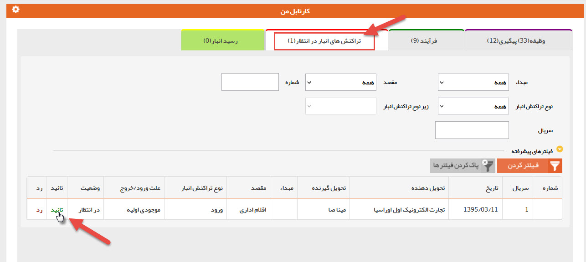

# تایید حواله/رسید    

**تایید حواله/رسید**

هر حواله یا رسید اگر نیاز به تایید داشته باشد، به کارتابل کاربری که مجوز تایید آن به او داده شده ارجاع می شود و منتظر تایید کاربر قرار می گیرد .

با کلیک بر روی تایید و یا رد وضعیت حواله/رسید را مشخص کنید.

 