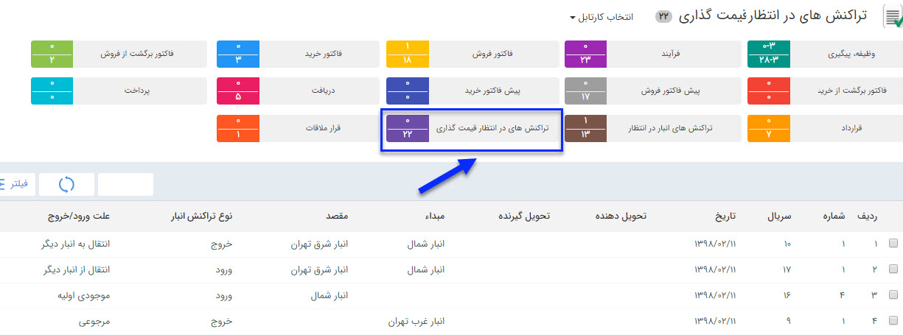

# قیمت گذاری و اتصال    

**قیمت گذاری**

تمامی حواله ها و رسید ها پس از تایید به  [کارتابل](../../CRM/CourseOfPresentation.md) کاربر یا کاربرانی که مجوز قیمت گذاری رسید/حواله در انبار مربوطه به آنها داده شده می روند تا عملیات قیمت گذاری بر روی آنها انجام شود. برای ویرایش مجوز قیمت گذاری کاربران در انبارها به قسمت مدیریت مجوزهای انبار در [مدیریت انبارها](Setting\Warehousemanagement.md) مراجعه کنید.

 

با دوبار کلیک روی هر سطر می توان قیمت گذاری را انجام داد.

 توجه داشته باشید که قیمت گذاری اقلام کالا ارتباطی با قیمت فروش به مشتری ندارد و صرفاً برای در اختیار داشتن موجودی ریالی کالاها در انبار و انجام عملیات انبارگردانی این کار انجام میشود. زمان ورود کالا به انبار(صدور رسید) قیمت گذاری باید توسط شما به صورت دستی یا از روی فاکتور خرید یا حواله فروش انجام شود، اما هنگام خروج کالا از انبار (صدور حواله) قیمت گذاری بر اساس فی میانگین هر کالا انجام می شود و نمی توانید آن را به صورت دستی انجام دهید.

قیمت گذاری ها انواع تراکنش های انبار به صورت زیر است:

[رسید موجودی اولیه:](InventoryTransactions/InitialInventoryStocks.md) به صورت دستی قیمت گذاری می شود.

[رسید انبار:](InventoryTransactions/WarehouseReceipt.md) به صورت دستی و یا از روی فاکتور خرید انجام می شود.

[رسید مرجوعی:](InventoryTransactions/RefundReceipts.md) به صورت دستی یا از روی حواله انجام می شود.

[حواله انبار:](InventoryTransactions/StockTransfer.md)  از روی میانگین قیمت های وارد شده در رسیدهای انبار انجام می شود. 

[حواله فروش:](InventoryTransactions/StockTransferSale.md) از روی میانگین قیمت های وارد شده در رسیدهای انبار انجام می شود. 

[حواله مرجوعی:](InventoryTransactions/RefundStockTransfer.md)  از روی میانگین قیمت های وارد شده در رسیدهای انبار انجام می شود.

[رسید انتقالی:](Buysaleswarehouse\Warehouses\StockTransfer.md) به صورت دستی یا از روی حواله انتقالی انجام می شود.

[حواله انتقالی:](Buysaleswarehouse\Warehouses\StockTransfer.md) از روی میانگین قیمت های وارد شده در رسیدهای انبار انجام می شود.