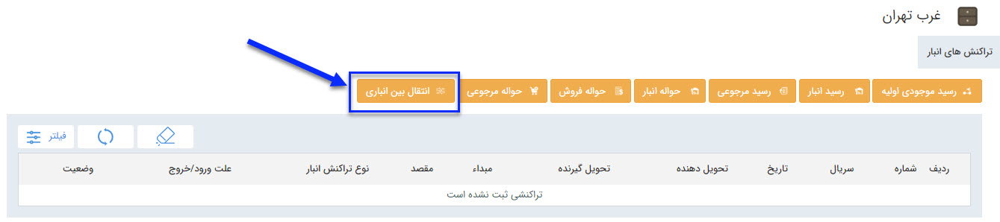
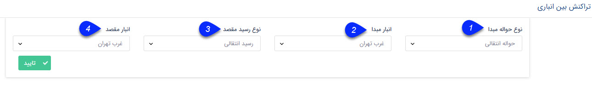
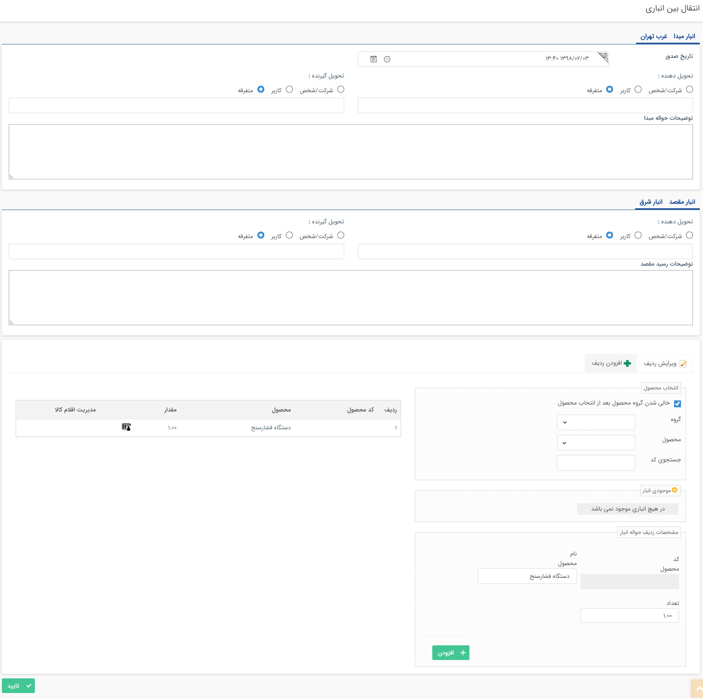

# انجام انتقال    

**انجام انتقال**

برای انجام انتقال بین انبارهای خود از این گزینه استفاده نمایید. پس از ثبت انتقال بین انباری، سیستم یک حواله در انبار مبداء و یک رسید در انبار مقصد ثبت خواهد کرد.

 

می توانید این تراکنش را در انبار مبداء یا مقصد ثبت نمایید، پس از کلیک بر روی دکمه انتقال بین انباری، باید جزئیات زیر را تعیین نمایید:

 

1\. **نوع حواله مبدا:** نوع حواله ای که باید در انبار مبدا استفاده شود را تعیین کنید.

2\. **انبار مبدا:** انباری که قرار است کالاها از آنها خارج شوند را تعیین کنید.

3\. **نوع رسید مقصد:** نوع رسیدی که باید در انبار مقصد استفاده شود را انتخاب کنید.

4\. **انبار مقصد:** انباری که قرار است کالاها به آن منتقل شوند را انتخاب کنید.

نکته: توجه داشته باشید برای انجام عملیات انتقال، ابتدا باید در قسمت [مدیریت تراکنش های انبار](Setting\Personalizing\Warehousedraftmanagement.md) ، حداقل یک رسید انبار از نوع انتقالی و حداقل یک حواله انبار از نوع انتقالی ایجاد کرده باشید.

پس از تعیین انبارهای مبداء و مقصد و نوع تراکنش های انباری که باید ثبت شوند، با کلیک بر روی دکمه "تایید" صفحه زیر را مشاهده خواهید نمود، در این قسمت  تحویل دهنده و گیرنده و توضیحات هر دو انبار را تعیین کرده، سپس اقلام کالاهای مورد انتقال را انتخاب کنید و تایید نمایید.

 