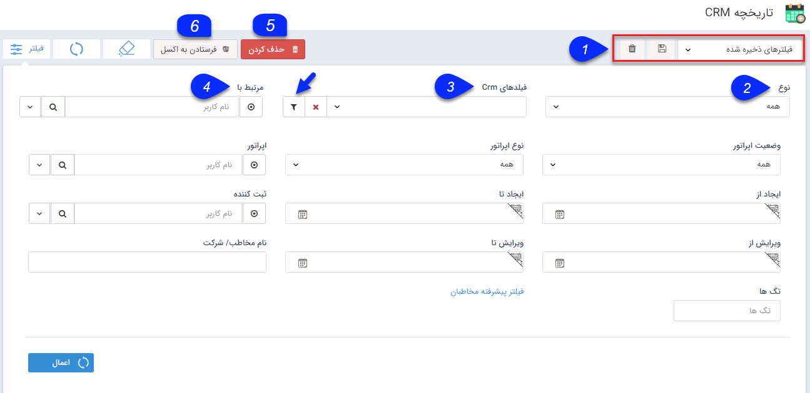

# CRM تاریخچه    

**تاریخچه CRM**

منظور از تاریخچه CRM تمام موارد ثبت شده در ارتباط با مشتریان و مخاطبان شامل تماس تلفنی، قرار ملاقات، فاکتور، پیش فاکتور و ... است. با استفاده از این صفحه و فیلترهای مختلف می توانید به جستجو در میان تمام موارد بپردازید و انواع گزارشات مورد نظر خود را از سوابق ثبت شده دریافت کنید.

نکته: هر کاربر می تواند تنها سوابقی را که خود ثبت نموده است مشاهده نماید و برای مشاهده سوابق ثبت شده توسط سایر کاربران برای هر کدام از آیتم ها باید مجوز "مشاهده لیست" را برای آن آیتم داشته باشد

 

1\. **نوع فیلتر:** میتوانید فیلترهای اعمال شده را به عنوان یک فیلتر اختصاصی خود ذخیره کرده و برای اخذ گزارشات بعدی از آن استفاده کنید.

نکته: لطفا ابتدا قسمت  [فیلترهای پیشرفته](../PayamGostarSyncBank/JobsForFirst/Background/AdvancedFilters.md) را مطالعه کنید.

2\. **نوع آیتم:** می توانید نوع آیتم دلخواه را برای فیلتر کردن مشخص کنید.

3\. **فیلدهای CRM:** در صورتی که نوع آیتم را مشخص کرده باشید، می توانید در این قسمت یک زیرنوع را نیز مشخص کنید. همچنین می توانید با استفاده از دکمه فیلتر موجود در این فیلد، پس از انتخاب یکی از زیرنوع ها، روی فیلدهای اضافه شده به آن نیز فیلتر مورد نظر خود را اعمال کنید.  

4\. **مرتبط با:** برای آیتم هایی که قابلیت تخصیص به یکی از کاربران را دارند کاربرد دارد. پارامتر مرتبط با برای آیتم های مختلف با نام های متفاوتی مشاهده می شود (فیلد "تخصیص داده شده به " در فرصت، فیلد "هماهنگ کننده" در قرار ملاقات و فیلد "فروشنده" در پیش فاکتور/فاکتورهای فروش/خرید، فیلد "کارشناس مرتبط" در درخواست و قرارداد)

5\. **حذف کردن:** می توانید آیتم مورد نظر را حذف کنید.

6\. **فرستادن به اکسل:** می توانید از آیتم های فیلتر شده به صورت یک فایل اکسل خروجی تهیه کنید.