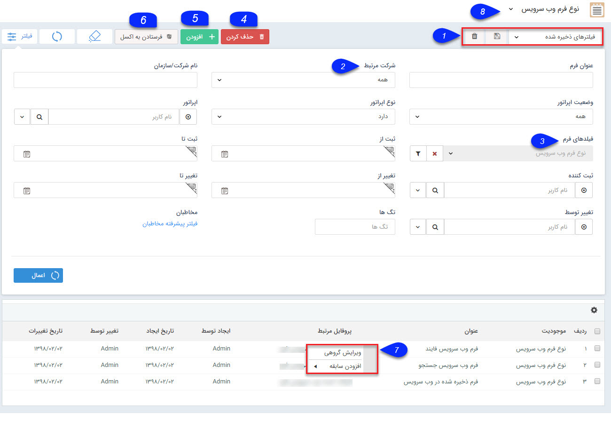

# فرم ها    

**فرم ها**

لیست تمام [فرم های ثبت شده](../Setting/FormsManagement.md) در سیستم نمایش داده می شود و می توان اطلاعات جزئی هر کدام از فرم ها را نیز جستجو و مشاهده نمود. با استفاده از پارامترهای تعریف شده در قسمت فیلتر می توانید به راحتی جستجو نمایید و به نتیجه دلخواه خود برسید.

 

نکته: لطفا ابتدا قسمت  [فیلترهای پیشرفته](../PayamGostarSyncBank/JobsForFirst/Background/AdvancedFilters.md)  را مطالعه کنید.  

1. **نوع فیلتر:** میتوانید فیلترهای اعمال شده را به عنوان یک فیلتر اختصاصی خود ذخیره کنید.

2. **شرکت مرتبط:** می توانید تعیین کنید که فرم مورد نظر دارای هویت مرتبط هست یا خیر.

نکته: توجه داشته باشید فرم از سوابقی است که امکان ذخیره بدون اتصال به یکی از هویت های بانک اطلاعاتی را دارد.

3. **فیلدهای فرم:** می توانید بر اساس فیلدهای فرم، فیلتر دلخواه را اعمال کنید.

4\. **حذف کردن:** می توانید فرم(های) انتخاب شده را حذف کنید.

5. **اضافه کردن:** می توانید یک [فرم جدید](../PayamGostarSyncBank/JobsForFirst/Forms/Newform.md) ایجاد نمایید.

6. **فرستادن به اکسل:** می توانید فرم های انتخاب شده را به صورت خروجی اکسل دریافت نمایید.

7\. **کلیک راست:** با کلیک راست بر روی یک یا چند تا از فرم ها می توانید اقدام به ویرایش گروهی یا افزودن سابقه برای آن ها کنید.

8.**زیرنوع فرم:** با استفاده از این فیلد کشویی می توانید زیرنوع فرم را تغییر دهید.