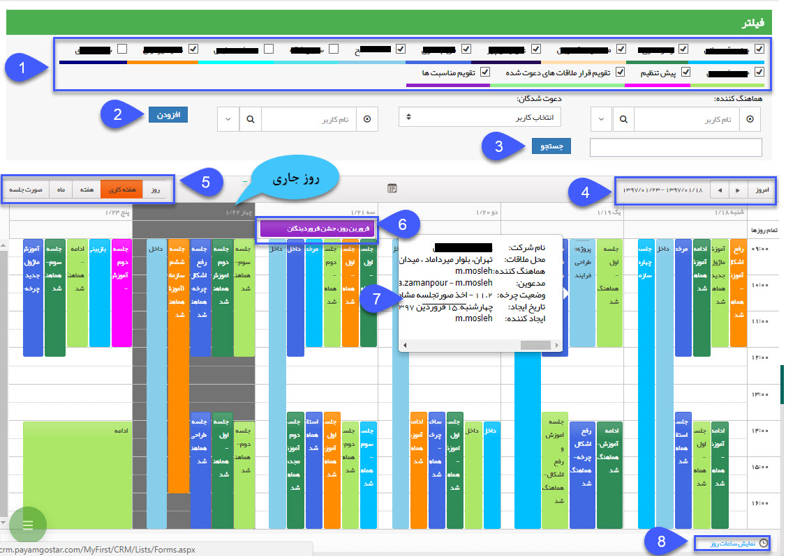

# تقویم کاری من    

 **تقویم کاری من**

در این قسمت لیست قرار ملاقات هایی که برای شما تنظیم شده است یا دسترسی دیدن آنها را دارید، مشاهده خواهید کرد. این قرار ملاقات ها ممکن است توسط شما، سایر کاربران و یا حتی فرآیندها و چرخه های کاری تعریف شده در نرم افزار ایجاد شوند. این تقویم ها با رنگهای مختلف ایجاد می شوند که در دیدن لیست قرار ملاقات ها و برنامه ریزی به کاربر اجازه مشاهده قرار ملاقات افراد مختلف را می دهد.

1\. **لیست تقویم ها:** لیست تقویم هایی که به آنها دسترسی دارید را می توانید مشاهده کنید، با فعال کردن هر تقویم لیست قرار ملاقات های تنظیم شده در آن نمایش داده می شود. هر تقویمی که در آن مجوز "فقط خواندن" یا "خواندن و نوشتن" داشته باشید در این لیست قابل مشاهده است.

نکته: تقویم های قرار ملاقات های دعوت شده و تقویم مناسبت ها توسط تمامی کاربران قابل مشاهده است و نیاز به مجوز ندارند.

2\. **افزودن:** می توانید قرار ملاقات های نمایش داده شده را بر اساس دعوت شدگان قرار فیلتر کنید، دعوت شدگان می توانند کاربران نرم افزار، مخاطبان یا اطلاعات تماس وارد شده در قرار باشند. توجه داشته باشید که می توانید بیش از یک مدعو را برای جستجو در نظر بگیرید ( به طور مثال برای نمایش قرار ملاقات هایی که دو کاربر مشخص در آن حضور داشته اند یا قرارهایی که یک کاربر و یک مخاطب مشخص در آن حضور داشته اند.)

3\. **جستجو:** فیلترهایی که در مرحله قبل اضافه کرده اید را بر روی قرار ملاقات های نمایش داده شده اعمال می کند.

4.  **بازه نمایش:**  بازه نمایش تقویم را در این قسمت مشخص کنید و با استفاده از دکمه هایی که در اختیارتان قرار داده شده قرار های گذشته و آینده را مشاهده کنید. توجه فرمایید که روز جاری در این تقویم با رنگ خاکستری نمایش داده می شود.

5\. **نوع نمایش:** نوع نمایش تقویم را می توانید از این قسمت تغییر دهید.

6\. **مناسبت ها:** مناسبت های تعریف شده در قسمت [مدیریت اعیاد و مناسبت ها](BaseInformatio\EYDManagement.md) در این قسمت نمایش داده می شوند.

7\. **جزئیات قرار ملاقات:** با نگه داشتن نشانگر بر روی هر کدام از قرار ملاقات ها می توانید برخی از جزییات آن را مشاهده کنید، با دوبار کلیک بر روی هر قرار ملاقات صفحه جزییات آن را مشاهده کنید.

8\. **نمایش ساعات کاری/روز:** با استفاده از این دکمه می توانید بازه ساعات نمایش داده شده در تقویم را تغییر دهید (24 ساعته یا ساعات کاری)

با کشیدن (Drag&Drop) هر کدام از قرار ملاقات ها می توانید آن را در این تقویم جا به جا کنید.

نکته: با دوبار کلیک بر روی قسمت های خالی تقویم می توانید یک قرار ملاقات جدید در آن زمان ایجاد کنید.

نکته: در صورتی که کاربر به تقویم مورد نظر دسترسی داشته باشد می تواند برای سایر کاربران قرار ملاقات تنظیم نماید و تمامی قرار ملاقات های تنظیم شده روی آن تقویم را مشاهده کند.

نکته: برای ایجاد تقویم های مختلف و تنظیم کاربران دارای دسترسی به آن ها به قسمت [مدیریت تقویم ها](../BaseInformatio/CalendersManagement.md) مراجعه کنید.