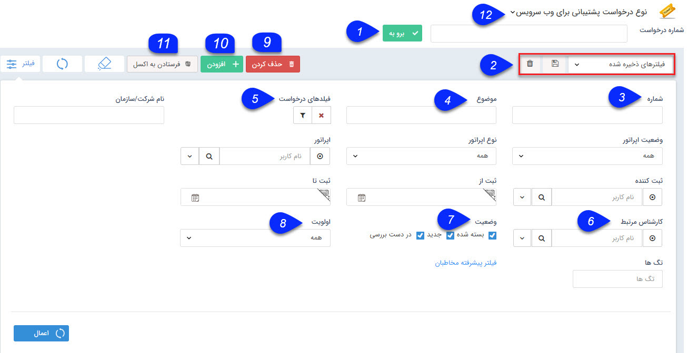

# درخواست ها    

**درخواست ها**

لیست تمام درخواست های ثبت شده در سیستم نمایش داده می شود و می توان اطلاعات جزئی هر کدام از درخواست ها را نیز مشاهده نمود. با استفاده از پارامترهای تعریف شده در قسمت فیلتر می توانید به راحتی جستجو نمایید و به نتیجه دلخواه خود برسید.

 

نکته: لطفا ابتدا قسمت  [فیلترهای پیشرفته](../PayamGostarSyncBank/JobsForFirst/Background/AdvancedFilters.md) را مطالعه کنید.

1.**شماره درخواست:** اگر شماره درخواست مورد نظر خود را می دانید، می توانید آن را در این قسمت وارد کرده و با کیک بر روی "برو به" به راحتی به صفحه این درخواست دسترسی داشته باشید. در واقع این روش ساده ترین راه برای دسترسی به درخواست های ثبت شده و انجام پیگیری های مربوط به آن هاست.

1. **نوع فیلتر:** می توانید فیلترهای اعمال شده را به عنوان یک فیلتر اختصاصی خود ذخیره کنید.

3\. **شماره:** شماره درخواست مورد نظر(یا قسمتی از شماره) را میتوانید برای فیلتر کردن وارد کنید.

4\. **موضوع:** می توانید درخواست ها را بر اساس موضوع آن ها جستجو کنید.

5\. **فیلدهای درخواست:** در این قسمت می توانید یکی از زیرنوع های درخواست تعریف شده در شخصی سازی را فیلتر کنید. همچنین می توانید با استفاده از دکمه فیلتر موجود در این فیلد، پس از انتخاب یکی از زیرنوع های درخواست، روی فیلدهای اضافه شده به آن نیز فیلتر مورد نظر خود را اعمال کنید.

6\. **کارشناس مرتبط:** می توانید از بین کاربران سیستم، کارشناس مرتبط با درخواست را برای اعمال فیلتر انتخاب کنید.

7. **وضعیت:** می توانید وضعیت دلخواه درخواست مورد نظر را انتخاب کنید.

8\. **اولویت:** می توانید اولویت دلخواه را برای اعمال فیلتر انتخاب کنید.

9\. **حذف کردن:** می توانید درخواست انتخاب شده را حذف کنید.

10. **اضافه کردن:** می توانید یک [درخواست جدید](../PayamGostarSyncBank/JobsForFirst/Request/Newrequest.md) ایجاد نمایید.

11. **فرستادن به اکسل:** می توانید درخواست های انتخاب شده را به صورت خروجی اکسل دریافت نمایید.

12\. **زیرنوع درخواست:** با استفاده از این فیلد کشویی می توانید زیرنوع درخواست را تغییر دهید.