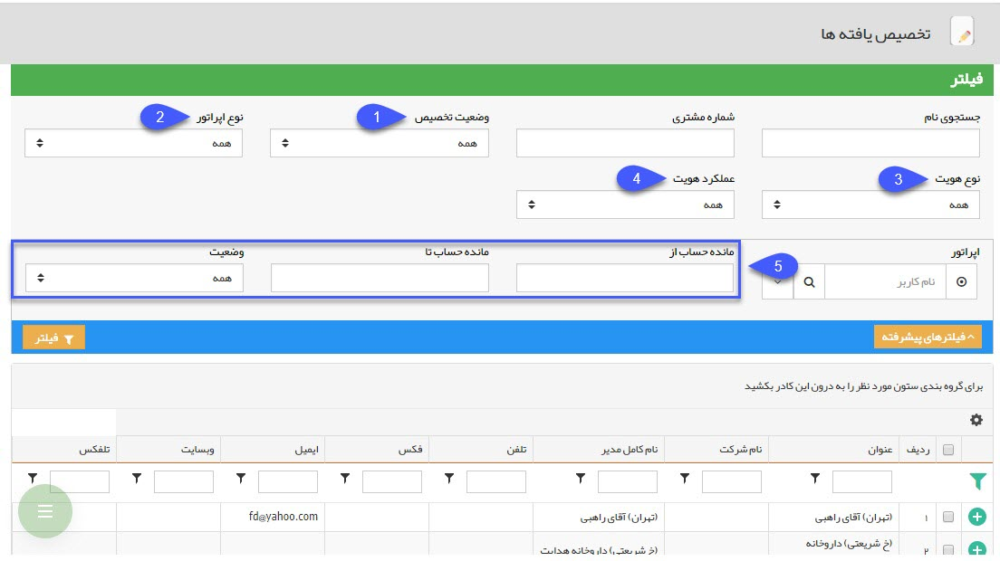

# تخصیص یافته ها    

**تخصیص یافته ها**

در این قسمت کلیه هویت هایی که به کاربران یا اپراتورها (مسئول فروش، پشتیبانی و متفرقه) اختصاص داده شده اند در این لیست نمایش داده می شوند. هر کاربر می تواند پروفایل های اختصاص یافته به خود را مشاهده نماید. مدیران سیستم و کاربران دارای مجوز مشاهده لیست تخصیص یافته ها می توانند تمامی مخاطبان تخصیص یافته و نیافته را مشاهده کنند. با استفاده از فیلترهای موجود در این قسمت می توانید گزارشات متفاوت مورد نیاز از وضعیت تخصیص هویت ها را دریافت کنید.

نکته: لطفا قسمت [فیلترهای پیشرفته](../PayamGostarSyncBank/JobsForFirst/Background/AdvancedFilters.md) را مطالعه فرمایید.

  

1\. **وضعیت تخصیص:** مشخص کنید که قصد مشاهده لیست هویت های تخصیص یافته را دارید یا هویت های تخصیص نیافته.

2\. **نوع اپراتور:** از گزینه های کارشناس فروش، پشتیبانی یا متفرقه، اپراتور مورد نظر را انتخاب کنید.

3\. **نوع هویت:** حقیقی یا حقوقی بودن هویت های مورد نظر خود را مشخص کنید.

4\. **عملکرد هویت:** سرنخ یا مخاطب بودن هویت های مورد نظر خود را مشخص کنید.

5\. **مانده حساب:** می توانید میزان مانده حساب (بدهکار و بستانکار) هویت ها را نیز به عنوان یک پارامتر جستجو اعمال کنید.