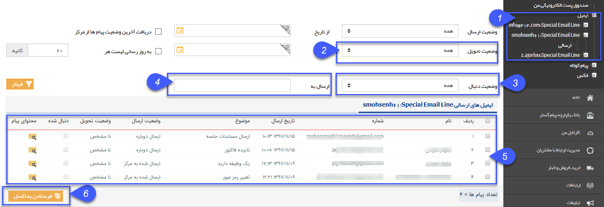

# ایمیل    

ایمیل 

با استفاده از این بخش، می توانید لیست ایمیل های ارسالی را مشاهده کنید و در صورت نیاز از آنها خروجی اکسل تهیه کنید، حذف کنید و وضعیت ارسال آنها را مشاهده کنید.

نکته: لطفا ابتدا قسمت [اطلاعات مشترک لیست ارسال پیام](SentlistCommoninfo.md) را مطالعه کنید.

1\. در این قسمت، لیست ایمیل های عمومی در اختیار قرار میگیرد تا با انتخاب آن، لیست ایمیل های ارسالی و دریافتی را ببینید.

  

2\. وضعیت تحویل: انواع وضعیت تحویل ها به شرح ذیل می باشد.

> A. نامشخص: ایمیل ارسال شده هنوز توسط مخاطب باز نشده است.
> 
> B. تحویل داده شده:  ایمیل ارسال شده توسط مخاطب حداقل یکبار باز شده است.
> 
> C. ناموفق: آدرس ایمیل مخاطب اشتباه است.

3\. وضعیت دنبال: اگر ایمیل ارسال شده دارای لینک ویژه باشد:

> A. دنبال شده: مخاطب بر روی لینک ویژه موجود در ایمیل کلیک کرده است.
> 
> B. دنبال نشده: مخاطب تاکنون بر روی لینک ویژه موجود در ایمیل کلیک نکرده است .

4\. ارسال به : آدرس ایمیلی که ارسال به آن صورت گرفته است را می توانید درج نمایید.

5. در جدول مشخص شده، اطلاعاتی مانند، آدرس مقصد و تاریخ ارسال به همراه وضعیت ارسال و موضوع قابل مشاهده می باشد.

6. درصورت نیاز می توان از لیست بالا، خروجی اکسل دریافت نمود.