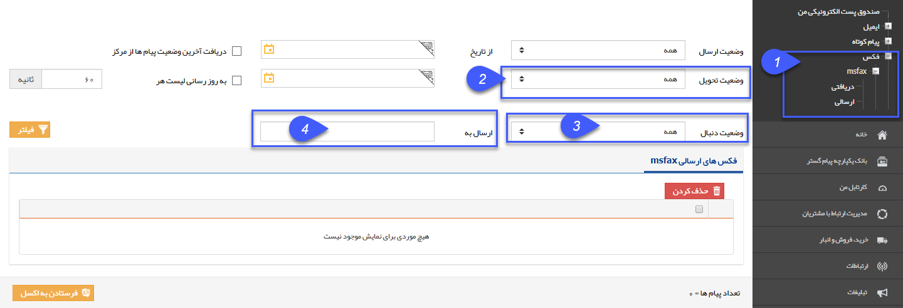

# فکس    

فکس

با استفاده از این بخش، می توانید لیست فکس های ارسالی و دریافتی را مشاهده کنید. 

نکته: لطفا ابتدا قسمت  [اطلاعات مشترک لیست ارسال پیام](SentlistCommoninfo.md) را مطالعه کنید.

1\. در این قسمت، لیست فکس ها در اختیار قرار میگیرد تا با انتخاب آن، لیست فکس های ارسالی و دریافتی را ببینید.

2\. وضعیت تحویل: انواع وضعیت تحویل ها به شرح ذیل می باشد.

> A. نامشخص: هنوز مرکز پاسخی برای وضعیت تحویل فکس به نرم افزار ارسال نکرده است.
> 
> B. تحویل داده شده:   فکس به مخاطب تحویل داده شده است. (Delivery Report)
> 
> C. ناموفق: فکس به مخاطب تحویل داده نشده است.
> 
> 3\. وضعیت دنبال: در حالتی که پیامک ارسال شده بتواند جواب داشته باشد (مانند پیامک های نظر سنجی، مسابقه، پاسخگوی خودکار)، وضعیت های دنبال شده به شرح ذیل است:
> 
> > A. دنبال شده:  مخاطب پیامی در جواب پیامک ارسال کرده است.
> > 
> > B. دنبال نشده: مخاطب تا کنون پیامکی در جواب پیامک ارسال نکرده است.

4\. ارسال به : شماره تلفنی که فکس برای آن ارسال شده است را می توانید درج نمایید.