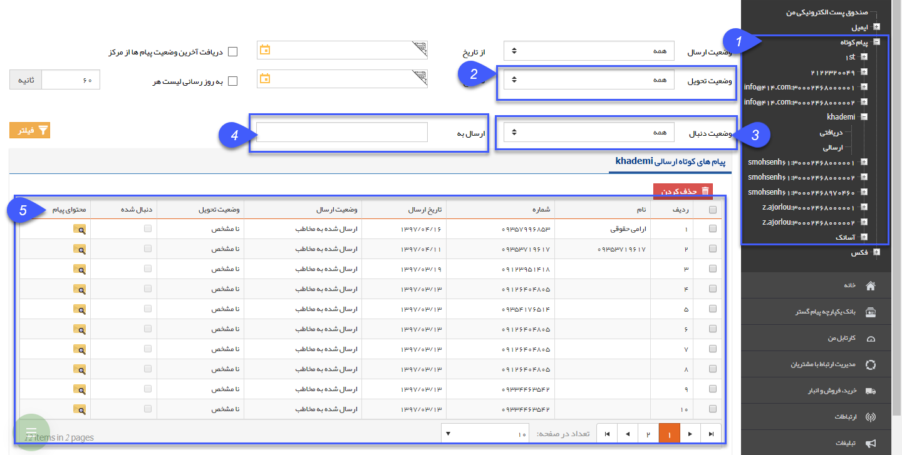

# پیام کوتاه    

پیام کوتاه

با استفاده از این بخش، می توانید لیست پیام کوتاه های ارسالی و در صورتی که خط مورد نظر امکان دریافت را هم داشته باشد، پیام های دریافتی را نیز مشاهده کنید.

نکته: لطفا ابتدا قسمت [اطلاعات مشترک لیست ارسال پیام](SentlistCommoninfo.md) را مطالعه کنید.

1\. در این قسمت، لیست پیامک های عمومی در اختیار قرار میگیرد تا با انتخاب آن، لیست پیامک های ارسالی و دریافتی را ببینید.

 

2\. وضعیت تحویل: انواع وضعیت تحویل ها به شرح ذیل می باشد.

> A. نامشخص: هنوز مرکز پاسخی برای وضعیت تحویل پیامک به نرم افزار ارسال نکرده است.
> 
> B. تحویل داده شده:  پیامک به مخاطب تحویل داده شده است. (Delivery Report)
> 
> C. ناموفق: پیامک به مخاطب تحویل داده نشده است.

3\. وضعیت دنبال: در حالتی که پیامک ارسال شده بتواند جواب داشته باشد (مانند پیامک های نظر سنجی، مسابقه، پاسخگوی خودکار)، وضعیت های دنبال شده به شرح ذیل است:

> A. دنبال شده:  مخاطب پیامی در جواب پیامک ارسال کرده است.
> 
> B. دنبال نشده: مخاطب تا کنون پیامکی در جواب پیامک ارسال نکرده است.

4\. ارسال به : شماره تلفنی که پیامک برای آن ارسال شده است را می توانید درج نمایید.

5\. در جدول مشخص شده، اطلاعاتی مانند، شماره دریافت کننده پیام و تاریخ ارسال به همراه وضعیت ارسال و وضعیت تحویل قابل مشاهده می باشد.