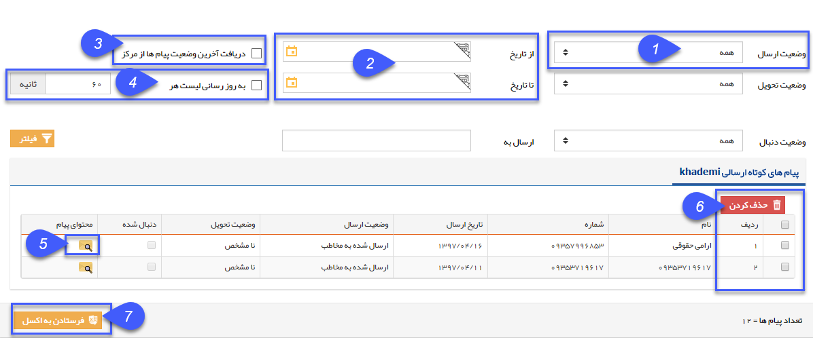

# اطلاعات مشترک لیست ارسال پیام    

اطلاعات مشترک لیست ارسال پیام

 

1\. وضعیت ارسال: انواع وضعیت ارسال ها به شرح ذیل می باشد:

> A. در صف ارسال: پیام به درستی در صف ارسال قرار گرفته و در حال است.
> 
> B. ارسال شده به مرکز: پیام به درستی به مرکز ارسال شده است.
> 
> C. ارسال شده به مخاطب: مخاطب پیام را به درستی دریافت کرده است.
> 
> D.ارسال ناموفق: مخاطب پیام را دریافت نکرده است.
> 
> E. مشکوک به ارسال شده به مرکز: مشکوک به ارسال شده و یا ارسال دوباره به دلایل زیر خواهد بود.
> 
> الف. درست نبودن نام کاربری و رمز عبور پرتال اول
> 
>     ب. مسدود بودن نام کاربری پرتال اول به دلیل رمز عبور اشتباه
> 
>     پ. موجودی ناکافی (شارژ نام کاربری)
> 
>     ت. مورد تایید نبودن مدارک هویتی
> 
> F. ارسال دوباره: نشان دهنده تلاش مجدد برای ارسال است که دلایل این حالت همانند وضعیت مشکوک به ارسال شده به مرکز است.
> 
> * * *

2\. از تاریخ/تا تاریخ: می توانید ابتدا و انتهای بازه زمانی ارسال را مشخص کنید.

3\. دریافت آخرین وضعیت پیام ها از مرکز: با فعال کردن این گزینه، کلید فیلتر علاوه بر اعمال فیلترهای تعیین شده، آخرین وضعیت پیام ها را از سرور دریافت خواهد کرد.

4. به روز رسانی لیست: با استفاده از این گزینه می توانید بر حسب ثانیه تعیین کنید که این لیست ارسال ها هر چند ثانیه یکبار به روز رسانی گردد.

5\. محتوای پیام: با استفاده از این گزینه می توانید محتوای پیام ارسال شده را مشاهده کنید.

6\. حذف: می توانید سابقه پیام ارسال شده را حذف کنید، کافی است پیام های مورد نظر را با تیک انتخاب و سپس دکمه حذف را کلیک نمایید.

7\. فرستادن به اکسل: می توانید لیست ارسال های انتخاب شده را در قالب فایل اکسل دریافت کنید.

وضعیت تحویل: نامشخص-تحویل داده شده- ناموفق