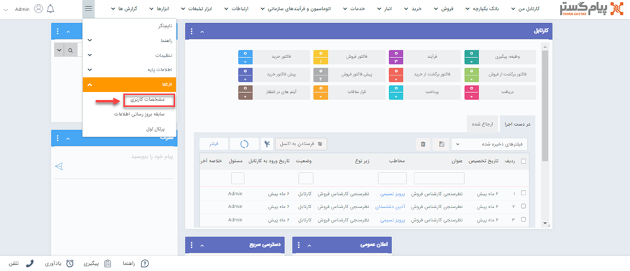
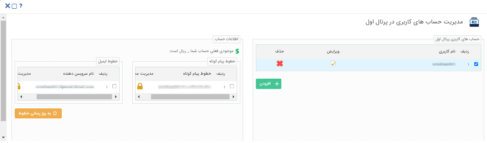
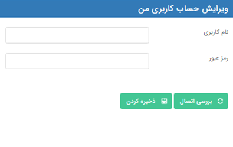
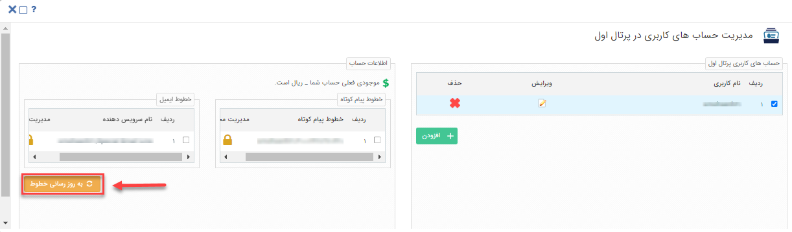

# تعریف خطوط پرتال اول
 

تجارت اول  به عنوان یکی از اعضای مجموعه شرکت‌های تجارت الکترونیک اول، با هدف ایجاد بازار معاملات کشوری، تسهیل فرایند تجارت الکترونیک برای تمامی تامین‌کنندگان و خریداران ایرانی و از میان برداشتن محدودیت‌های مالی در این حوزه در سال 1389 تاسیس گردید. 
مجموعه بزرگ و پراکنده خریداران و فروشندگان موجود در ایران، تشخیص کسب‌وکار معتبر برای شکل‌گیری ارتباط و انجام معاملات را تا حدودی دشوار نموده است. در این راستا تجارت اول، با رویکرد رفع کاستی‌های موجود در خرید و فروش عمده، بستر مناسبی شامل اعطای صفحات اختصاصی، فروشگاه آنلاین، درگاه پرداخت امن و ... را  جهت انجام معاملات در فضای تجارت الکترونیک ایجاد نموده است. 
در حال حاضر تجارت اول به عنوان بزرگترین سامانه تجارت بین بنگاهی (B2B) در ایران با بیش از دویست هزار کسب و کار از سراسر کشور در حوزه تجارت الکترونیک در حال فعالیت می باشد . 
برای ارتباط با تجارت اول باید: 
1- در سایت www.1st.ir ثبتنام کنید. 
2- از منوی بالای نرم‌افزار، سمت چپ مسیر **1st** > **مشخصات کاربری** را انتخاب نمایید. 

3- در صفحه مدیریت حساب‌های کاربری پرتال اول، با **نام کاربری و رمز عبوری که در سایت 1st.ir ثبتنام کرده‌اید**، حساب کاربری جدید بسازید. برای این کار روی دکمه **افزودن** کلیک کنید.

4- لیست حساب‌های کاربری و موجودی خطوط شما در قسمت مدیریت حساب‌های کاربری پرتال اول قابل مشاهده است. با کلیک روی گزینه ویرایش، از برقراری اتصال حساب‌های خود اطمینان حاصل نمایید.([ راهنمای ثبت نام در سایت](https://github.com/1stco/PayamGostarDocs/blob/master/Help/1st/nahve-ozviat/nahve_ozviat.md) ) 
با زدن دکمه **بررسی اتصال**  در صورتی که اتصال به دسترسی برقرار شود پیامی مبنی بر موفقیت آمیز بودن نمایش داده می‌شود و شما با زدن دکمه ذخیره کردن، نام کاربری را ثبت می‌نمایید. 
تمامی حساب‌های کاربری که ساخته‌اید را می‌توانید ویرایش و یا حذف نمایید. پس از ساخت نام کاربری، **به روز رسانی خطوط** را بزنید تا خط‌های پیام کوتاه و ایمیلی که به نام کاربری شما اختصاص داده شده به‌روز شوند و موجودی شما نمایش داده شود . ([راهنمای شارژ حساب کاربری](https://github.com/1stco/PayamGostarDocs/blob/master/Help/1st/nahve-sharj/nahve-sharj.md))

