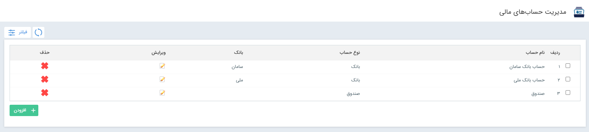

# مدیریت حساب‌های مالی 

در برخی آیتم‌ها از جمله دریافت و پرداخت و یا هنگام استفاده از لینک پرداخت، لازم است که کاربران یک حساب مالی را برای واریز یا برداشت انتخاب نمایند. این حساب‌ها باید پیش‌تر در نرم‌افزار تعریف شده‌باشند. در بخش مدیریت حساب‌های مالی می‌توانید، حساب‌های مورد نظر برای استفاده جهت پرداخت در باشگاه، استفاده از لینک پرداخت و یا درج در آیتم دریافت/پرداخت را تعریف نمایید. در ادامه به نحوه تکمیل اطلاعات مورد نیاز برای تعریف حساب‌های بانکی می‌پردازیم. 
در لیست حساب‌های مالی ممکن است حساب‌های مختلفی از نوع «صندوق» یا «بانک» مشاهده نمایید.: 
- **صندوق:** صندوق‌ها نوعی از حساب هستند که در واقع به صورت مجازی یا توافقی در سازمان تعریف می‌شوند. مشخصات بانکی ندارند و برای اتصال به لینک پرداخت یا پرداخت آنلاین در باشگاه نیز قابل استفاده نمی‌باشند. این حساب‌ها صرفاً تحت عنوان یک اسم در لیست حساب‌ها قابل انتخاب هستند. 
- **بانک:** حساب‌های بانکی حساب‌های مالی هستند که با درج مشخصات بانکی حساب تعریف می‌شوند و در صورت صحت اطلاعات وارد شده، علاوه بر لیست حساب‌ها، می‌توانید از آن‌ها برای پرداخت آنلاین و لینک پرداخت استفاده نمایید. 

در صورت نیاز به تعریف حساب جدید، بر روی کلید افزودن کلیک کرده و وارد صفحه حساب مالی جدید شوید. 

- **نام حساب:** برای حساب یک عنوان انتخاب کنید. سعی کنید عنوان حساب را به گونه‌ای انتخاب کنید که شناسایی آن برای کاربران آسان باشد.
- **نوع حساب:** مشخص کنید  حساب مورد نظر از نوع «بانک» یا «صندوق» ایجاد شود.
- **کلید کاربر:** برای حساب یک کلید در نظر بگیرید. 
- **فعال:**{#AccountActivation} فعال بودن این حساب را با علامت‌گذاری این گزینه مشخص کنید. پس از تعریف حساب، چنانچه بنا بر شرایطی نیاز داشتید که از استفاده کاربران از این حساب جلوگیری نمایید، می‌توانید با غیرفعال کردن حساب، به صورت موقت یا دائم، حساب را از دسترس کاربران خارج کنید. 
اگر حسابی که تعریف کرده‌اید از نوع صندوق باشد، این اطلاعات برای ذخیره‌ی حساب کافی می‌باشد. در صورت تمایل به تعریف حساب بانکی، لازم است که سایر اطلاعات را نیز مطابق راهنمای زیر تکمیل نمایید: 
- **نام بانک:**  از بین گزینه‌های موجود در لیست، انتخاب کنید نام بانک حساب را انتخاب کنید. چنانچه نام بانک مورد نظر را در لیست مشاهده نمی‌کنید، با جستجوی «بانک» در بخش [مدیریت آیتم‌های سیستم](https://github.com/1stco/PayamGostarDocs/blob/master/Help/Basic-Information/Management-of-system-items/Management-of-system-items.md) اقدام به افزودن آن نمایید. 
- **نام دارنده حساب:** صاحب حساب را مشخص کنید.
- **نوع:** حقیقی یا حقوقی بودن حساب را مشخص کنید.
- **شماره حساب:** شماره حساب مورد نظر را وارد نمایید. چنانچه از حساب صرفاً برای درج دریافت و پرداخت استفاده می‌کنید، درج شماره حساب تنها جنبه ثبت اطلاعات در سیستم را دارد. توجه داشته‌باشید که در صورت استفاده از سرویس پرداخت پول خرد، درج شماره‌ی حساب در این قسمت الزامی می‌باشد. در این حالت، شماره حساب خود را از پول خرد دریافت نمایید.
- **شماره کارت:** اگر حساب دارای کارت است، شماره کارت را وارد نمایید. 
- **پرداخت کارت به کارت:** چنانچه کاربران باشگاه، اقدام به پرداخت آنلاین در باشگاه نمایند، یکی از روش‌های پرداخت با عنوان «انتقال از طریق کارت خودپرداز» به آن‌ها نمایش داده‌می‌شود. چنانچه این گزینه برای شماره حساب تعریف شده فعال باشد، این حساب جهت انتخاب در این بخش به کاربران نمایش داده می‌شود.
- **پرداخت نقدی:** چنانچه کاربران باشگاه، اقدام به پرداخت آنلاین در باشگاه نمایند، یکی از روش‌های پرداخت با عنوان «واریز نقدی به حساب» به آن‌ها نمایش داده‌می‌شود. چنانچه این گزینه برای شماره حساب تعریف شده فعال باشد، این حساب جهت انتخاب در این بخش به کاربران نمایش داده می‌شود.
- **پرداخت آنلاین:** اگر از لینک پرداخت استفاده می‌کنید، برای اتصال لینک پرداخت به حساب مورد نظر، لازم است که این گزینه را برای حساب فعال نمایید. علاوه بر آن، با فعال‌سازی این گزینه، کاربران باشگاه به منظور پرداخت آنلاین می‌توانند از روش «پرداخت اینترنتی» برای واریز مبلغ استفاده نمایند. با فعال کردن این گزینه، تنظیمات اطلاعات پرداخت آنلاین برای شما فعال شده و می‌توانید مشخصات مورد نیاز برای اتصال حساب به حساب پول خرد خود را وارد نمایید. برای تکمیل اطلات پرداخت آنلاین، به نکات زیر توجه کنید: 
- **اطلاعات پرداخت آنلاین:**{#SecretKey} در حال حاضر تنها سرویس پرداخت برای اتصال به نرم‌افزار «[پول خرد](https://poolkhord.com/)» می‌باشد که به صورت پیش‌فرض انتخاب شده‌است. در صورت تکمیل فرآیند دریافت حساب در پول خرد، یک API Key و یک Secret Key از طرف پول خرد در اختیار شما قرار داده می‌شود. پس از درج اطلاعات، با فشردن کلید «بررسی ارتباط با سرور» از صحت تنظیمات مطمئن شده و در صورت دریافت پیام تایید، تنظیمات خود را ذخیره کنید. 

 > **نکته** 
 > برای استفاده از لینک پرداخت به نکات زیر توجه داشته‌باشید:
 >- داشتن ماژول «پیام‌گستر پرداخت» برای استفاده از این قابلیت (لینک پرداخت و پرداخت اینترنتی در باشگاه) الزامی می‌باشد.
 >- با توجه به اینکه Secret Key از جمله تنظیمات امنیتی اضافه شده به پول خرد است، حساب‌هایی که پیش‌تر برای پرداخت آنلاین تنظیم شده‌اند، بدون درج این کلید فعال هستند. در صورت اعمال هر گونه ویرایش در حساب مربوطه، ملزم به درج Secret Key خواهید بود. در غیر این صورت، API نامعتبر تشخیص داده می‌شود.
 >- در صورت استفاده از سرویس پرداخت پول خرد، شماره‌ی حساب خود را از پول خرد دریافت نمایید. این شماره، شماره حساب شما در پول خرد بوده و با شماره‌ی حساب بانکی شما متفاوت می‌باشد. 
  
 
 
