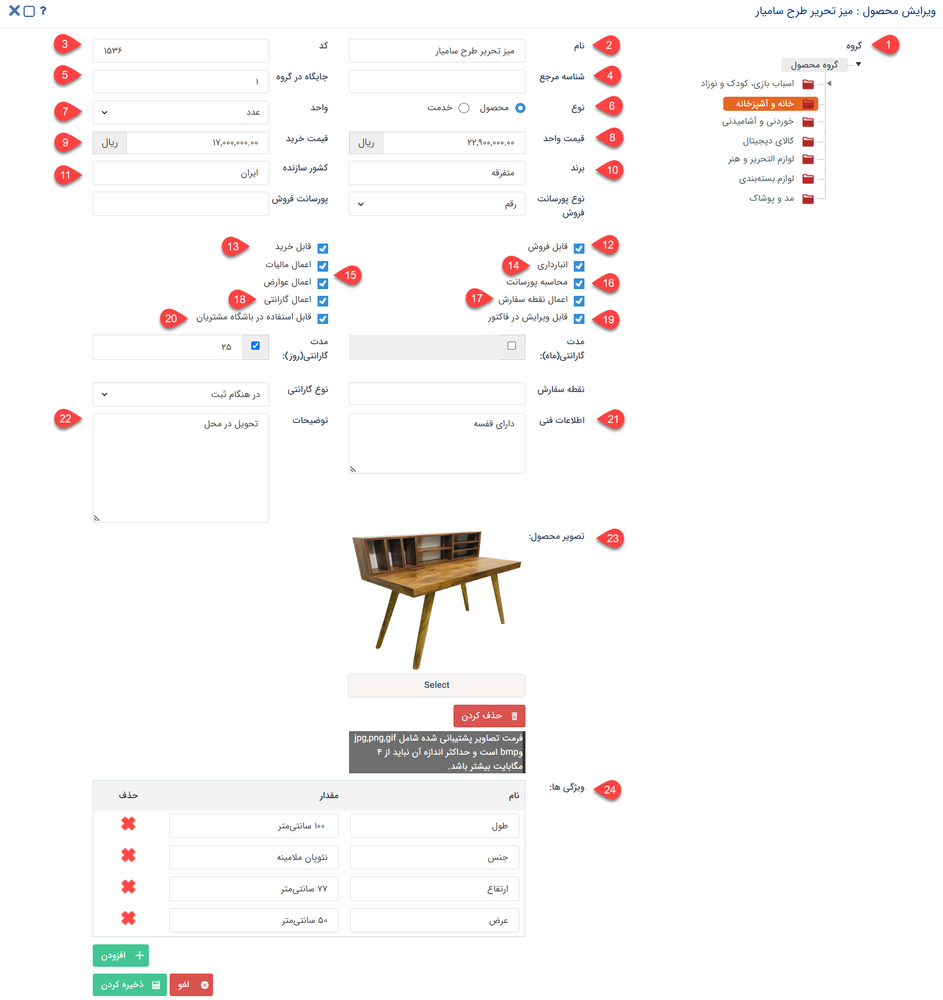

# ایجاد محصول جدید

برای اینکه کاربران بتوانند از عناوین محصولات و خدمات در لیست محصولات، اقلام فرصت و اقلام انواع فاکتور استفاده نمایند، لازم است که این محصولات/خدمات و همچنین مشخصات آن‌ها پیش‌تر در نرم‌افزار تعریف شده‌باشد. برای ایجاد محصول/خدمت جدید در لیست محصولات خود، کافیست که وارد صحفه مدیریت محصولات شوید و بر روی کلید افزودن کلیک کنید. در صفحه‌ی نمایش داده شده می‌توانید مشخصات محصصول/خدمت مورد نظر را تعریف کنید. در ادامه‌ی مطلب، به جزئیات و مشخصات مورد نیاز برای ایجاد محصول می‌پردازیم. 

 

**1. گروه:** ابتدا گروهی که کالا یا خدمت مورد نظر باید در آن قرار بگیرد را مشخص کنید. چنانچه گروهی دارای زیرگروه باشد، باید آخرین زیرلایه را برای ثبت محصول/خدمت انتخاب نمایید.

**2. نام:** نام محصول/خدمت را درج نمایید.

**3. کد:** می‌توانید به صورت دستی و یا با استفاده از بارکدخوان کد محصول مورد نظر را وارد کنید. توجه داشته‌باشید در صورتی که نرم افزار به نرم‌افزارهای حسابداری همچون سپیدار یا همکاران متصل باشد، این کد باید در هر دو نرم‌افزار به صورت یکسان و مشابه یکدیگر تعریف شود.

> **نکته** 
> لازم به ذکر است تعداد کاراکتر مجاز برای نام کالا ۱۰۰۰ کاراکتر و برای کد کالا ۵۰ کاراکتر می‌باشد. 

**4. شناسه مرجع:** از این فیلد می‌توانید برای همگام‌سازی پیام‌گستر با فروشگاه آنلاین و یا سایر نرم‌افزارها استفاده نمایید.

**5. جایگاه در گروه:** اولویت نمایش محصول در لیست گروه در هنگام صدور انواع فاکتور و پیش‌فاکتور را تعیین نمایید. به عنوان مثال، چنانچه محصولی برای کاربرانتان پرکاربرد است می‌توانید جایگاه اول لیست را به آن بدهید تا دسترسی به آن برای کاربرانتان آسان‌تر باشد. این فیلد می‌تواند دارای مقدار تکراری و یا فاقد مقدار مقدار باشد. در صورت عدم درج مقدار برای جایگاه، محصول بالاتر از سایر موارد در لیست نمایش داده می‌شود.

**6. نوع:** از بین گزینه‌های محصول و خدمت، نوع مورد نظر را انتخاب کنید.

**7. واحد:** در صورت ایجاد محصول (کالا)، واحد آن را مشخص کنید. واحد کالا را می‌توانید از بین گزینه‌های موجود در لیست انتخاب نمایید. در صورت نیاز به افزودن گزینه‌های بیشتر و یا ویرایش عناوین موجود، از قسمت [ مدیریت آیتم‌های سیستم ](https://github.com/1stco/PayamGostarDocs/blob/master/Help/Basic-Information/Management-of-system-items/Management-of-system-items.md) اقدام به انجام این کار نمایید.

**8. قیمت واحد:** قیمت فروش محصول/خدمت مورد نظر را درج کنید. در صورت افزودن کالا/خدمت به لیست اقلام فرصت، پیش‌فاکتور فروش، فاکتور فروش و فاکتور برگشت از فروش، این مبلغ به عنوان قیمت هر واحد آن در نظر گرفته‌می‌شود. در صورت نیاز می‌توانید مجوز ویرایش آن را بر روی انواع فاکتور فروش (زیرنوع‌های پیش‌فاکتور فروش، فاکتور فروش و فاکتور برگشت از فروش) به کاربرانتان بدهید.

**9. قیمت خرید:** در صورت نیاز می‌توانید قیمت خرید محصول مورد نظر را نیز تعیین نمایید. در صورت افزودن محصول به پیش‌فاکتور خرید، فاکتور خرید و یا فاکتور برگشت از خرید، این مبلغ به عنوان قیمت واحد آن در نظر گرفته‌می‌شود. به مشابه قیمت فروش، در صورت نیاز می‌توانید مجوز ویرایش آن را بر روی انواع فاکتور خرید روش (زیرنوع‌های پیش‌فاکتور خرید، فاکتور خرید و فاکتور برگشت از خرید) به کاربرانتان بدهید.

> **نکته** 
> با استفاده از [لیست قیمت](https://github.com/1stco/PayamGostarDocs/blob/master/Help/Settings/Price-list-management/Price-list-management.md) می‌توانید برای محصولات و خدمات خود، قیمت خرید و فروش متفاوت تعریف نمایید. 

**10. برند:** در صورت نیاز برند محصول را درج نمایید. 

**11. کشور سازنده:** کشور سازنده محصول خود را تعیین کنید.

**12. قابل فروش:** برای اینکه محصول/خدمت در لیست فرصت و انواع فاکتورهای مرتبط با فروش (پیش‌فاکتور فروش، فاکتور فروش و فاکتور برگشت از فروش) به کاربران نمایش داده‌شود، لازم است که این گزینه فعال باشد. به عبارت دیگر، چنانچه این گزینه غیرفعال باشد، محصول/خدمت قابل فروش نبوده و در آیتم‌های مذکور قابل درج نمی‌باشد.

**13. قابل خرید:** برای اینکه محصول/خدمت در لیست انواع فاکتورهای مرتبط با خرید (پیش‌فاکتور خرید، فاکتور خرید و فاکتور برگشت از خرید) به کاربران نمایش داده‌شود، لازم است که این گزینه فعال باشد.  به عبارت دیگر، چنانچه این گزینه غیرفعال باشد، محصول/خدمت قابل خریداری نبوده و در آیتم‌های مذکور قابل درج نمی‌باشد.

**14. انبارداری:** فارغ از اینکه از انبارداری تعدادی استفاده می‌کنید و یا انبارداری سریالی، برای اینکه محصول مورد نظر شامل انبارداری شود، لازم است که این گزینه فعال باشد. در این حالت:  
- اگر از انبارداری تعدادی استفاده می‌کنید، می‌توانید از صفحه مدیریت محصولات، تعداد محصولات ورودی و خروجی کالایی که گزینه انبارداری برای آن فعال است را تعیین نمایید و یا از روش بارگذاری اکسل برای تعیین موجودی یا به‌روزرسانی آن استفاده کنید.
- اگر از انبارداری سریالی استفاده می‌کنید، با فعال بودن این گزینه امکان انتخاب محصول به عنوان محصولات انبار برای شما فراهم می‌شود. پس از آن می‌توانید موجودی محصول در هر انبار را از طریق ثبت رسید و حواله مشخص نمایید. 

**15. اعمال مالیات و عوارض:** در صورتی که محصول شما مشمول مالیات و/یا عوارض می‌شود، گزینه‌ی مرتبط با آن را فعال نمایید. مقدار آن بر اساس درصد مندرج در بخش شخصی‌سازی فاکتور مربوطه اعمال می‌شود. با توجه به این نکته، چنانچه این گزینه برای یک محصول فعال باشد و این محصول در فاکتوری درج شود که مقدار مالیات و/یا عوارض آن غیر از صفر در نظر گرفته شده، مقدار مالیات و/یا عوارض برای آن لحاظ می‌شود.  

**16. محاسبه پورسانت:** اگر فروش این محصول/خدمت برای مسئول مربوطه پورسانت به همراه دارد، این گزینه را فعال نموده و سپس از بخش «نوع پورسانت فروش» نوع آن را مشخص کنید.  
- اگر مقدار ثابتی برای پورسانت در نظر دارید، گزینه‌ی رقم را انتخاب و مقدار مورد نظر را در فیلد «پورسانت فروش» درج نمایید. 
- در صورتی که قصد دارید درصدی از مبلغ فروش را به عنوان پورسانت در نظر بگیرید، نوع آن را درصد انتخاب کرده و مقدار درصد مورد نظر را در فیلد کناری مشخص کنید.  
با مشخص کردن پورسانت مربوط به محصول و نوع پورسانت می‌توانید از قسمت مدیریت و گزارشات >  [گزارش پورسانت محصول محور](https://github.com/1stco/PayamGostarDocs/blob/master/Help/Management-and-reports/Sales-reports/Payroll-calculation/Product-centric-commission/Product-centric-commission.md)، پورسانت هرکارشناس را در بازه زمانی مشخص نسبت به محصولاتی که به فروش رسانده‌است، مشاهده نمایید.

**17. اعمال نقطه سفارش:** فارغ از اینکه از انبارداری تعدادی استفاده می‌کنید و یا انبارداری سریالی، برای تعیین نقطه‌ی سفارش، این گزینه باید برای محصول فعال باشد. 
- اگر از انبارداری تعدادی استفاده می‌کنید، تعداد مورد نظر برای نقطه سفارش محصول را در فیلد «نقطه سفارش» درج نمایید.
- اگر از انبارداری سریالی استفاده می‌کنید، نقطه سفارش محصول را در بخش [مدیریت انبارها](https://github.com/1stco/PayamGostarDocs/blob/master/Help/Settings/Warehouse-management/manage-mahsool.md)، برای هر انبار به صورت مجزا تعیین نمایید. 
برای تکمیل تنظیمات، [اقدامات نقطه سفارش](https://github.com/1stco/PayamGostarDocs/blob/master/Help/Settings/sefaresh/sefaresh.md) را در بخش تنظیمات کلی تکمیل کنید. 

**18. اعمال گارانتی:** اگر از انبارداری سریالی استفاده می‌کنید، با فعال کردن این گزینه می‌توانید گارانتی محصول را مشخص نمایید. در خصوص گارانتی به این نکته توجه داشته‌باشید که: 
- اگر برای محصولاتتان سریال تعریف می‌کنید،‌ نوع و مدت گارانتی را باید هنگام [تعریف سریال کالا](https://github.com/1stco/PayamGostarDocs/blob/master/Help/Buy-warehouse-sales/Store/sabthavale-resid/aghlam-kala.md) مشخص کنید.
- اگر محصولات خود را بدون تعریف سریال مدیریت می‌کنید، در همین صفحه، ابتدا «نوع گارانتی» را مشخص کنید و سپس تعداد روزها یا ماه‌های گارانتی را در فیلدهای پایین وارد نمایید (این فیلدها تنها در صورت فعال کردن گزینه‌ی «اعمال گارانتی» به شما نمایش داده‌می‌شوند).

**19. قابل ویرایش در فاکتور:**{#ProductNameEditing} اگر می‌خواهید که نام این محصول/خدمت هنگام ثبت پیش‌فاکتور یا فاکتور قابل ویرایش باشد، این گزینه را فعال نمایید. 

**20. قابل استفاده در باشگاه مشتریان:** اگر می‌خواهید این محصول در لیست محصولات (در آیتم‌هایی مانند فرصت و انواع فاکتور و هر آیتمی که فیلد لیست محصول در آن تعبیه شده‌است)، در باشگاه مشتریان به کاربران باشگاه نمایش داده‌شود، این گزینه را فعال نمایید. در غیر این صورت امکان استفاده از این محصول/خدمت (ثبت آن در آیتم) برای کاربران باشگاه مشتریان فراهم نمی‌باشد.

**21. اطلاعات فنی:** در صورت نیاز می‌توانید اطلاعات فنی محصول (نظیر میزان مصرف انرژی) را در این قیمت درج نمایید. از این اطلاعات می‌توانید رد قالب پیش‌نمایش آیتم نیز استفاده کنید.

**22. توضیحات:** توضیحات محصول (نظیر ملاحظات، مزایا و...) را در این قسمت ثبت کنید. 

**23. تصویر محصول:** می‌توانید تصویر این محصول را در این قسمت بارگذاری کنید.
 
**24. ویژگی‌ها:**{#ProductSpecifications} در این  قسمت می‌توانید تمامی ویژگی‌های محصول یا خدمت خود را درج نمایید. فیلد ویژگی‌ها یک فیلد لیستی می‌باشد که به شما این امکان را می‌دهد که انواع مختلف ویژگی‌های محصول را برای آن درج نمایید. بدین منظور عنوان مورد نظر برای ویژگی را در قسمت نام درج کرده و مقدار آن (که می‌تواند یک ویژگی کمّی یا کیفی باشد) را مشخص نمایید. به عنوان مثال یک جعبه چوبی را در نظر بگیرید. این محصول می‌تواند سه ردیف ویژگی داشته‌باشد:  
- نام: جنس؛ مقدار: چوبی
- نام: ابعاد؛ مقدار: ۲۰×۲۰
- نام: رنگ؛ مقدار: بلوطی

> **نکته** 
> اطلاعات مندرج در مشخصات محصول نظیر برند، کشور سازنده، اطلاعات فنی، توضیحات، تصویر و ویژگی‌ها دارای پارامتر هوشمند در قالب پیش‌نمایش بوده و می‌توانید از این اطلاعات در قالب پیش‌نمایش آیتم مربوطه استفاده نمایید.
