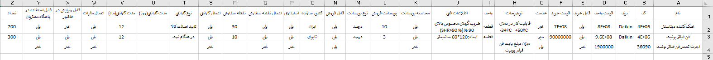
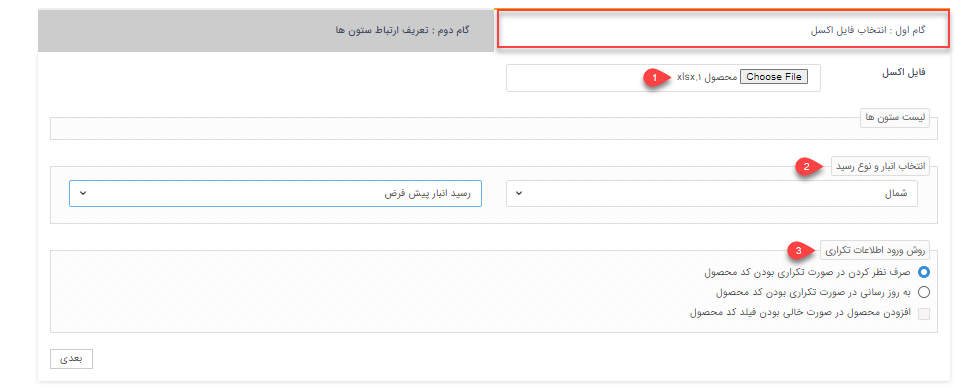
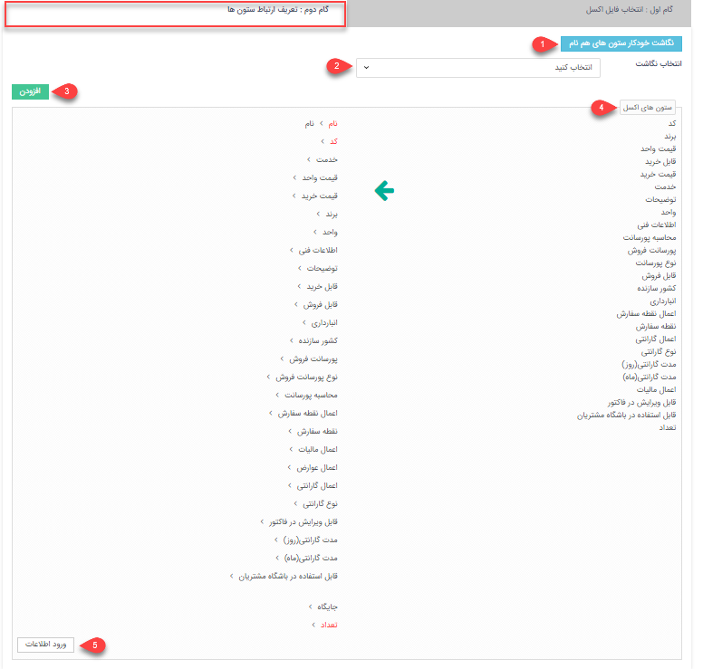

#  بارگذاری محصولات از طریق اکسل
در صورت نیاز به بارگذاری اطلاعات تعدادی از محصولات به صورت یکجا، می‌توانید از روش ورود اکسلی استفاده نمایید. بدین ترتیب می‌توانید اطلاعات محصولات مورد نظر را در اکسل درج کرده (یا از سایر نرم‌افزارهای خود خروجی بگیرید) و سپس در پیام‌گستر بارگذاری کنید. در این حالت محصولات مورد نظر ایجاد شده و اطلاعات آن در فیلدهای مربوطه وارد می‌شود. علاوه بر ایجاد محصول یا خدمت از این روش می‌توانید برای ویرایش محصولات یا خدمات موجود نیز استفاده نمایید. 
برای اینکه بارگذاری محصولات بدون مواجهه با خطا و با موفقیت به اتمام برسد، لازم است که قوانین تهیه و بارگذاری اکسل را رعایت کنید. در این راهنما تمامی موارد لازم برای تنظیم صحیح فایل اکسل، به همراه شیوه بارگذاری آن مطرح شده‌است. بدین منظور در این مقاله به موارد زیر می‌پردازیم: 

- [شیوه تهیه و تنظیم فایل اکسل محصولات](#ProductsExcelSetting)
- [روش بارگذاری فایل اکسل محصولات](#ProductsExcelUpload)
- [مجوز لازم برای بارگذاری اکسل محصولات](#ProductsExcelPermission)

## تنظیمات فایل اکسل{#ContractExcelSetting}
برای بارگذاری و ورود اطلاعات محصولات از طریق اکسل، ابتدا باید اکسل مورد نظر را بر اساس فرمت مورد پذیرش نرم‌افزار تنظیم کنید.  بدین منظور می‌توانید از فایل نمونه استفاده نمایید. فایل نمونه را می‌توانید از سایت **پیام‌گستر** دانلود کنید. 
برای ورود اطلاعات محصولات از طریق اکسل، ابتدا باید اکسل مورد نظر را بر اساس فرمت مورد پذیرش نرم‌افزار تنظیم کنید. بدین منظور می‌توانید اکسلی با ستون‌هایی که در تصویر می‌بینید (فیلدهای آیتم محصولات) ایجاد کنید و یا از فایل نمونه استفاده نمایید. فایل نمونه در مرحله‌ی اول بارگذاری به شما ارائه می‌شود (جلوتر به آن می‌رسیم). 
برای تکمیل فایل اکسل، به موارد زیرتوجه فرمایید:
در تهیه اکسل توجه داشته باشید که تمامی اطلاعات در یک Sheet ذخیره شده باشد. در غیر این صورت بارگذاری اکسل با موفقیت انجام نخواهد شد.
امکان بارگذاری محصولات به دسته‌بندی‌های متفاوت به صورت یکجا (با استفاده از یک اکسل) وجود ندارد.
در صورت استفاده از اکسل نمونه‌ی موجود در سایت،‌ فرمت و کامنت‌های آن را حذف نمایید. بدین منظور جدول را نتخاب کرده و از Clear Comment و Clear Format استفاده نمایید. 
برای ورود اطلاعات محصولات از طریق اکسل، ابتدا باید اکسل مورد نظر را بر اساس فرمت مورد پذیرش نرم‌افزار تنظیم کنید. بدین منظور می‌توانید اکسلی با ستون‌هایی که در تصویر می‌بینید (فیلدهای آیتم محصولات) ایجاد کنید و یا از فایل نمونه استفاده نمایید. فایل نمونه در مرحله‌ی اول بارگذاری به شما ارائه می‌شود (جلوتر به آن می‌رسیم). 

تصویر فوق،‌ ستون‌های مورد نیاز برای بارگذاری محصولات را بر اساس فیلدهای پیش‌فرض نرم‌افزار نشان می‌دهد. چنانچه از فایل نمونه‌ای که نرم‌افزار به شما می‌دهد استفاده می‌کنید، این فیلدها به صورت خودکار در فایل اکسل قرار داده‌می‌شود. 
برای تکمیل اطلاعات مربوط به فیلدهای پیش‌فرض به راهنمایی‌های زیر توجه داشته‌باشید: 
- **نام‌**: نام محصول یا خدمت را در این قسمت وارد می‌کنید.
- **کد**: کد محصول را در این قسمت درج کنید.

> **نکته** 
چنانچه نرام‌افزار به نرم‌افزارهای حسابداری مانند راهکاران یا سپیدار متصل باشد باید کد محصول انتخابی در هر دو نرم‌افزار یکسان باشد. 

- **برند**: یکی از مشخصه‌های محصول، برند محصول است که می‌بایست در این قسمت درج نمایید.
- **قیمت واحد**: قیمت واحد همان قیمت فروش است که در پیش‌فاکتور و فاکتورها به صورت خودکار برای محصول ثبت می‌شود 
- **قابل خرید**: برای تکمیل این ستون از جدول از عبارت "بلی" یا "خیر" استفاده نمایید. با تکمیل این بخش مشخص کنید که این کالا برای کاربران مجاز است یا خیر. چنانچه این گزینه غیر فعال باشد، هنگام صدور فاکتور یا پیش‌فاکتور خرید این کالا به کاربر نمایش داده نمی‌شود.
- **قیمت خرید**: قیمت خرید محصول را در این قسمت وارد کنید. هنگام ثبت فاکتور یا پیش‌فاکتور در صورت انتخاب این محصول، قیمت خرید به صورت خودکار ثبت خواهدشد.
- **توضیحات**: در این بخش می‌توانید توضیحاتی در خصوص محصول مانند مزایای استفاده، نحوه استفاده و ... را ثبت کنید. 
- **واحد** : واحد شمارش کالا را در این بخش مشخص کنید. 

> **نکته** 
چنانچه انبارداری از نوع تعدادی باشد می‌توانبد واحد شمارش را  از طریق مدیریت آیتم‌های سیستم  و واحد شمارش محصول مشخص کنید.

- **اطلاعات فنی**: در این ستون می‌توانید توضیحات فنی مرتبط با محصول مانند ابعاد، میزان مصرف انرزی و .. را مشخص کنید.
- **محاسبه پورسانت**: برای تکمیل این ستون از جدول از عبارت "بلی" یا "خیر" استفاده نمایید، در این حالت مشخص می‌کنید که برای این محصول باید پورسانت لحاظ شود یا خیر. در صورتی که محاسه پورسانت فروش فعال‌باشد می‌بایست میزان و نوع پورسانت را نیز مشخص کنید.
- **پورسانت فروش**: پورسانت فروش براساس نوع سیاست شرکت می‌تواند درصد یا عدد ثابتی درنظر گرفته‌شود. تنها در صورتی که گزینه «بلی» را برای محاسبه پورسانت انتخاب کرده باشید می‌توانید میزان آن را مشخص کنید.
- **نوع پورسانت**: نوع پورسانت می‌تواند رقم یا درصد مشخصی باشد.
- **قابل فروش**: برای تکمیل این ستون از جدول از عبارت "بلی" یا "خیر" استفاده نمایید، در این حالت مشخص می‌کنید که فروش این کالا برای کاربران مجاز است یا خیر. چنانچه این گزینه غیر فعال باشد، هنگام صدور فاکتور یا پیش‌فاکتور فروش این کالا به کاربر نمایش داده‌نمی‌شود.
- **کشور سازنده**:  کشور سازنده و تولید‌کننده این محصول را مشخص نمایید.
- **انبارداری**: برای تکمیل این ستون از جدول از عبارت "بلی" یا "خیر" استفاده نمایید، در این حالت مشخص می‌کنید انبارداری برای محصولات فعال باشد یا خیر. در پیام‌گستر دو نوع انبارداری تعدادی و پیشرفته وجود دارد. چنانچه انبارداری فعال باشد :
  - **انبارداری تعدادی**: در صورتیکه از انبارداری تعدادی استفاده کنید، تعداد کالایی که در هر فاکتور تایید شده وجوددارد از موجودی انبار کسر می‌شود.
  - **انبارداری پیشرفته**:در صورتیکه از انبارداری پیشرفته استفاده کنید، اجازه ورود این کالا را در انبارهای مختلف را خواهید داشت.

> **نکته**
انبارداری تنها برای محصولات قابل دسترسی است و برای خدمات انبارداری وجود نخواهد داشت. 

- **اعمال نقطه سفارش**: نقطه سفارش میزان حداقل موجودی برای سفارش مجدد محصول می‌باشد. برای اعمال نقطه سفارش از عبارت "بلی" یا "خیر" استفاده کنید. با انتخاب گزینه «بلی» ، نقطه سفارش برای محصول فعال خواهد شد.
- **نقطه سفارش**: در صورتیکه اعمال نقطه سفارش فعال باشد میزان سفارش را در این قسمت مشخص می‌کنید. با تعیین نقطه سفارش مشخص می‌کنید هر زمان حداقل موجودی به این میزان مشخص‌شده رسید سفارش گذاری انجام‌شود.
- **اعمال گارانتی**: با انتخاب یکی از عبارت‌های "بلی" یا "خیر" مشخص می‌کنید این محصول شامل گارانتی شود یا خیر. با انتخاب گزینه «بلی» گارانتی برای محصول فعال خواهد شد و در مرحله بعد می‌بایست نوع و مدت گارانتی را تعیین کنید.
- **نوع گارانتی**: در این قسمت می‌بایست مشخص کنید که گارانتی چه زمانی اعمال شود. برای نوع گارانتی باید یکی از گزینه‌های چک‌‌باکس «هنگام ثبت»، «تایید صلاحیت کالا» و یا «هیچکدام» را انتخاب کنید.
- **مدت گارانتی(روز)**: می‌توانید مدت زمان گارانتی را برحسب روز در نظر بگیربد
- **مدت گارانتی(ماه)**: می‌توانید مدت زمان گارانتی را برحسب ماه در نظر بگیرید.
- **اعمال مالیات**: برای تکمیل این ستون از جدول از عبارت "بلی" یا "خیر" استفاده نمایید، در این حالت مشخص می‌کنید که هنگام ثبت فاکتور فروش باید برای این محصول مالیات لحاظ شود یا خیر.
- **قابل ویرایش در فاکتور**:برای تکمیل این ستون از جدول از عبارت "بلی" یا "خیر" استفاده نمایید، در صورت فعال بودن این گزینه این امکان به کاربر داده می‌شود که در فاکتور بتواند نام محصول را اصلاح کنید.
- **قابل استفاده در باشگاه مشتریان**:
برای تکمیل این ستون از جدول از عبارت "بلی" یا "خیر" استفاده نمایید، با فعال کردن این گزینه امکان استفاده از آن را برای مشتریان در باشگاه مشتریان فراهم می‌کند.
- **تعداد**: در صورت استفاده از انبارداری، تعداد محصول موجود در انبار را در این قسمت وارد کنید

## مراحل بارگذاری فایل اکسل{#ProductsExcelUpload}
بارگذاری اکسل محصولات در پیام‌گستر، دو گام اصلی دارد: 
### انتخاب فایل اکسل
برای بارگذاری فایل اکسل از مسیر  **اطلاعات پایه** > **مدیریت محصولات** > **انتخاب دسته‌بندی مشخص**  مورد نظر را انتخاب کنید و وارد صفحه لیست محصولات شوید. بر روی کلید «دریافت اطلاعات» کلیک کنید تا صفحه بارگذاری به شما نمایش داده‌شود. 

> **نکته** 
قبل از ورود به قسمت بارگذاری فایل اکسل می‌بایست زیرگروهی از دسته‌بندی محصولات را که قصد دارید محصولات در آن بارگذاری شود را انتخاب کنید.

 با ورود به صفحه بارگذاری اطلاعات مرتبط با محصولات از طریق اکسل می‌بایست مراحل زیر را تکمیل کنید:
 
 

 - **1. فایل اکسل** : فایلی که در قسمت قبلی تهیه کردید را در این قسمت بارگذاری کنید.
 - **2. انتخاب انبار و نوع رسید**: در صورتی که از انبارداری پیشرفته استفاده می‌کنید، باید نام انیار و نوع رسید انبار برای ورود محصولات به انبار  را انتخاب کنید. با انجام این کار پس از ورود محصولات، سیستم به صورت خودکار در انبار مشخص شده یک رسید ثبت خواهد کرد. تعداد هر محصول (موجودی انبار)  را می‌توانید با یک ستون به نام تعداد در فایل اکسل تعریف کنید.
 - **3. روش ورود اطلاعات تکراری**: این بخش شامل سه چک‌باکس به شرح زیر می‌باشد: 
     - **صرف نظر کردن در صورت تکراری بودن کد محصول**:در صورت فعال بودن این گزینه، چنانچه کد محصولاتی که قصد ورود آنها در نرم‌افزار را دارید تکراری باشند، نرم‌افزار آن محصول را نادیده خواهد گرفت. به عنوان مثال، اگر کالایی با کد 10012 قبلا در سیستم وجود داشته باشد و دوباره در فایل اکسل محصولی جدید با کد 10012 وجود داشته باشد، نرم‌افزار با در نظر گرفتن کد محصول قبلی محصول جدید را وارد می‌کند. 
     - **به روز رسانی در صورت تکراری بودن کد محصول**: در صورت فعال بودن این گزینه، چنانچه یک کد محصول در اکسل تکراری باشد، نرم‌افزار اطلاعات را بر طبق آن بروز می کند. این گزینه برای بروز رسانی لیست قیمت های کالاها بسیار مناسب است.  
    - **افزودن محصول در صورت خالی بودن فیلد کد محصول**: در صورت غیرفعال بودن این گزینه، محصولاتی از فایل اکسل که برای آن ها کد محصول تعریف نکرده‌باشید، در نظر گرفته نخواهند‌شد و فقط محصولات دارای کد در نرم‌افزار وارد خواهند شد. 

>**نکته** 
  در صورتیکه برای محصولات  کد تعریف نشود امکان بروزرسانی اطلاعات آن از طریق فایل اکسل وجود نخواهدداشت زیرا بروزرسانی فقط از روی کد محصول انجام می‌شود.

## تعریف ارتباط ستون‌ها
در این گام باید ستون‌هایی که در اکسل خود دارید را با عناوینی که در نرم افزار پیام گستر موجود است، نگاشت کنید.

**1. نگاشت خودکار ستون های هم نام:** نرم افزار به صورت خودکار ستون‌هایی که با عناوین نرم افزار یکسان باشد را کنار هم قرار می‌دهد. 
**2. انتخاب نگاشت:** اگر قبلا نگاشتی را ذخیره کرده باشید از این لیست می‌توانید آن را انتخاب کنید. 
**3. اضافه کردن:** می‌توانید این نگاشت (ترتیبی که عناوین اکسل شما با عناوین نرم افزار در کنار یکدیگر قرار‌گرفته‌اند) را در نرم افزار ذخیره کنید تا در دفعات بعد نیاز به نگاشت کردن دوباره آنها نباشد. 

>**نکته** 
> توجه داشته باشید که داشتن ستون‌های نام و تعداد (که با رنگ قرمز عنوان آنها متمایز شده) اجباری است. یعنی تمامی محصولات اکسل شما باید این دو مقدار را داشته باشند. اگر قصد بروز رسانی محصولات را داشته باشید ستون کد هم به‌صورت اجباری نمایش داده‌می‌شود .

**4. ستون های اکسل:** باید ستون‌هایی که نیاز دارید را از ستون راستی (که عنوان ستونهای اکسل شما است.) به ستون سمت چپ نگاشت کنید. 
**5. ورود اطلاعات:** با انتخاب این کلید محصولات فایل اکسل وارد نرم‌افزار خواهدشد. 

## مجوز مورد نیاز برای بارگذاری محصولات از طریق اکسل{#ProductsExcelPermission}
برای ثبت محصولات از طریق اکسل کاربر باید مجوز «مدیریت  محصولات» را داشته باشد تا بتواند محصولات و خدمات را بارگذاری کند.