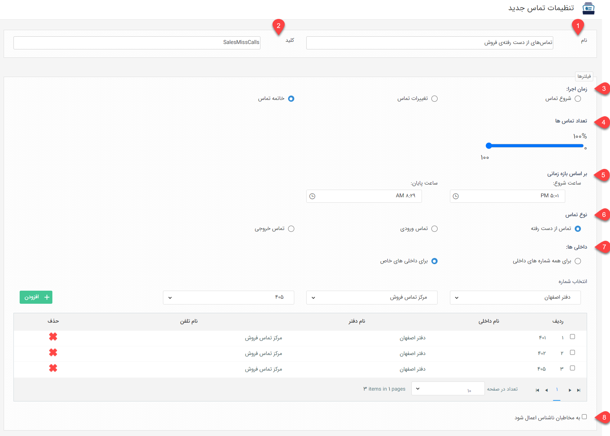
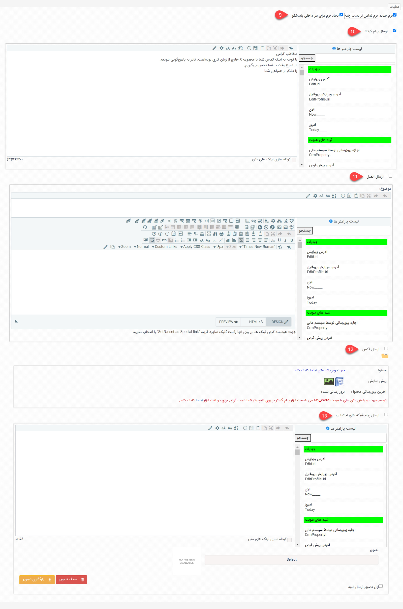

# تنظیم یادآوری تماس

برای افزودن یک رویداد جدید طبق مراحل زیر می توانید اقدام نمایید. 
برای دسترسی به تنظیمات یادآوری تماس، از مسیر **اطلاعات پایه** > **سیستم‌های تلفنی** > **تنظیمات یادآوری تماس‌ها** وارد صفحه لیست تنظیمات شوید و با کلیک بر روی کلید افزودن، یک صفحه جدید برای تعریف تنظیمات باز کنید. در این صفحه در بخش فیلترها، مشخص کنید که می‌خواهید برنامه یادآوری برای چه نوع تماس‌هایی اعمال شود. سپس در بخش عملیات، اقدام مورد نظر برای اجرا را مشخص و تنظیمات لازم آن را اعمال نمایید. در ادامه‌، به معرفی هر یک از تنظیمات این بخش‌ها می‌پردازیم. 

## تنظیم عنوان
با توجه به اینکه شما ممکن است برای یادآوری تماس‌های خود برنامه‌های مختلفی تنظیم کنید، لازم است که برای هر برنامه عنوانی در بگیرید. 
1. برای برنامه‌ی اجرایی خود یک نام مشخص کنید. نام برنامه باید گویای محتوای آن باشد تا در لیست برنامه‌ها قابل شناسایی باشد.
2. برای برنامه یک کلید تعریف کنید. این کلید با کلید سایر برنامه‌ها متفاوت باشد و از حروف انگلیسی و عدد تشکیل شده‌باشد. در صورت نیاز به استفاده از وب‌سرویس، این کلید معرف برنامه‌ی شما خواهدبود. 

## تنظیم فیلترها{#CallReminderTime}
برای تعریف برنامه، ابتدا لازم است که شروط اجرای برنامه را مشخص کنید. به عبارت دیگر در این بخش باید تعیین کنید که برنامه (عملیات) مورد نظر چه زمانی اجرا شود. برای تعریف شروط یا به عبارت دیگر زمان اجرای برنامه باید به سوالات زیر پاسخ دهید: 
- برای تماس‌های ورودی، خروجی و یا از دست رفته می‌خواهید برنامه تعریف کنید؟
- تماس‌های کل روز مد نظرتان است یا فقط تماس‌هایی که در یک بازه‌ی زمانی مشخص برقرار می‌شوند؟
- این برنامه برای تماس‌های کل داخلی‌ها اجرا شود یا برخی داخلی‌ها؟
- عملیات هنگام شروع تماس اجرا شود یا پس از اتمام آن؟ یا حتی قصد اجرای برنامه در هر تغییر وضعیت را دارید؟ 
در این بخش باید بر اساس پاسخ به سوال‌های فوق، تنظیمات خود را اعمال نمایید. 
3. زمان اجرا را مشخص کنید. از بین گزینه‌های «شروع تماس»، «تغییرات تماس» و «خاتمه‌ی تماس» یک گزینه را به عنوان زمان اجرای برنامه انتخاب کنید. بر این اساس مشخص می‌شود که عملیات چه زمانی نسبت به تماس آغاز شود. لازم به ذکر است که منظور از تغییرات تماس، هر نوع تغییر در وضعیت (status) تماس را شامل می‌شود. اقداماتی مثل انتقال تماس به داخلی دیگر یا گذاشتن آن بر روی حالت انتظار می‌تواند از مثال‌های رایجی باشد که وضعیت تماس را تغییر می‌دهد. 
4. تعداد تماس‌ها را می‌توانید از این بخش کنترل کنید. در حالت پیش‌فرض، عملیات تنظیم شده برای تمامی (۱۰۰٪) تماس‌ها اجرا می‌شود. در صورت نیاز می‌توانید با کاهش درصد، تعداد عملیات اجرایی را کاهش دهید. به عنوان مثال  انتخاب کنید که برای نیمی از تماس‌های از دست‌رفته پیامک ارسال شود. 
5. در این بخش می‌توانید بازه‌ی زمانی مورد نظر برای اجرای عملیات را محدود کنید. به عبارت دیگر می‌توانید مشخص کنید که این عملیات صرفاً برای تماس‌های ورودی/خروجی/از دست‌رفته (بنابر تنظیمات) در یک بازه‌ی زمانی مشخص اجرا شود. به عنوان مثال با انتخاب ۱۷:۰۰ (ساعت شروع) تا ۸:۳۰ (ساعت پایان) مشخص می‌کنید که پیامک فقط برای تماس‌های از دست‌رفته که در خارج ساعت کاری دریافت شده‌اند ارسال شود. در این حالت چنانچه در ساعات کاری یعنی ۸:۳۱ تا ۱۶:۵۹ تماس از دست‌رفته‌ای داشته‌باشید، پیامکی برای آن ارسال نمی‌شود. در صورت خالی بودن ساعت شروع و پایان، برنامه تماس‌‌های کل روز را شامل می‌شود. 
6. مشخص کنید که برنامه برای چه نوع تماسی اجرا شود. برای اجرای برنامه برای تماس‌هایی که کاربرانتان برقرار می‌کنند «تماس‌ خروجی»، برای تماس‌های موفقی که با سازمانتان انجام می‌شود (تماس‌هایی که پاسخگوی آنان بودید)، «تماس‌ ورودی» و برای تماس‌هایی که قادر به پاسخگویی آن‌ها نبودید گزینه «تماس از دست‌رفته» را انتخاب کنید. توجه داشته‌باشید که در صورت انتخاب تماس‌های از دست‌رفته،‌ زمان اجرا را بر روی حالت خاتمه تماس تنظیم نمایید. 
7. در بخش داخلی‌ها مشخص کنید که برنامه برای تماس‌های ورودی/خروجی/از دست رفته‌ی تمامی داخلی‌ها اجرا شود یا قصد اجرای آن برای تعدادی از داخلی‌ها را دارید. در صورت انتخاب گزینه‌ی «برای داخلی‌های خاص»، بخش انتخاب شماره برایتان فعال شده و می‌‌توانید مشخص کنید که کدام داخلی‌ها مشمول برنامه‌ی اجرایی باشند. برای انتخاب داخلی‌ها کافیست که ابتدا شعبه و سپس سیستم تلفنی و داخلی مورد نظر را انتخاب و به جدول اضافه نمایید. به همین ترتیب تمامی داخلی‌های مورد را به جدول اضافه نمایید. 
8. به صورت پیش‌فرض، برنامه‌های یادآوری تماس صرفاً برای افرادی که هویتشان در نرم‌افزار ثبت شده‌باشد اجرا می‌شود. چنانچه قصد اجرای برنامه برای تمامی افراد شناس و ناشناس، گزینه‌ی «به مخاطبان ناشناس اعمال شود» را فعال نمایید. بر این اساس چنانچه شماره‌ی مورد نظر در اطلاعات هویتی در نرم‌افزار ثبت نشده‌باشد (ناشناس باشد)، به صورت خودکار یک هویت برای او ایجاد شده و سپس عملیات مورد نظر برای وی اجرا می‌گردد. توجه داشته‌باشید که در صورت فعال کردن این گزینه، تنظیمات نرم‌افزار برای ایجاد هویت ناشناس فعال باشد. در واقع در بخش تنظیمات کلی، مخاطب ناشناس، ثبت هویت برای تماس‌گیرنده باید فعال باشد و تنظیمات آن از جمله انتخاب زیرنوع هویت و دسته‌بندی بانک اطلاعاتی تکمیل شده‌باشد.  

## تنظیم عملیات{#CallReminderAction}
حال که شرایط و زمان اجرای برنامه را مشخص کردید، وقت آن است که بگویید هنگام برقراری شرط‌های فوق، چه عملیاتی اجرا شود. شما می‌توانید از بین ایجاد فرم، ارسال پیام کوتاه، ارسال ایمیل، ارسال فکس و یا ارسال پیام در شبکه‌های اجتماعی یک یا چند اقدام را برای اجرا انتخاب نمایید. 

 

9. با فعال کردن گزینه‌ی فرم جدید، هنگام برقراری تماس با شرایطی که در بخش فیلترها مشخص کرده‌اید یک فرم جدید در نرم‌افزار ثبت می‌شود. در صورت انتخاب این عملیات، از لیست کناری فرمی که قصد دارید در این برنامه ایجاد شود را مشخص نمایید (این فرم را باید پیش‌تر در بخش شخصی‌سازی ایجاد کرده‌باشید). فرم مذکور مرتبط با هویت تماس‌گیرنده/شخصی که با او تماس گرفته شده در سامانه ثبت می‌شود. لازم به ذکر است که از آنجا که فرم به صورت خودکار توسط نرم‌افزار ثبت می‌شود، ایجادکننده‌ی آن سیستم در نظر گرفته می‌شود. لکن با فعال‌سازی گزینه‌ی «ایجاد فرم برای هر داخلی پاسخگو» می‌توانید کاربر داخلی‌ای که تماس با وی برقرار شده (تماس دریافتی/خروجی/از دست رفته)،‌ به عنوان ایجاد‌کننده‌ی فرم در نظر گرفته‌شود. این موضوع می‌تواند در پیاده‌سازی فرآیند، تهیه گزارش و یا فیلتر فرم‌ها برای شما کاربردهای فراوانی داشته‌باشد. 
10. با فعال‌سازی گزینه‌ی ارسال پیام کوتاه، هنگام برقراری تماس با شرایطی که در بخش فیلترها مشخص کرده‌اید یک پیامک برای هویت مرتبط (شخص تماس‌گیرنده یا کسی که کاربران شما با وی تماس گرفته‌اند) ارسال می‌شود. بدین منظور کافیست که گزینه‌ی «ارسال پیام کوتاه» را فعال و متن پیام خود را در قسمت مربوطه تنظیم نمایید. برای شخصی‌سازی پیام‌های خود از پارامترهای هوشمند نیز می‌توانید استفاده کنید. در صورت عدم آشنایی کافی با این پارامترها از [راهنمای استفاده از پارامترهای هوشمند](https://github.com/1stco/PayamGostarDocs/blob/master/Help/Marketing/Parameters/MessageParameters.md) استفاده کنید. به خاطر داشته‌باشید که در صورت درج لینک در متن پیام خود، با فعال‌سازی گزینه‌ «کوتاه‌سازی لینک‌های متن» لینک‌ها را به صورت کوتاه شده برای مخاطبان خود ارسال نمایید. 
11. با فعال‌سازی گزینه‌ی ارسال ایمیل، هنگام برقراری تماس با شرایطی که در بخش فیلترها مشخص کرده‌اید یک ایمیل برای هویت مرتبط (شخص تماس‌گیرنده یا کسی که کاربران شما با وی تماس گرفته‌اند) ارسال می‌شود. بدین منظور کافیست که گزینه‌ی «ارسال ایمیل» را فعال و متن پیام خود را در قسمت مربوطه تنظیم نمایید. در تنظیم ایمیل نیز مشابه پیام می‌توانید از پارامترهای هوشمند استفاده نمایید.  به خاطر داشته‌باشید که در بخش موضوع، عنوان ایمیل خود را نیز مشخص نمایید تا در صندوق پستی مخاطبانتان قابل شناسایی باشد. 
12. با فعال‌سازی گزینه‌ی ارسال فکس، هنگام برقراری تماس با شرایطی که در بخش فیلترها مشخص کرده‌اید یک فکس برای هویت مرتبط (شخص تماس‌گیرنده یا کسی که کاربران شما با وی تماس گرفته‌اند) ارسال می‌شود. بدین منظور کافیست که گزینه «ارسال فکس» را فعال کرده و قالب فکس خود را بارگذاری نمایید. در صورت نیاز می‌توانید از [راهنمای تنظیم قالب چاپ](https://github.com/1stco/PayamGostarDocs/blob/master/Help/Settings/Personalization-crm/CustomizationCommonSettings/PrintTemplateSetting.md) برای این کار کمک بگیرید.  
13. با فعال‌سازی گزینه‌ی ارسال پیام شبکه اجتماعی، هنگام برقراری تماس با شرایطی که در بخش فیلترها مشخص کرده‌اید یک پیام در شبکه‌ی اجتماعی برای هویت مرتبط (شخص تماس‌گیرنده یا کسی که کاربران شما با وی تماس گرفته‌اند) ارسال می‌شود. مشابه عملیات‌های قبلی گزینه «ارسال پیام شبکه‌های اجتماعی» را فعال و متن پیام خود را در قسمت مربوطه تنظیم نمایید. در این حالت می‌توانید یک تصویر را هم همراه پیام خود ارسال نمایید. بدین منظور از سمت راست صفحه تصویر مورد نظر خود را انتخاب و سپس با کلیک بر روی کلید «بارگذاری تصویر» که در سمت چپ صفحه می‌بینید آن را بارگذاری نمایید. 

