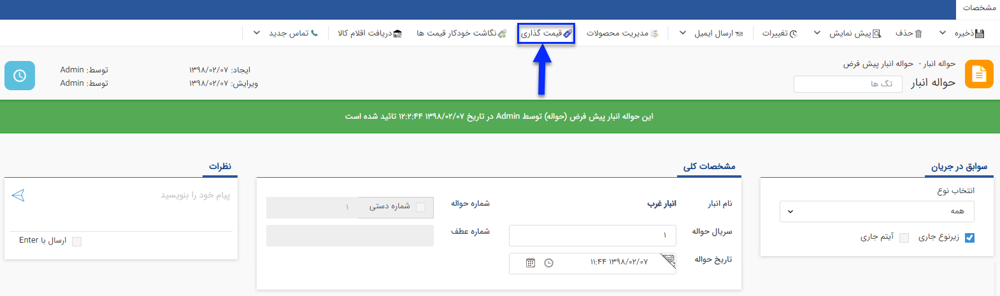

# قیمت گذاری حواله انبار

برای خارج کردن کالا از انبار از این حواله استفاده میشود.

**قیمت گذاری:** از روی میانگین قیمت رسیدهایی که تا کنون ثبت شده است (رسیدهای شامل محصولات این حواله) محاسبه می شود.

به طور مثال اگر خودکار فابرکاستل آبی از طریق 2 رسید انبار وارد شده باشد و در یک رسید 5 خودکار با قیمت 10000 ریال وارد شده باشد و در رسید دوم 15 خودکار با قیمت 20000 ریال وارد شده باشد، فی میانگین به صورت زیر محاسبه خواهد شد:

	فی میانگین = (5*10000+ 15*20000)/20= 17500

**A. دکمه قیمت گذاری:** پس از قیمت گذاری برای تمام ردیف های کالا، با کلیک بر روی این علامت قیمت گذاری روی حواله انجام میشود.

پس از انجام قیمت گذاری، می توانید با استفاده از دکمه لغو قیمت گذاری، تراکنش را به حالت قیمت گذاری نشده برگردانید.

# قیمت گذاری

تمامی حواله ها و رسید ها پس از تایید به کارتابل کاربر یا کاربرانی که مجوز قیمت گذاری رسید/حواله در انبار مربوطه به آنها داده شده می روند تا عملیات قیمت گذاری بر روی آنها انجام شود. برای ویرایش مجوز قیمت گذاری کاربران در انبارها به قسمت مدیریت مجوزهای انبار در [مدیریت انبارها ](https://github.com/1stco/PayamGostarDocs/blob/master/Help/Settings/Warehouse-management/Warehouse-management.md)مراجعه کنید.

**با دوبار کلیک روی هر سطر می توان قیمت گذاری را انجام داد.**

> نکته: کاربری که مجوز قیمت گذاری تراکنش ها را داشته باشد  علاوه بر کارتابل در انتظار قیمت گذاری از قسمت خرید فروش انبار در لیست تراکنش های انبار مورد نظر  هم می تواند تراکنش مورد نظر را قیمت گذاری کند .

 توجه داشته باشید که قیمت گذاری اقلام کالا ارتباطی با قیمت فروش به مشتری ندارد و صرفاً برای در اختیار داشتن موجودی ریالی کالاها در انبار و انجام عملیات انبارگردانی این کار انجام میشود. زمان ورود کالا به انبار(صدور رسید) قیمت گذاری باید توسط شما به صورت دستی یا از روی فاکتور خرید یا  اگر رسید مرجوعی بود از حواله فروش انجام شود، اما هنگام خروج کالا از انبار (صدور حواله) قیمت گذاری بر اساس فی میانگین هر کالا انجام می شود و نمی توانید آن را به صورت دستی انجام دهید.

**قیمت گذاری‌ها انواع تراکنش های انبار به صورت زیر است:**

**رسید موجودی اولیه:** باید  بصورت دستی قیمت گذاری  شود.

**رسید انبار:** قیمت گذاری بصورت دستی و یا از روی فاکتور خرید انجام می شود .

**رسید مرجوعی:** قیمت گذاری  بصورت دستی یا از روی حواله انجام می شود.

**حواله انبار:**  قیمت گذاری از روی میانگین قیمت های وارد شده در رسیدهای انبار انجام می شود. 

**حواله فروش:**  قیمت گذاری از روی میانگین قیمت های وارد شده در رسیدهای انبار انجام می شود. 

**حواله مرجوعی:**  قیمت گذاری از روی میانگین قیمت های وارد شده در رسیدهای انبار انجام می شود. 

**رسید انتقالی:** قیمت گذاری به صورت دستی یا از روی حواله انتقالی انجام می شود.

**حواله انتقالی:**  قیمت گذاری از روی میانگین قیمت های وارد شده در رسیدهای انبار انجام می شود.

# قیمت گذاری حواله مرجوعی

برای بازگرداندن کالاهایی که قبلا در انبار وارد شده اند(رسید خورده اند) به تامین کننده، از این حواله استفاده میشود.

**قیمت گذاری:**  از آنجایی که حواله مرجوعی در صورت مرجوع کردن کالاهای وارد شده (رسید شده) به انبار استفاده می شود، می توان مشخص کرد که هرکدام از محصولات حواله مرتبط با کدام رسید انبار می باشد. برای قیمت گذاری باید ابتدا تمام محصولات را به یکی از رسیدهای انبار شامل این محصول متصل کنید.

**1. اتصال به رسید:** می توانید انتخاب کنید که تعداد موجود در این حواله مرجوعی مرتبط با کدام رسید ها است.

**2. دکمه قیمت گذاری:** پس از قیمت گذاری برای تمام ردیف های کالا، با کلیک بر روی این علامت قیمت گذاری روی حواله انجام میشود.

> نکته: توجه داشته باشید تا زمانی که تمامی ردیف های کالا به رسیدهای انبار متصل نشوند، امکان قیمت گذاری حواله مرجوعی وجود ندارد.

پس از انجام قیمت گذاری، می توانید با استفاده از دکمه لغو قیمت گذاری، تراکنش را به حالت قیمت گذاری نشده برگردانید.

# قیمت گذاری

تمامی حواله ها و رسید ها پس از تایید به کارتابل کاربر یا کاربرانی که مجوز قیمت گذاری رسید/حواله در انبار مربوطه به آنها داده شده می روند تا عملیات قیمت گذاری بر روی آنها انجام شود. برای ویرایش مجوز قیمت گذاری کاربران در انبارها به قسمت مدیریت مجوزهای انبار در [مدیریت انبارها ](https://github.com/1stco/PayamGostarDocs/blob/master/Help/Settings/Warehouse-management/Warehouse-management.md)مراجعه کنید.

**با دوبار کلیک روی هر سطر می توان قیمت گذاری را انجام داد.**

> نکته: کاربری که مجوز قیمت گذاری تراکنش ها را داشته باشد  علاوه بر کارتابل در انتظار قیمت گذاری از قسمت خرید فروش انبار در لیست تراکنش های انبار مورد نظر  هم می تواند تراکنش مورد نظر را قیمت گذاری کند .

 توجه داشته باشید که قیمت گذاری اقلام کالا ارتباطی با قیمت فروش به مشتری ندارد و صرفاً برای در اختیار داشتن موجودی ریالی کالاها در انبار و انجام عملیات انبارگردانی این کار انجام میشود. زمان ورود کالا به انبار(صدور رسید) قیمت گذاری باید توسط شما به صورت دستی یا از روی فاکتور خرید یا  اگر رسید مرجوعی بود از حواله فروش انجام شود، اما هنگام خروج کالا از انبار (صدور حواله) قیمت گذاری بر اساس فی میانگین هر کالا انجام می شود و نمی توانید آن را به صورت دستی انجام دهید.

**قیمت گذاری‌ها انواع تراکنش های انبار به صورت زیر است:**

**رسید موجودی اولیه:** باید  بصورت دستی قیمت گذاری  شود.

**رسید انبار:** قیمت گذاری بصورت دستی و یا از روی فاکتور خرید انجام می شود .

**رسید مرجوعی:** قیمت گذاری  بصورت دستی یا از روی حواله انجام می شود.

**حواله انبار:**  قیمت گذاری از روی میانگین قیمت های وارد شده در رسیدهای انبار انجام می شود. 

**حواله فروش:**  قیمت گذاری از روی میانگین قیمت های وارد شده در رسیدهای انبار انجام می شود. 

**حواله مرجوعی:**  قیمت گذاری از روی میانگین قیمت های وارد شده در رسیدهای انبار انجام می شود. 

**رسید انتقالی:** قیمت گذاری به صورت دستی یا از روی حواله انتقالی انجام می شود.

**حواله انتقالی:**  قیمت گذاری از روی میانگین قیمت های وارد شده در رسیدهای انبار انجام می شود.

# قیمت گذاری و اتصال حواله فروش

برای خارج کردن کالایی که فروش رفته از این نوع حواله استفاده می شود.

**قیمت گذاری:** از روی میانگین قیمت رسیدهایی که تا کنون برای محصولات این حواله ثبت شده است محاسبه می شود.

به طور مثال اگر خودکار فابرکاستل آبی از طریق 2 رسید انبار وارد شده باشد و در یک رسید 5 خودکار با قیمت 10000 ریال وارد شده باشد و در رسید دوم 15 خودکار با قیمت 20000 ریال وارد شده باشد، فی میانگین به صورت زیر محاسبه خواهد شد:

	فی میانگین = (5*10000+ 15*20000)/20= 17500 

**1.** با استفاده از کلید قیمت گذاری حواله فروش قیمت گذاری می شود.

پس از انجام قیمت گذاری، می توانید با استفاده از دکمه لغو قیمت گذاری، تراکنش را به حالت قیمت گذاری نشده برگردانید.

**اتصال:** از آنجایی که حواله فروش در صورت خارج کردن محصولات به فروش رفته از انبار استفاده می شود، می توان مشخص کرد که هرکدام از محصولات حواله مرتبط با کدام فاکتور فروش می باشد. این اتصال در [گزارشات افتراق ](https://github.com/1stco/PayamGostarDocs/blob/master/Help/Management-and-reports/Sales-reports/Differentiation-reports/Differentiation-reports.md) نرم افزار تاثیر گذار است. 

**2. اتصال به فاکتور فروش:** می توانید تعیین کنید که کالاهای این حواله فروش مرتبط با کدام فاکتورهای فروش می شود.

> نکته: یک حواله می تواند برای چند فاکتور مختلف باشد.(یعنی محصولات موجود در حواله مربوط به فاکتور فروش های مختلف باشد ، برای مثال اگر محصول خودکار در حواله مقدار 10 باشد می تواند 5 خودکار مربوط به یک فاکتور فروش و 5 تای دیگر مربوط به فاکتور فروش دیگر باشد)

ابتدا مشخص کنید که چه تعداد از کالا مرتبط با کدام فاکتور فروش می باشد و در انتها روی دکمه تایید کلیک کنید.

