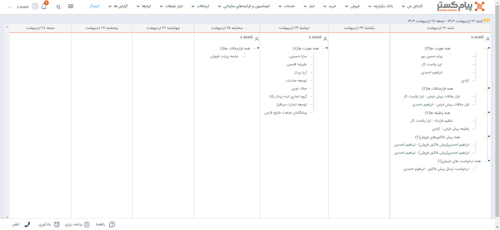

# تقویم عملیاتی

این تقویم نشان‌دهنده کلیه سوابق و فعالیت‌هایی است که کاربر و کاربران زیرمجموعه‌اش در طول یک روز خاص ایجاد کرده و یا بر روی آن ویرایشی انجام داده‌اند. به عبارت دیگر، در تقویم عملیاتی می‌توانید هویت‌ها و اسنادی که در یک هفته اخیر توسط شما یا کابران زیرمجموعه‌تان ثبت و یا ویرایش شده باشد را مشاهده کنید. 

> **نکته** 
> کاربران زیرمجموعه بر اساس چارت سازمانی و حکم پرسنلی کاربران مشخص می‌شود.به عبارت دیگر، منظور از زیرمجموعه شما کاربرانی است که سمت آن‌ها، در چارت سازمانی، زیرمجموعه سمت شما تعریف شده‌باشد. 

بر اساس آنچه گفته شد، تقویم عملیاتی دو کاربرد اصلی دارد: 
- یافتن سابقه‌ای که اخیراً ثبت شده‌است. مثلاً پیدا کردن یک هویت که ساعاتی قبل آن را ثبت کرده‌اید و نام آن را به خاطر ندارید.
- مشاهده هویت‌ها و اسنادی که کاربران زیر مجموعه‌تان ثبت یا ویرایش کرده‌اند. 

با دوبار کلیک (دبل کلیک) بر روی هر رکورد تقویم،آیتم مورد نظر باز شده و می‌توانید آن را بررسی نمایید. 

> **نکته** 
> تقویم عملیاتی کاربرانی که سمت‌های زیرمجموعه‌ی شما به آن‌ها اختصاص داده شده‌است را می‌توانید از قسمت  گزارشات [ تقویم عملیاتی کاربران ](https://github.com/1stco/PayamGostarDocs/blob/master/Help/Management-and-reports/Functional-reports/User-Operating-Calendar/User-Operating-Calendar.md)نیز مشاهده کنید.

