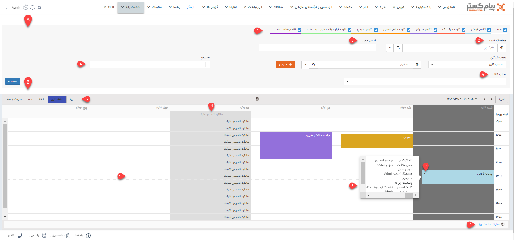

# تقویم کاری 
در این قسمت، تقویم‌هایی که مجوز خواندن آن‌ها را دارید و همچنین لیست قرارملاقات‌هایی که در این تقویم‌ها برای شما تنظیم شده‌است یا دسترسی دیدن آن‌ها را دارید، مشاهده خواهید کرد. این قرارملاقات‌ها ممکن است توسط شما، سایر کاربران و یا حتی چرخه‌های کاری (به صورت خودکار از طریق فرآیند) ایجاد شده‌باشند. این تقویم‌ها با رنگ‌های مختلف امکان تفکیک قرارملاقات‌های هر تقویم را به شما می‌دهد. 

## A. فیلترهای تقویم کاری
برای استفاده از تقویم کاری، ابتدا لازم است که با بخش‌های مختلف فیلتر‌های آن آشنا شوید: 
**۱. لیست تقویم‌ها:** در این قسمت می‌توانید لیست تقویم‌هایی که به آن‌ها دسترسی دارید را مشاهده و انتخاب کنید. برای مشاهده قرارملاقات‌های تنظیم شده در هر تقویم، لازم است که چک‌باکس را فعال نمایید. چنانچه تعداد تقویم‌هایی که کاربرمجوز مشاهده آن‌ها را دارد، کمتر از ۵ باشد، تمام تقویم‌ها به هنگام ورود به تقویم کاری، فعال خواهد بود. لکن اگر به بیشتر از ۵ تقویم دسترسی داشته‌باشید، به طور پیش‌فرض همه‌ی آن‌ها غیرفعال بوده و شما باید به صورت دستی تقویم(های) مورد نیاز خود را انتخاب نمایید. 
توجه داشته‌باشید که در این بخش فقط تقویم‌هایی را می‌بینید که مجوز "خواندن" یا "خواندن و نوشتن" در آن‌ها به شما داده‌ شده‌باشد. 

> **راهنمای مدیر سیستم** 
> برای ایجاد تقویم‌های مختلف و تنظیم دسترسی کاربران به آن‌ها به قسمت[ مدیریت تقویم‌ها ](https://github.com/1stco/PayamGostarDocs/blob/master/Help/Basic-Information/Calendar-management/Calendar-management.md)مراجعه کنید. 

**۲. هماهنگ‌‌کننده:** 
نام هماهنگ‌کننده قرارملاقات را در این قسمت انتخاب کنید. فیلد هماهنگ‌کننده درقرارملاقات، به صورت پیش‌فرض کاربر ثبت‌کننده در نظر گرفته می‌شود. اما می‌توان آن را به صورت دستی تغییر داد. در واقع با استفاده از این فیلتر می‌توانید تمامی قرارملاقات‌هایی که هماهنگ‌کننده آن یک کاربر مشخص است را پیدا کنید. 

**۳. آدرس محل:** چنانچه قصد مشاهده قرارملاقات‌هایی را دارید که محل برگزاری آن‌ها یک مکان خاص است، از این فیلتر استفاده نمایید. فیلد آدرس محل در آیتم قرارملاقات ممکن است با آدرس مشتری یا آدرس دیگری پر شده‌باشد. 

**۴. دعو‌ت‌شدگان:** یکی از کارآمدترین فیلترهای تقویم، فیلتر مدعوین جلسه است. با استفاده از این فیلتر می‌توانید دعوت‌شدگان جلسه را از بین کاربران، مشتری‌ها یا هر نوع اطلاعات تماسی که به هنگام مدعو کردن وی در قرارملاقات استفاده کرده‌اید، انتخاب و قرارملاقات‌هایی که این افراد در آن مدعو هستند را انتخاب نمایید.  
برای این کار کافیست نوع دعوت‌شدگان را از بین گزینه‌های کاربر، مشتری و اطلاعات تماس انتخاب نمایید و سپس فرد مورد نظر را از فیلد مقابل انتخاب و اضافه نمایید. در این حالت نام هویت‌های اضافه‌شده را می‌توانید در فیلد «جستجو» مشاهده و در صورت نیاز حذف نمایید. توجه داشته باشید که می‌توانید بیش از یک مدعو را برای جستجو در نظر بگیرید ( به طور مثال برای نمایش قرار ملاقات‌هایی که دو کاربر مشخص در آن حضور دارند یا قرارهایی که یک کاربر و یک مخاطب مشخص در آن دعوت هستند). 

**۵. محل قرارملاقات:** با استفاده از این فیلتر می‌توانید براساس محل قرارملاقات انتخاب شده، جستجو انجام دهید . با توجه به اینکه فیلد «محل قرارملاقات» در آیتم قرارلاقات می‌تواند با گزینه‌های محل مشتری، شرکت، سایر موارد و یا گزینه‌های اضافه‌شده به لیست انتخاب شده باشد، شما در تقویم نیز می‌توانید یکی از این گزینه‌ها را برای جستجوی قرارملاقات مورد نظر انتخاب نمایید. به عنوان مثال نمایش قرارملاقات‌هایی که محل برگزاری آن‌ها، اتاق مدیریت انتخاب شده‌است. 

> **نکته** 
> در فیلتر کردن قرارملاقات‌ها بر اساس مدعوین، اگر نوع دعوت‌شدگان (کاربر، مشتری و اطلاعات تماس) در فیلتر اعمال شده یکسان باشد (به عنوان مثال دو یا چند کاربر را انتخاب و در فیلد جستجو اضافه کرده‌باشید)، حتی اگر یکی از هویت‌های انتخابی در یک قرارملاقات دعوت شده باشند، آن قرارملاقات در نتیجه‌ی جستجو به شما نمایش داده‌می‌شود. 
اگر نوع دعوت‌شدگان در فیلتر انتخابی متفاوت باشد (به عنوان مثال دو کاربر و سه مشتر مشتری انتخاب و در فیلد جستجو اضافه شده باشد)، قرارملاقاتی به شما نمایش داده می‌شود که حداقل یک هویت از هر نوع در آن قرار قرارملاقات دعوت شده‌باشد (در مثال فوق حداقل یکی از کاربران و یکی از مشتریان انتخابی در آن قرارملاقات دعوت باشد). 

پس از اینکه فیلتر‌های مورد نظر را وارد کردید، بر روی کلید «جستجو» کلیک کنید. 

## B. قرارملاقات‌های تنظیم شده در تقویم کاری
قرارملاقات‌های شما، بر اساس فیلتری که در قسمت بالا (A) اعمال کرده‌اید، در قسمت پایین (B) به شما نمایش داده‌می‌شود. در تقویم نمایش داده شده، روز جاری (روزی که در آن قرار دارید) با رنگ طوسی مشخص می‌شود. برای متناسب‌سازی تقویم با نیازهای خود از راهنمایی‌های زیر استفاده کنید: 

**۶. نوع نمایش تقویم:** در صورت نیاز می‌توانید حالت نمایش تقویم را تغییر دهید.  
- روز: هر صفحه تقویم صرفاً یک روز و قرارملاقات‌های تنظیم شده در آن را نمایش می‌دهد.
- هفته کاری: هر صفحه یک هفته‌ی کاری شامل روزهای شنبه تا پنج‌شنبه را نمایش می‌دهد.
- هفته: هر صفحه یک هفته‌ی کامل شامل شنبه تا جمعه را نمایش می‌دهد.
- صورت جلسه: در این حالت صرفاً لیست قرارملاقات‌ّای یک هفته‌ی پیش رو به شما نمایش داده‌می‌شود. 
با استفاده از کلیدهای سمت راست می‌توانید تقویم را به صفحه بعد/قبل انتقال دهید و یا آن را به روز جاری (امروز) بازگردانید. 

**۷. نمایش ساعات روز/کاری:** با استفاده از این دکمه می‌توانید بازه ساعات نمایش داده شده در تقویم را تغییر دهید. با انتخاب حالت ساعت کاری، تقویم ساعات ۹ صبح تا ۵ بعدازظهر را نمایش می‌دهد. در صورت انتخاب حالت ساعات روز، تقویم به صورت ۲۴ ساعته به شما نمایش داده‌می‌شود. 

**۸. جزئیات قرارملاقات:** با نگه داشتن نشانگر بر روی هر کدام از قرارملاقات‌ها می‌توانید خلاصه‌ای از جزییات آن را مشاهده کنید. با دوبار کلیک بر روی هر قرارملاقات صفحه جزییات آن برای شما باز می‌شود. 

**۹. حذف قرارملاقات:** با استفاده از ضربدر کنار هر قرارملاقات می‌توانید آن را حذف کنید. برای مشاهده این آیکون کافیست نشانگر را بر روی آن قرارملاقات قرار دهید. توجه داشته‌باشید که برای حذف این قرارملاقات باید مجوز حذف آن زیرنوع قرارملاقات را داشته‌باشید. 

**۱۰. تنظیم قرارملاقات:** با دو بار کلیک کردن بر روی هر بخش خالی تقویم می‌توانید در آن روز و باز زمانی، قرارملاقات تنظیم کنید. برای آگاهی از نحوه‌ی تنظیم قرارملاقات می‌توانید از راهنمای [ثبت قرارملاقات جدید]() استفاده کنید. توجه داشته‌باشید که برای ثبت قرارملاقات، علاوه بر مجوز «خواندن و نوشتن» در تقویم مورد نظر، باید مجوز «ذخیره اولیه» آن زیرنوع قرارملاقات را نیز داشته‌باشد. 
علاوه بر آن با کشیدن قرارملاقات (Drag & drop) می‌توانید آن را به روز یا ساعت دیگری انتقال دهید. البته برای این کار نیز علاوه بر مجوز «خواندن و نوشتن» در تقویم مورد نظر، به مجوز «ویرایش» آن زیرنوع قرارملاقات نیاز دارید. 

**۱۱. مناسبت‌ها:** چنانچه عید و یا مناسبتی در سیستم به عنوان روز تعطیل تعریف شده‌باشد (این مناسبت‌ها ممکن است مناسبت‌های رسمی کشور و یا مختص به شرکت شما باشد)، بدین شکل در تقویم به شما نمایش داده‌می‌شود. 

> **راهنمای مدیر سیستم** 
> برای تنظیم مناسبت‌ها می‌توانید از راهنمای [مدیریت اعیاد و مناسبت‌ها ](https://github.com/1stco/PayamGostarDocs/blob/master/Help/Basic-Information/Holiday-management-and-occasions/Holiday-management-and-occasions.md) استفاده کنید. 

در صورتی که شما مجوز «خواندن و نوشتن» در یک تقویم را داشته‌باشید می‌توانید برای خود یا سایر کاربران قرارملاقات تنظیم نماید و تمامی‌ قرارملاقات‌های تنظیم شده روی آن تقویم را مشاهده کنید. اما برای مشاهده کامل یک قرارملاقات (اینکه قرارملاقات را باز کنید و مشاهده نمایید) به مجوز «مشاهده آیتم» بر روی آن زیرنوع قرارملاقات نیاز دارید. در صورتی که در دسترسی به قرارملاقات‌هایتان دچار مشکل هستید، آن را با مدیر سیستم (ادمین) نرم‌افزار خود در میان بگذارید. 
