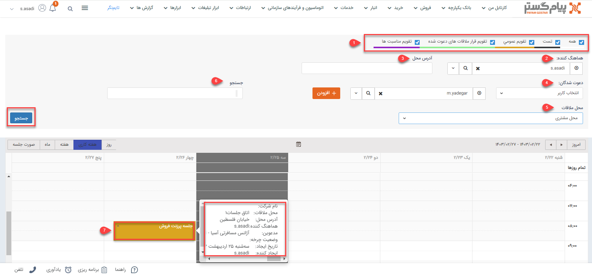

# تقویم کاری من
در این قسمت تقویم‌هایی که مجوز خواندن آن‌ها را دارید و همچنین لیست قرارملاقات‌هایی که در این تقویم‌ها برای شما تنظیم شده است یا دسترسی دیدن آنها را دارید، مشاهده خواهید کرد. این قرارملاقات‌ها ممکن است توسط شما، سایر کاربران و یا حتی فرآیندها و چرخه‌های کاری تعریف شده در نرم افزار ایجاد شوند. این تقویم‌ها با رنگ‌های مختلف ایجاد می‌شوند که در دیدن لیست قرارملاقات‌ها و برنامه‌ریزی به کاربر اجازه مشاهده قرار ملاقات افراد مختلف را می‌دهد.

**1. لیست تقویم‌ها:** لیست تقویم‌هایی که به آنها دسترسی دارید را می‌توانید مشاهده کنید، با فعال کردن هر تقویم لیست قرارملاقات‌های تنظیم شده در آن نمایش داده می‌شود. هر تقویمی‌ که در آن مجوز "فقط خواندن" یا "خواندن و نوشتن" داشته باشید در این لیست قابل مشاهده است.

تنظیماتی را که برای مشاهده‌ی تقویم‌ها توسط کاربر اعمال می‌شود، ذخیره شده و با هر بار ورود به نرم‌افزار همان تنظیمات نمایش داده می‌شود.
لازم به ذکر است، پیش از اعمال تنظیمات اگر تعداد تقویم‌ها کمتر از 5 باشد، تمام تقویم‌ها به صورت پیش فرض فعال است و درصورتیکه تعداد تقویم‌ها بیش تر از 5 باشد، تمام آن‌ها غیرفعال است.

**2. هماهنگ‌ کننده:** 
نام هماهنگ کننده این قرارملاقات را در این قسمت درج کنید.

**3. آدرس محل:** چنانچه هنگام ثبت قرار ملاقات محل ملاقات در محل مشتری یا سایر را انتخاب کرده باشید می‌بایست فیلد آدرس محل را پر کنید. پس از ثبت آدرس محل در تقویم کاری می‌توانید براساس محل برگزاری فیلتر کنید. به عنوان مثال تمام قرارملاقات‌هایی که در محدوده ونک برگزار می‌شود.

**4. دعو‌ت‌شدگان:** می‌توانید قرار ملاقات‌های نمایش داده شده را بر اساس دعوت شدگان قرارملاقات فیلتر کنید، دعوت‌شدگان می‌توانند کاربران نرم‌افزار، مخاطبان یا اطلاعات تماس وارد شده در قرار باشند. توجه داشته باشید که می‌توانید بیش از یک مدعو را برای جستجو در نظر بگیرید ( به طور مثال برای نمایش قرار ملاقات‌هایی که دو کاربر مشخص در آن حضور داشته‌اند یا قرارهایی که یک کاربر و یک مخاطب مشخص در آن حضور داشته اند.)

**5. محل قرارملاقات:** با استفاده از این فیلتر می‌توانید براساس محل قرارملاقات انتخاب شده جستجو انجام دهید . 

**6. جستجو:** فیلترهایی که در مرحله قبل اضافه کرده‌اید را بر روی قرار ملاقات‌های نمایش داده شده اعمال می‌کند.

درصورتی‌که در قسمت تقویم کاری من،  قرارملاقات را برحسب دعوت شدگان فیلتر نمایید، اگر نوع دعوت شدگان(کاربر، مشتری و اطلاعات تماس) در فیلتر اعمال شده یکسان باشد، حتی اگر تنها یک فرد در نتیجه فیلتر موجود باشد، قرارملاقات مربوطه در نتایج جستجو در تقویم کاری نمایش داده خواهد شد و لزومی‌ ندارد همه افراد انتخاب شده در نتیجه فیلتر وجود داشته باشند. ولی اگر نوع دعوت شدگان متفاوت باشد، یعنی یک فرد از انتخاب کاربر و یک فرد از انتخاب مشتری افزوده شده باشد، نتیجه فیلتر، قرارهایی را نمایش می‌دهد که هر دو فرد مورد نظر در آنها حضور داشته باشند. 

**7. نوع نمایش:** نوع نمایش تقویم را می‌توانید از این قسمت تغییر دهید.
- **بازه نمایش:**  بازه نمایش تقویم را در این قسمت مشخص کنید و با استفاده از دکمه‌هایی که در اختیارتان قرار داده شده قرار‌های گذشته و آینده را مشاهده کنید. توجه فرمایید که روز جاری در این تقویم با رنگ خاکستری نمایش داده می‌شود.

> **نکته** 
 در انتخاب نوع نمایش بصورت صورت جلسه لیست قرار ملاقات‌ها از امروز تا یک هفته را نمایش می‌دهد .

- **مناسبت‌ها:** مناسبت‌های تعریف شده در قسمت [مدیریت اعیاد و مناسبت‌ها ](https://github.com/1stco/PayamGostarDocs/blob/master/Help/Basic-Information/Holiday-management-and-occasions/Holiday-management-and-occasions.md)در این قسمت نمایش داده می‌شوند.

- **جزئیات قرار ملاقات:** با نگه داشتن نشانگر بر روی هر کدام از قرار ملاقات‌ها می‌توانید برخی از جزییات آن را مشاهده کنید، با دوبار کلیک بر روی هر قرار ملاقات صفحه جزییات آن را مشاهده کنید.

- **نمایش ساعات کاری/روز:** با استفاده از این دکمه می‌توانید بازه ساعات نمایش داده شده در تقویم را تغییر دهید (24 ساعته یا ساعات کاری)

با کشیدن (Drag&Drop) هر کدام از قرار ملاقات‌ها می‌توانید آن را در این تقویم جا به جا کنید.

برای جا به جا کردن قرارملاقات به مجوز ویرایش روی اون نوع قرارملاقات و مجوز خواندن و نوشتن در تقویمی‌ که قرارملاقات روی آن تنظیم شده است نیاز است .

> **نکته** 
 در صورتی که کاربر به تقویم مورد نظر دسترسی خواندن و نوشتن داشته باشد می‌تواند برای سایر کاربران قرار ملاقات تنظیم نماید و تمامی‌قرار ملاقات‌های تنظیم شده روی آن تقویم را مشاهده کند کاربر برای مشاهده کامل یک قرارملاقات (قرارملاقات تنظیم شده را باز کند) نیاز به مجوز مشاهده روی اون نوع قرارملاقات دارد.
>> **نکته** 
برای ایجاد تقویم‌های مختلف و تنظیم کاربران دارای دسترسی به آن‌ها به قسمت[ مدیریت تقویم‌ها ](https://github.com/1stco/PayamGostarDocs/blob/master/Help/Basic-Information/Calendar-management/Calendar-management.md)مراجعه کنید.
