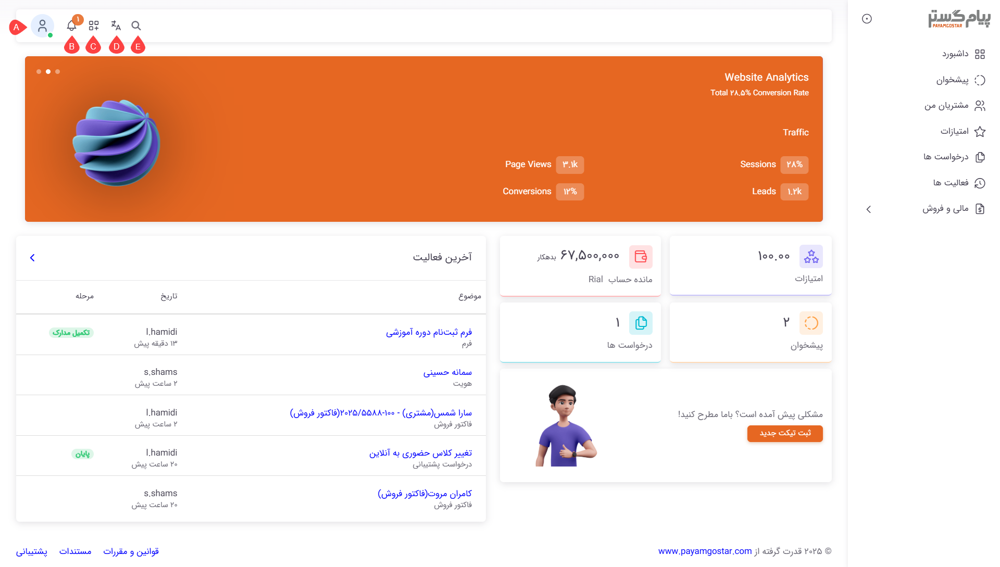
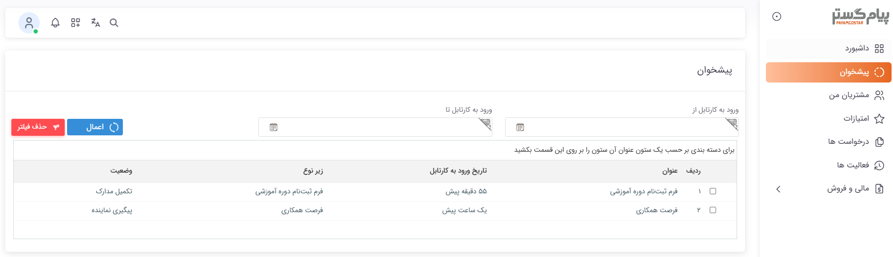
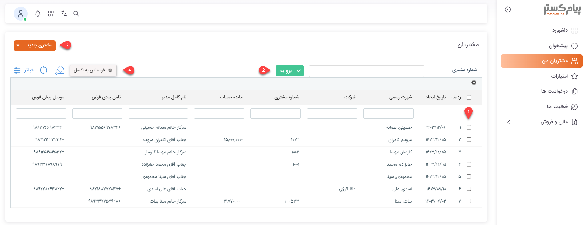
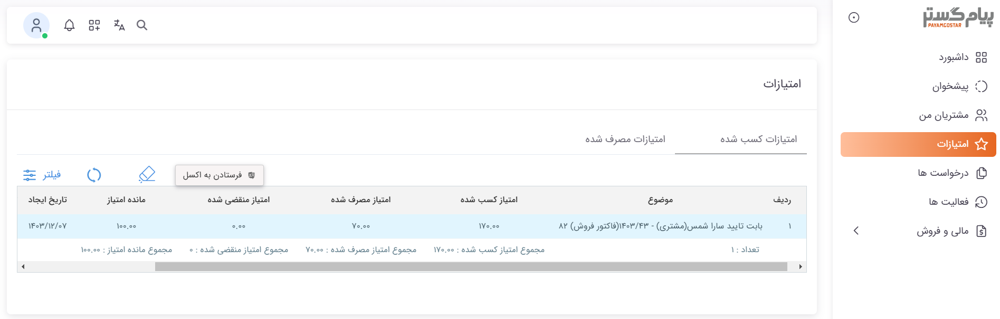
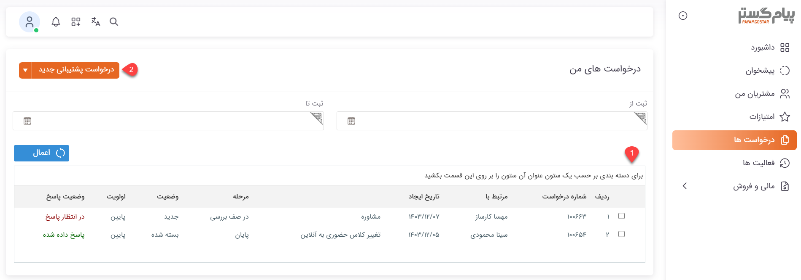
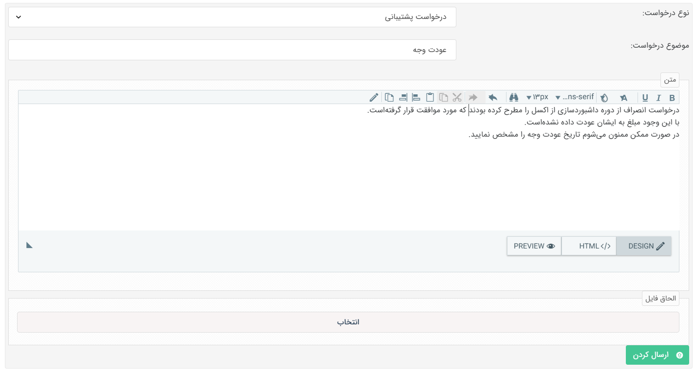
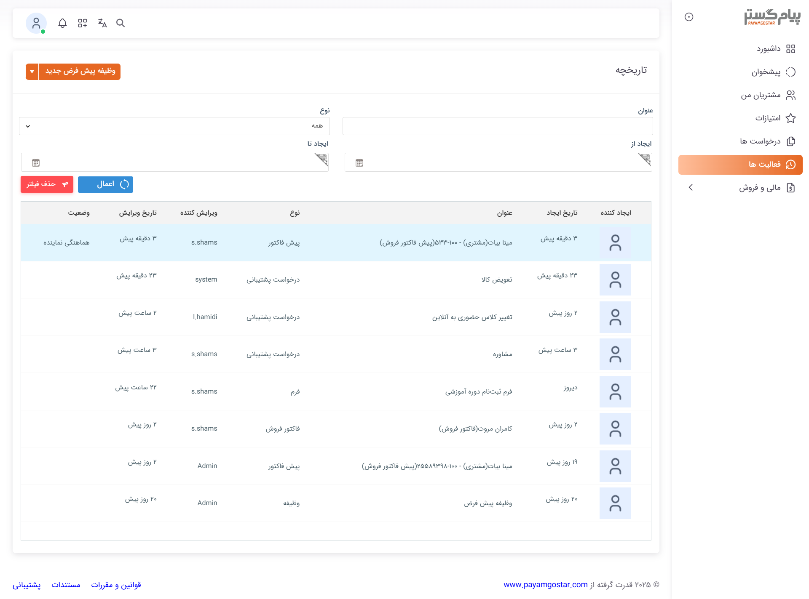

# آشنایی با پنل باشگاه نمایندگان

نمایندگان پس از ورود به حساب کاربری‌شان با صفحه‌ای نظیر تصویر زیر روبه‌رو می‌شوند. با توجه به دسترسی تنظیم شده برای نمایندگان، امکانات و دسترسی‌های کاربران به بخش‌های مختلف پنل می‌تواند متفاوت باشد. جهت آشنایی کامل با امکانات باشگاه نمایندگان، در ادامه به بررسی هر یک از بخش‌های باشگاه و قابلیت‌های آن برای نمایندگان می‌پردازیم. 

## داشبورد
داشبورد که در واقع صفحه اصلی (خانه) پنل باشگاه به شمار می‌رود، صفحه‌ای برای دسترسی نمایندگان به بخش‌های مختلف می‌باشد.  

داشبورد بالای صفحه می‌تواند نمایشگر اطلاعات مورد نیاز نمایندگان شما باشد. اطلاعات نمایش داده شده در این بخش و نوار پایین صفحه (فوتر) را می‌توانید با استفاده از ابزار سایت‌ساز منطبق با نیاز خود طراحی و شخصی‌سازی کنید. بدین منظور برای [ورود به ابزار سایت‌ساز](https://github.com/1stco/PayamGostarDocs/blob/master/Help/Supplementary-modules/site/varedeabzarsite/abzarsite.md) و همچنین [آشنایی با نحوه‌ی کار با این ابزار](https://github.com/1stco/PayamGostarDocs/blob/master/Help/Supplementary-modules/site/abzar/abzar.md) از راهنمای بخش مربوطه استفاده نمایید.  
نوار بالای صفحه دارای ۵ کلید اصلی برای دسترسی به بخش‌های مختلف است: 
**A. پروفایل نماینده:** نماینده از این بخش می‌تواند اطلاعات حساب کاربری خود را ویرایش نماید و یا برای تغییر رمز عبور خود اقدام کند.  
**B. پیام‌های سیستمی:** پیام‌های سیستمی که برای نماینده ارسال شده‌باشند در این بخش به وی نمایش داده می‌شود. در صورت دریافت پیام جدید، تعداد پیام‌های مشاهده نشده بر روی آیکون قابل مشاهده خواهدبود. 
**C. ثبت آیتم جدید:** تمامی آیتم‌هایی که نماینده اجازه‌ی ثبت آن را داشته‌باشد، در این بخش به وی نمایش داده‌ شده و می‌تواند از این طریق اقدام به ثبت آیتم مورد نظر نماید. 
**D. انتخاب زبان:** نماینده می‌توانند از این بخش اقدام به تغییر زبان پنل خود نمایند. 
**E. جستجو:** نمایندگان می‌توانند از بخش جستجو برای یافتن هویت مورد نظر استفاده کنند. 
اجزای داخل صفحه نیز نمایش خلاصه‌ای از اطلاعاتی است که در تب‌های کنار در دسترس هستند. با آشنایی با عملکرد هر یک از این بخش‌ها می‌توانید ارتباط بین این عناصر و اطلاعات هر بخش را به راحتی درک کنید. 

## پیشخوان
کارهایی که طی فرآیند به کاربر رسیده‌باشند، در بخش پیشخوان به وی نمایش داده‌می‌شود. به عبارت دیگر،‌ چنانچه نماینده مسئول کارتابلی در فرآیند باشد، این کارها در بخش پیشخوان در دسترس ایشان قرار گرفته و می‌تواند اقدام مورد نیاز را از همین بخش به انجام برساند. 

با یک نگاه کلی به لیست پیشخوان، کاربر می‌تواند بفهمد که کار از چه آیتمی، در چه زمانی با چه عنوانی به کارتابل وی وارد شده‌است. ستون «وضعیت» در جدول، عنوان کارتابلِ تعبیه شده در فرآیند را به نماینده نمایش می‌دهد که می‌تواند گویای کار لازم‌الاجرا باشد. نماینده با دو بار کلیک کردن بر روی رکورد مورد نظر می‌تواند به آیتم تحت چرخه دسترسی داشته‌باشد و اقدام مورد نیاز آن را به انجام برساند. 

## مشتریان من
نمایندگان می‌توانند از این بخش اقدام به ثبت هویت نموده (زیرنوع‌هایی که مجوز ثبت آن را دارند) و به پروفایل مشتریان خود دسترسی داشته‌باشند. تمامی هویت‌هایی که توسط نماینده ثبت شده‌باشند و یا اینکه نماینده به عنوان یکی از مسئولان پروفایل آن هویت‌ها (مسئول فروش/پشتیبانی/متفرقه) انتخاب شده‌باشد، در این لیست به وی نمایش داده‌می‌شود. 

**1. لیست مشتریان:** تمامی هویت‌هایی که نماینده آن‌ها را ثبت کرده‌باشد و یا به عنوان یکی از مسئولان فروش، پشتیبانی یا متفرقه‌ی وی انتخاب شده‌باشد، در این قسمت به وی نمایش داده‌می‌شود. توجه داشته‌باشید که دسترسی ورود به صفحه مشخصات این مخاطبان منوط بر داشتن مجوز «مشاهده آیتم» برای نماینده بر روی زیرنوع هویت می‌باشد. لازم به ذکر است که نمایندگان با استفاده از آیکون تنظیماتی که در سمت راست جدول قابل مشاهده است می‌توانند ستون‌های نمایش داده شده در لیست را متناسب با نیازمندی‌های خودشان تنظیم کنند. 

> **نکته** 
> به صورت کلی، هر هویتی که نماینده به عنوان مسئول آن انتخاب شده‌باشد و یا اینکه خود نماینده آن را ایجاد کرده‌باشد، فارغ از اینکه مجوز مشاهده آن زیرنوع هویت را دارد یا خیر، در لیست به وی نمایش داده‌می‌شود. بر این اساس می‌توان گفت که داشتن مجوز مشاهده زیرنوع هویت، دلیلی بر نمایش آن به نماینده نمی‌باشد! به عبارت دیگر، چنانچه نماینده بر روی زیرنوعی از هویت مجوز مشاهده داشته‌باشد لکن نه ایجادکننده‌ی آن باشد نه نماینده‌ی آن، هویت مذکور در لیست به وی نمایش داده نمی‌شود. 

**2. جستجو:** نمایندگان می‌توانند با وارد کردن شماره مشتری در کادر بالای لیست، مشتری مورد نظر خود را به راحتی بیایند. علاوه بر آن می‌توانند از کادر جستجوی بالای لیست برای جستجوی هویت مورد نظر بر اساس هر اطلاعات دیگری نیز استفاده کنند. مشابه تمامی لیست‌های موجود در نرم‌افزار، گزینه‌ی فیلتر در سمت چپ تصویر برای فیلتر هویت‌ها بر اساس معیارهای مورد نظر در اختیار نمایندگان قرار گرفته‌است. 

**3. ایجاد هویت:** نماینده از این بخش می‌تواند اقدام به ثبت هویت نماید. زیرنوع‌های هویت که دسترسی ایجاد آن برای نماینده مجاز اعلام شده‌باشد در این قسمت به وی نمایش داده‌می‌شود. با کلیک بر روی فلش کناری، سایر زیرنوع‌هایی که مجوز ثبت آن را داشته‌باشد نیز به وی نمایش داده‌می‌شود. با انتخاب زیرنوع هویت مورد نظر برای ثبت، صفحه مشخصات هویت به وی نمایش داده‌می‌شود. 

> **نکته** 
> هویت‌های ثبت شده توسط نماینده، بسته به اینکه از چه زیرنوعی باشد، در دسته‌بندی مشخص شده در بخش [دسته‌بندی کاربران](https://github.com/1stco/PayamGostarDocs/blob/master/Help/Settings/General-settings/User-category/User-category.md) در تنظیمات کلی (گروه پیش‌فرض ذخیره هویت) ذخیره می‌شود. 

**4. دریافت خروجی اکسل:** نمایندگان در صورت نیاز می‌توانند هویت‌های مورد نظر خود را در لیست انتخاب و سپس با کلیک بر روی کلید «فرستادن به اکسل» از آن خروجی دریافت کنند. 

## امتیازات
نمایندگان در این بخش می‌توانند لیست امتیازهایی که به دست آورده‌اند و یا مصرف کرده‌اند را مشاهده کنند. این امتیازات بر اساس [قوانین امتیازدهی](https://github.com/1stco/PayamGostarDocs/blob/master/Help/Basic-Information/Product-management/Score-settings/Score-settings.md) مندرج در نرم‌افزار به هویت مربوطه داده شده و یا به صورت دستی در ازای خدمات مشخصی از وی کسر می‌شود. جدولی که در این قسمت به نماینده نمایش داده‌می‌شود در واقع همان سربرگ [امتیازات مشتری](https://github.com/1stco/PayamGostarDocs/blob/master/Help/Integrated-bank/Database/Customer-ratings/Customer-ratings.md) در صفحه پروفایل وی است. 

به منظور سهولت کاربری، امتیازات کسب/کسر شده در دو تب مجزا به نماینده نمایش داده‌می‌شود. به مشابه سایر آیتم‌ها، نماینده با استفاده از فیلتر می‌توانند امتیازات کسب/کسر شده با ویژگی‌های مورد نظر خود را جداسازی و مشاهده نمایند. 

## درخواست‌ها
درخواست‌ها در واقع نمایشی از موجودیت درخواست‌‌های ایمیلی در نرم‌افزار است که به نمایندگان این امکان را می‌دهد که به جای ارسال ایمیل،‌ از این بستر برای ثبت درخواست خود استفاده کنند. کاربران می‌توانند از همین بخش، وضعیت درخواست‌های خود را نیز پیگری کنند. 

**1. لیست درخواست‌ها:** نماینده می‌تواند تمامی درخواست‌هایش را در این لیست مشاهده کند. وضعیت، وضعیت پاسخ و موقعیت درخواست‌ها در این لیست قابل مشاهده است. فیلدهای تاریخی قابل مشاهده در بالای لیست به نماینده این امکان را می‌دهد که درخواست‌هایی که در یک بازه‌ی زمانی مشخص ثبت شده‌اند را از سایر درخواست‌هایشان جدا کنند. 
نماینده در این لیست، علاوه بر درخواست‌های خودش، می‌تواند درخواست‌های مشتریانش را هم مشاهده کند. توجه داشته‌باشید که مشاهده درخواست‌ها در این لیست منوط بر داشتن مجوز مشاهده بر روی زیرنوع درخواست می‌باشد. 

**2. ثبت درخواست:** نماینده می‌تواند از این قسمت اقدام به ثبت درخواست نمایند. تمامی زیرنوع‌های درخواست ایمیلی که نماینده مجوز ایجاد آن را داشته‌باشد، در این قسمت قابل انتخاب خواهدبود. پس از انتخاب زیرنوع مورد نظر، صفحه ثبت درخواست به نماینده نمایش داده‌می‌شود. نماینده در این صفحه می‌تواند عنوان و توضیحات درخواست خود را درج نماید و در صورت لزوم فایلی را برای تکمیل توضیحات به آن پیوست کند. 

## فعالیت‌ها
این بخش در واقع تاریخچه‌ی تمامی آیتم‌های در دسترس نماینده است. تمامی آیتم‌هایی که به نام نماینده ثبت شده‌باشد در این قسمت به وی نمایش داده‌می‌شود.در واقع نماینده با توجه به دسترسی‌اش، علاوه بر آیتم‌های مرتبط با خودش، آیتم‌های مرتبط با مشتریانش (هویت‌هایی که خودش ثبت کرده و یا به عنوان یکی از مسئولان پروفایل آن‌ها انتخاب شده‌) را هم می‌تواند در این بخش مشاهده کند. توجه داشته‌باشید که در هر حالت، مشاهده آیتم‌ها در این لیست منوط بر داشتن مجوز مشاهده بر روی موجودیت‌ها برای نمایندگان است. فیلترهای بالای صفحه امکان دسترسی به آیتم‌هایی از یک نوع خاص، با عنوان مشخص و یا آیتم‌هایی که در یک بازه زمانی مشخص ثبت شده‌اند را آسان‌تر می‌سازد. 

نماینده از این بخش می‌تواند برای ثبت هر نوع آیتمی که دسترسی ایجاد آن را دارد، برای خودش و مشتریانش اقدام نماید. آیتم‌هایی نظیر قرارملاقات، وظیفه، فرم و... که بخش مجزایی برای آن‌ها در نظر گرفته نشده، در این بخش امکان مشاهده و ثبت دارد.

## مالی و فروش
این تب شامل فاکتورها، پیش‌فاکتورها، قراردادها و تمامی اسناد در دست بررسی می‌باشد. در ادامه به بررسی هر یک از این بخش‌ها می‌پردازیم. 

### فاکتورها و پیش‌فاکتور
با توجه به عملکرد مشابه بخش‌های پیش‌فاکتور و فاکتور، دو بخش را با هم بررسی می‌کنیم. 

**1. لیست پیش‌فاکتورها و فاکتورها:** نماینده می‌تواند تمامی پیش‌فاکتورها و فاکتورهای تاییدشده‌ی خود و مشتریانش (که مجوز مشاهده آن‌ها را داشته‌باشند) را در این لیست مشاهده کند. فیلدهای تاریخی قابل مشاهده در بالای لیست به کاربران این امکان را می‌دهد که فاکتورهایی که در یک بازه‌ی زمانی مشخص ثبت شده‌اند یا مبلغ آن‌ها در بازه‌ی خاصی قرار می‌گیرند را از سایر فاکتورها جدا کنند. 

**2. ثبت پیش‌‌فاکتور و فاکتور:** نماینده می‌تواند از این قسمت اقدام به ثبت انواع فاکتور نمایند. تمامی زیرنوع‌های پیش‌فاکتور/فاکتور که نماینده مجوز ایجاد آن را داشته‌باشد، در این قسمت قابل انتخاب خواهدبود. پس از انتخاب زیرنوع مورد نظر صفحه ثبت فاکتور به او نمایش داده می‌شود و می‌تواند آیتم مورد نظر را برای خودش یا مشتریانش ثبت نماید. 

### قراردادها
**1. لیست قراردادها:**نماینده می‌تواند تمامی قراردادهای خود و مشتریانش (که مجوز مشاهده آن‌ها را داشته‌باشند) را در این لیست مشاهده کند. فیلدهای تاریخی قابل مشاهده در بالای لیست به کاربران این امکان را می‌دهد که قراردادهایی که در یک بازه‌ی زمانی مشخص ثبت شده‌اند یا مبلغ آن‌ها در بازه‌ی خاصی قرار می‌گیرند را از سایر قراردادها جدا کنند. 

**2. ثبت قرارداد:** نماینده می‌تواند از این قسمت اقدام به ثبت انواع قرارداد نمایند. تمامی زیرنوع‌های قرارداد که نماینده مجوز ایجاد آن را داشته‌باشد، در این قسمت قابل انتخاب خواهدبود. پس از انتخاب زیرنوع مورد نظر صفحه ثبت قرارداد به او نمایش داده می‌شود و می‌تواند آیتم مورد نظر را برای خودش یا مشتریانش ثبت نماید. 

> **نکته** 
> آیتم‌های پیش‌فاکتور، فاکتور و قرارداد تنها در حالت تایید شده در این لیست قابل رویت‌ هستند. به عبارت دیگر، آیتم‌هایی که هنوز تایید نشده‌ و یا رد شده‌اند در این لیست نمایش داده نمی‌شوند. 

### پرداخت‌ها
این بخش به انواع پرداختی‌های نماینده به شما اختصاص داده‌ شده‌است. 

**1. لیست پرداخت‌ها:** نماینده می‌تواند تمامی پرداخت‌های خود (که مجوز مشاهده آن‌ها را داشته‌باشند) را در این لیست مشاهده کنند. به این نکته توجه داشته‌باشید که پرداخت افراد و شرکت‌ها به شما، با سند دریافت در نرم‌افزار ثبت می‌شود. در نتیجه این لیست در واقع لیست زیرنوع دریافت‌هایی است که نماینده مجوز مشاهده آن را داشته‌باشد. نماینده در این صفحه می‌تواند دریافت‌هایی که مرتبط با او یا مشتریانش ثبت شده را مشاهده نماید. فیلدهای تاریخی قابل مشاهده در بالای لیست به نمایندگان این امکان را می‌دهد که پرداخت‌هایی که در یک بازه‌ی زمانی مشخص ثبت شده‌اند یا مبلغ آن‌ها در بازه‌ی خاصی قرار می‌گیرند را از سایر پرداخت‌ها جدا کنند. 

**2. ثبت پرداخت:**  نماینده می‌تواند از این قسمت اقدام به ثبت سند پرداخت‌های خود و مشتریانش نمایند. تمامی زیرنوع‌های موجودیت دریافت که نماینده مجوز ایجاد آن را داشته‌باشد، در این قسمت قابل انتخاب خواهدبود. پس از انتخاب زیرنوع مورد نظر، صفحه ثبت اطلاعات پرداخت به نماینده نمایش داده می‌شود و می‌تواند آیتم مورد نظر را ثبت نماید. 

**3. پرداخت آنلاین:** در صورت فعال بودن پرداخت آنلاین و اتصال به درگاه پرداخت، نماینده می‌تواند از این طریق اقدام به پرداخت مبلغ مورد نظر نمایند. برای فعال بودن بخش پرداخت اینترنتی لازم است که برای حداقل یکی از [حساب مالی](https://github.com/1stco/PayamGostarDocs/blob/master/Help/Basic-Information/Financial-account-management/FinancialAccountsManagement-2.8.7.md)، گزینه‌ی پرداخت آنلاین فعال شده‌باشد. چنانچه نمایندگان اقدام به واریز مبلغ به حساب و یا انتقال از طریق کارت به کارت کرده‌باشند نیز می‌توانند اطلاعات واریز خود را از بخش «واریز نقدی به حساب» و «انتقال از طریق کارت خودپرداز» ثبت نمایند. 

**4. پرداخت‌های رد شده:** با توجه به اینکه دریافت‌های تایید شده در نرم‌افزار به صورت مستقیم بر مانده حساب تاثیر می‌گذارد، لازم است که پرداخت‌هایی که توسط نمایندگان ثبت می‌شوند، توسط پرسنل بررسی و در صورت صحّت واریزی تایید گردد. به همین منظور بخش جداگانه‌ای برای پرداخت‌های رد شده در نظر گرفته شده تا کاربران باشگاه بتوانند به راحتی پرداخت‌های ناموفق خود را مشاهده و پیگیری کنند. 