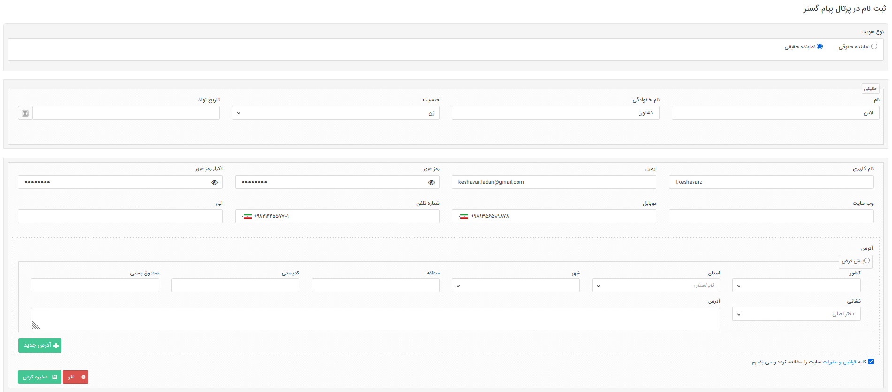
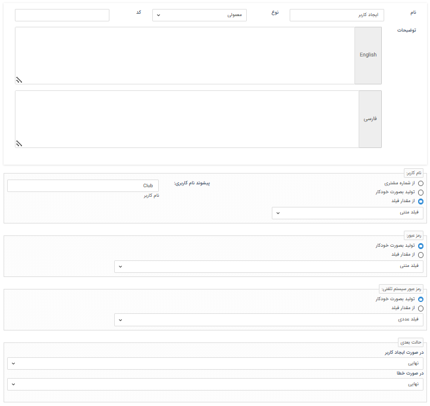

# ثبت‌نام نمایندگان در باشگاه

برای ساخت حساب کاربری برای نمایندگان باشگاه، روش‌های مختلفی وجود دارد. کاربری نماینده می‌تواند توسط پرسنل ایجاد شود،‌ طی فرآیند به صورت خودکار ایجاد گردد و یا با ثبت‌نام خود نمایندگان در باشگاه ساخته‌شود. در ادامه به بررسی روش‌های ممکن برای ایجاد حساب کاربری برای نمایندگان می‌پردازیم. 

## ساخت کاربری برای نمایندگان توسط کاربران نرم‌افزار
اگر کاربران نرم‌افزار (پرسنل شرکت) مسئولیت ایجاد کاربری نمایندگان را به عهده داشته‌باشند، از دو مسیر می‌توانند اقدام به انجام این کار نمایند: 

### افزودن نماینده از صفحه مدیریت اعضای باشگاه نمایندگان
اگر به عنوان کاربر نرم‌افزار قصد ایجاد حساب کاربری برای نمایندگان را دارید، از مسیر **تنظیمات** > **مدیریت اعضای باشگاه نمایندگان** وارد صفحه لیست کاربران باشگاه نمایندگان شوید و بر روی کلید «کاربر جدید» کلیک کنید. مشابه روش [ایجاد کاربر](https://github.com/1stco/PayamGostarDocs/blob/master/Help/Settings/GroupsAndUsersManagement/NewUserCreation.md)، مشخصات کاربری نماینده‌ی مورد نظر را تکمیل نمایید.

 

- نوع هویت وی را مشخص کنید. در صورت انتخاب نماینده‌ی حقیقی، تمامی زیرنوع‌های هویت که پروفایلشان از نوع نماینده و نوعشان حقیقی باشد، در لیست بعدی به شما نمایش داده‌می‌شود تا گزینه‌ی مورد نظر را انتخاب نمایید. به صورت مشابه در صورت انتخاب نوع حقوقی برای نماینده‌ی خود، زیرنوع‌های هویت حقوقی که نوع پروفایلشان نماینده باشد، جهت انتخاب به شما نمایش داده‌می‌شود.
- در صورت انتخاب نماینده‌ی حقیقی، نام و نام خانوادگی و در صورت انتخاب نماینده‌ی حقوقی نام شرکت وی را وارد نمایید.
- اطلاعات ارتباطی نظیر ایمیل و موبایل او را درج نمایید. درج ایمیل برای ایجاد کاربری الزامی می‌باشد.
- نام کاربری مورد نظر (که می‌تواند نام انگلیسی و یا عددی مثل شماره موبایلش باشد) را وارد نموده و رمز ابتدایی وی را درج و تکرار نمایید. این رمز در ادامه‌ی مسیر توسط نماینده تغییر پیدا خواهدکرد.
- توجه داشته‌باشید که با علامت‌گذاری «کاربر فعال است»، کاربری وی را فعال اعلام نمایید.
- در صورت نیاز به در نظر گرفتن پورسانت فروش برای نماینده، درصد مورد نظر را وارد نمایید.
- اگر تصویری از نماینده در اختیار دارید آن را در کادر فوق بارگذاری نمایید. نماینده خود می‌تواند در باشگاه اقدام به تنظیم تصویر پروفایلش نماید. 
در نهایت کافیست که اطلاعات وی را ذخیره کنید. کاربری نماینده به لیست اضافه شده و نام کاربری و رمز عبور وی از طریق یک پیام (که بنابر تنظیمات بخش [مدیریت پیام‌های سیستمی](https://github.com/1stco/PayamGostarDocs/blob/master/Help/Basic-Information/Manage-system-messages/2.6.0/Manage-system-messages.md) می‌تواند ایمیل یا پیامک باشد) به او اطلاع‌رسانی می‌شود. 

> **نکته** 
> برای اینکه کاربر بتواند به صفحه مدیریت اعضای باشگاه نمایندگان دسترسی داشته‌باشد، باید مجوز «مدیریت باشگاه نمایندگان» را دریافت نماید. توجه داشته‌باشید که برای ایجاد نماینده از این صفحه، داشتن این مجوز کافی بوده و نیازی به اعطای مجوز بر روی زیرنوع هویت نماینده نمی‌باشد. 

### ایجاد حساب کاربری نماینده از صفحه هویت
اگر هویت نماینده پیش‌تر در نرم‌افزار ثبت شده‌است، می‌توانید از صفحه پروفایل هویت نیز اقدام به ایجاد کاربری برای وی نمایید. در صفحه پروفایل نماینده از کلید «تعریف کاربر» استفاده کرده و با درج نام کاربری و تعریف رمز عبور اولیه، حساب کاربری وی را ایجاد نمایید. حساب کاربری وی ایجاد شده و نام کاربری برایشان ارسال می‌شود. پس از ایجاد حساب کاربری، پیامی برای نماینده ارسال می‌شود که علاوه بر اعلام نام کاربری وی، لینکی جهت تایید حساب  را شامل می‌شود. کاربر با کلیک بر روی لینک وارد صفحه تایید می‌شود. کد تایید برای ایشان ارسال شده و نماینده می‌تواند با وارد کردن کد تایید و همچنین رمز عبور مورد نظر خود، کاربری خود را با رمز عبور شخص‌اش فعال نماید. 

 

توجه داشته‌باشید که تنها در صورتی که پروفایل هویت از نوع نماینده باشد، کاربری نماینده‌ی باشگاه برای او ایجاد می‌شود. 

> **نکته** 
> برای اینکه کاربر بتواند از طریق صفحه پروفایل هویت اقدام به تعریف کاربری برای وی نماید، علاوه بر مجوزهای لازم برای مشاهده و دسترسی به زیرنوع هویت مورد نظر (نماینده)،‌ باید مجوز «تعریف کاربر» را بر روی آن زیرنوع هویت و همچنین مجوز «ایجاد کاربر باشگاه نمایندگان» را در قسمت مجوزهای باشگاه داشته‌باشد. 

## ثبت‌نام توسط نماینده
نمایندگان می‌توانند خود اقدام به ثبت‌نام و ایجاد حساب کاربری در باشگاه نمایند.  

> **نکته** 
> برای اینکه کاربران بتوانند اقدام به ثبت‌نام در باشگاه نمایند، لازم است که گزینه‌ی «امکان ثبت‌نام مشتریان در باشگاه» در تنظیمات امنیتی فعال و تنظیمات این بخش تکمیل شده‌باشد. در صورت نیاز به راهنمایی در این خصوص به [راهنمای تنظیمات امنیتی](https://github.com/1stco/PayamGostarDocs/blob/master/Help/Settings/General-settings/security/SecuritySetting-2.8.7.md) مراجعه نمایید. 

 

پس از تکمیل اطلاعات و ذخیره‌ی آن، یک کد تایید برای کاربر ارسال می‌شود. در صورت ورود صحیح کد، کاربری نماینده ایجاد می‌شود لکن هنوز غیرفعال است. یکی از کاربران نرم‌افزار که دارای مجوز «مدیریت اعضای باشگاه نمایندگان» می‌باشد، باید اقدام به تایید حساب کاربری وی نماید تا کاربری نماینده تایید شده و فعال گردد. در راهنمای [مدیریت اعضای باشگاه نمایندگان](https://github.com/1stco/PayamGostarDocs/blob/master/Help/Club/AgentClubUsersMnagement-2.8.6.md)  به صورت کامل به این موضوع پرداخته شده‌است.  

## ایجاد کاربری برای نمایندگان در فرآیند
با استفاده از فعالیت «ایجاد کاربری» می‌توانید در هر مرحله‌ای از فرآیند، برای هویت مرتبط با آیتم تحت چرخه، کاربری ایجاد نمایید. توجه داشته‌باشید که تنها اگر نوع پروفایل هویت مرتبط با آیتم تحت چرخه، از نوع «نماینده» باشد، کاربری نمایندگی باشگاه برای وی ایجاد می‌گردد. برای کسب اطلاعات بیشتر در مورد نحوه ایجاد کاربر در فرایند و استفاده از این فعالیت، به راهنمای [فعالیت ایجاد کاربر](https://github.com/1stco/PayamGostarDocs/blob/master/Help/Settings/Personalization-crm/Overview/Process-design/Create-a-work-cycle/Activity/Create-a-user/Create-a-user.md) مراجعه کنید. 

 

پس از ایجاد حساب کاربری  طی فرآیند (از طریق فعالیت ایجاد کاربر)، پیامی حاوی نام کاربری و لینک تایید برای او ارسال می‌شود. با این وجود، حساب کاربری تا پیش از تایید نماینده غیرفعال خواهد بود. نماینده باید از طریق لینک دریافتی، ورود رمز تایید و سپس درج رمزعبور مورد نظرش اقدام به فعال‌سازی حساب کاربری‌اش نماید. 