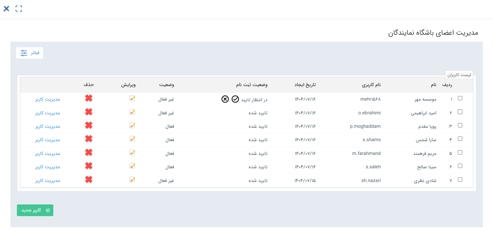

# مدیریت اعضای باشگاه نمایندگان
در این صفحه می‌توانید لیست تمامی نمایندگانی که در باشگاه حساب کاربری دارند را مشاهده نمایید، اطلاعات آن‌ها را ویرایش کنید، وضعیت آن‌ها را تغییر دهید، به کنسول مدیریتی کاربر دسترسی داشته‌باشید و یا اقدام به ایجاد نماینده جدید نمایید.  

## وضعیت ثبت‌نام و فعال‌سازی
در این بخش می‌توانید وضعیت ثبت‌نام و وضعیت فعال‌سازی حساب کاربری هر نماینده را مشاهده نمایید. به صورت کلی، برای اینکه نماینده بتواند در باشگاه فعالیت داشته‌باشد، باید وضعیتش **تاییدشده** و **فعال** باشد. چنانچه کاربری نیاز به تایید و یا فعال‌سازی داشته‌باشد، از این طریق می‌توانید اقدام به انجام این کار نمایید. 
به صورت کلی: 
- اگر کاربران نرم‌افزار (پرسنل) از همین صفحه (مدیریت اعضای باشگاه نمایندگان)، اقدام به ایجاد نماینده کنند، کاربری نماینده از ابتدا تاییده‌شده و فعال خواهدبود.
- اگر نماینده خودش اقدام به ثبت‌نام کرده‌باشد (نظیر موسسه مهر در تصویر)، وضعیتش غیرفعال و وضعیت ثبت‌نامش در انتظار تایید بوده و لازم است که یکی از کاربران نرم‌افزار (پرسنل) اقدام به تایید آن از این بخش نماید. برای این کافیست که بر روی آیکون دایره‌ای مقابل نام نماینده، کلیک کند. بدیهی است که آیکون دایره‌ای با علامت ضربدر به معنای رد صلاحیت نماینده برای ثبت‌نام می‌باشد. در نهایت، با تایید وضعیت ثبت‌نام، وضعیت نماینده به صورت خودکار فعال می‌شود. 
- اگر کاربری نماینده طی فرآیند ایجاد شده‌باشد یا کاربران نرم‌افزار از صفحه هویت اقدام به ایجاد کاربر کرده‌باشند، ثبت‌نام وی تایید شده لکن نیازمند فعال‌سازی است. در این حالت‌ها لینکی برای نماینده ارسال شده که می‌تواند از آن طریق حساب کاربری خود را فعال کند و نیازی به اقدام از جانب کاربران نرم‌افزار ندارد.  

## مدیریت کاربر
از طریق مدیریت کاربر می‌توانید به کنسول مدیریت کاربر وارد شوید. در این صفحه، هم می‌توانید تنظیمات امنیتی لازم را برای حساب کاربری وی شخصی‌سازی کنید و هم می‌توانید حساب او را تعلیق کرده یا از حالت قفل شده خارج نمایید. برای آشنایی با قابلیت‌های این کنسول، راهنمای [کنسول مدیریت کاربر](https://github.com/1stco/PayamGostarDocs/blob/master/Help/Settings/GroupsAndUsersManagement/UserManagementConsole-2.8.7.md) را مطالعه فرمایید. 

## ایجاد کاربر
چنانچه در راهنمای [ثبت‌نام نمایندگان در باشگاه](https://github.com/1stco/PayamGostarDocs/blob/master/Help/Club/AgentClubUser-2.8.6.md) نیز به آن پرداخته شده‌است، شما می‌توانید از این بخش اقدام به ایجاد نماینده نمایید. در این حالت، کافیست که با کلیک بر روی کلید «ایجاد کاربر»، وارد صفحه اطلاعات کاربر جدید شوید و مشخصات نماینده‌ی خود را وارد نمایید. پس از ثبت اطلاعات، یک هویت از نوع نماینده، در دسته‌بندی‌ای که به عنوان دسته‌بندی پیش‌فرض نماینده انتخاب شده ایجاد شده و حساب کاربری باشگاه نیز برای او ساخته می‌شود. این حساب به صورت خودکار تایید و فعال شده‌است.