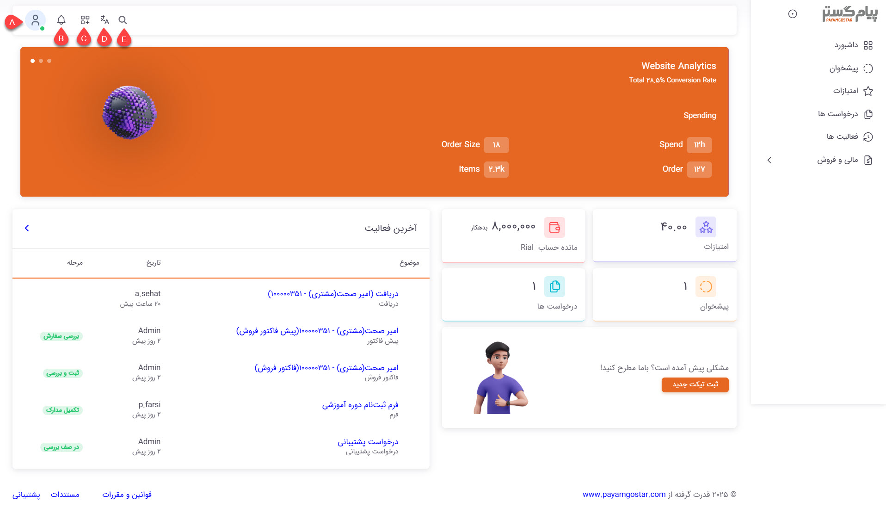
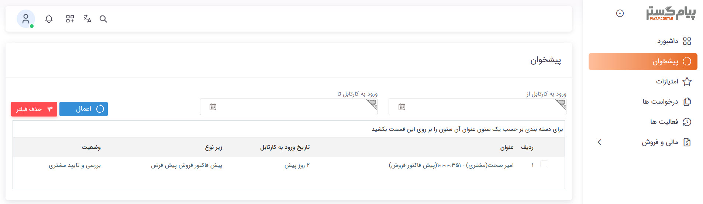
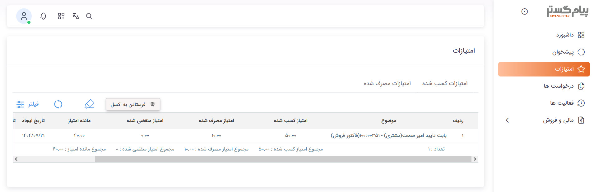
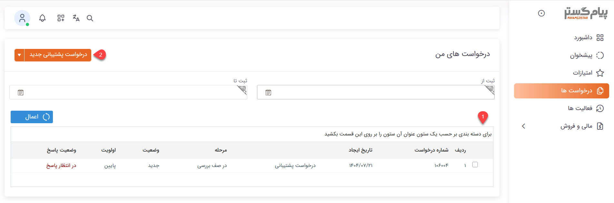
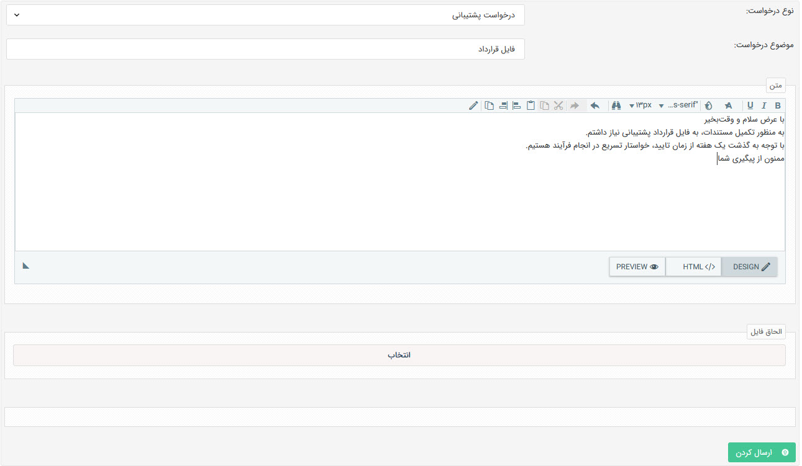
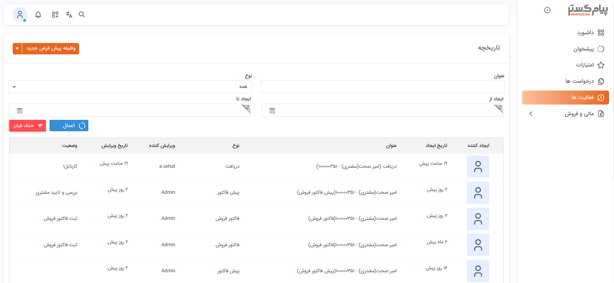

# آشنایی با پنل باشگاه مشتریان

کاربران باشگاه مشتریان پس از ورود به حساب کاربری‌شان با صفحه‌ای نظیر تصویر زیر روبه‌رو می‌شوند. با توجه به دسترسی تنظیم شده برای مشتریان، امکانات و دسترسی‌های مشتریان به بخش‌های مختلف پنل می‌تواند متفاوت باشد. جهت آشنایی کامل با امکانات باشگاه مشتریان، در ادامه به بررسی هر یک از بخش‌های باشگاه و قابلیت‌های آن برای مشتریان می‌پردازیم. 

## داشبورد
داشبورد که در واقع صفحه اصلی پنل باشگاه به شمار می‌رود، صفحه‌ای برای دسترسی مشتریان به بخش‌های مختلف می‌باشد.  

داشبورد بالای صفحه می‌تواند نمایشگر اطلاعات مورد نیاز کاربران شما باشد. اطلاعات نمایش داده شده در این بخش و نوار پایین صفحه (فوتر) را می‌توانید با استفاده از ابزار سایت‌ساز منطبق با نیاز خود طراحی و شخصی‌سازی کنید. بدین منظور برای [ورود به ابزار سایت‌ساز](https://github.com/1stco/PayamGostarDocs/blob/master/Help/Supplementary-modules/site/varedeabzarsite/abzarsite.md) و همچنین [آشنایی با نحوه‌ی کار با این ابزار](https://github.com/1stco/PayamGostarDocs/blob/master/Help/Supplementary-modules/site/abzar/abzar.md) از راهنمای بخش مربوطه استفاده نمایید.  
نوار بالای صفحه دارای ۵ کلید اصلی برای دسترسی به بخش‌های مختلف است: 
**A. پروفایل کاربر:** مشتری از این بخش می‌تواند اطلاعات حساب کاربری خود را ویرایش نماید و یا برای تغییر رمز عبور خود اقدام کند.  
**B. پیام‌های سیستمی:** پیام‌های سیستمی که برای مشتری ارسال شده‌باشند در این بخش به وی نمایش داده می‌شود. در صورت دریافت پیام جدید، تعداد پیام‌های مشاهده نشده بر روی آیکون قابل مشاهده خواهدبود. 
**C. ثبت آیتم جدید:** تمامی آیتم‌هایی که مشتری اجازه‌ی ثبت آن را داشته‌باشد، در این بخش به وی نمایش داده‌می‌شود و کاربر می‌تواند از این طریق اقدام به ثبت آیتم مورد نظر نماید. 
**D. انتخاب زبان:** مشتریان می‌توانند از این بخش اقدام به تغییر زبان پنل خود نمایند. 
**E. جستجو:** مشتریان می‌توانند از بخش جستجو برای یافتن هویت مورد نظر استفاده کنند. 
اجزای داخل صفحه نیز نمایش خلاصه‌ای از اطلاعاتی است که در تب‌های کنار در دسترس هستند. با آشنایی با عملکرد هر یک از این بخش‌ها می‌توانید ارتباط بین این عناصر و اطلاعات هر بخش را به راحتی درک کنید. 

## پیشخوان
در مورد فرآیندهای تحت چرخه، مشتری می‌تواند به عنوان مسئول کارتابل آیتمی که به نام خودش ثبت شده در نظر گرفته شده باشد. به عنوان مثال فرض کنید که در فرآیندی که بر روی آیتم پیش‌فاکتور پیاده‌سازی شده، لازم است که در یکی از مراحل، مشتری آیتم را مشاهده، اطلاعات را تایید و همچنین فیش واریزی خود را بارگذاری کند. در این حالت پیش‌فاکتور در بخش پیش‌خوان به دست مشتری می‌رسد. 
به صورت کلی می‌توان گفت کارهایی که طی فرآیند به مشتری رسیده‌باشند، در بخش پیشخوان به وی نمایش داده‌می‌شود. به عبارت دیگر،‌ چنانچه مشتری مسئول کارتابلی در فرآیند باشد، این کارها در بخش پیشخوان در دسترس ایشان قرار گرفته و می‌تواند اقدام مورد نیاز را از همین بخش به انجام برساند. 

با یک نگاه کلی به لیست پیشخوان، کاربر می‌تواند بفهمد که کار از چه آیتمی، در چه زمانی با چه عنوانی به کارتابل وی وارد شده‌است. ستون وضعیت در جدول، عنوان کارتابل تعبیه شده در فرایند را به کاربر نمایش می‌دهد که می‌تواند گویای کار لازم‌الاجرا باشد. کاربر با دو بار کلیک کردن بر روی رکورد مورد نظر می‌تواند به آیتم تحت چرخه دسترسی داشته‌باشد و اقدام مورد نیاز آن را به انجام برساند. 

## امتیازات
مشتریان در این بخش می‌توانند لیست امتیازهایی که به دست آورده‌اند و یا مصرف کرده‌اند را مشاهده کنند. این امتیازات بر اساس [قوانین امتیازدهی](https://github.com/1stco/PayamGostarDocs/blob/master/Help/Basic-Information/Product-management/Score-settings/Score-settings.md) مندرج در نرم‌افزار به هویت مربوطه داده شده و یا به صورت دستی در ازای خدمات مشخصی از وی کسر می‌شود. جدولی که در این قسمت به مشتریان نمایش داده می‌شود در واقع همان سربرگ [امتیازات مشتری](https://github.com/1stco/PayamGostarDocs/blob/master/Help/Integrated-bank/Database/Customer-ratings/Customer-ratings.md) در صفحه پروفایل وی است. 

کسب و کسر امتیازات به منظور سهولت کاربری در دو تب مجزا به مشتری نمایش داده می‌شود. به مشابه سایر آیتم‌ها، مشتریان با استفاده از فیلتر می‌توانند امتیازات کسب/کسر شده با ویژگی‌های مورد نظر خود را جدا و مشاهده نمایند. 

## درخواست‌ها
درخواست‌ها در واقع نمایشی از موجودیت درخواست‌‌های ایمیلی در نرم‌افزار است که به مشتریان این امکان را می‌دهد که به جای ارسال ایمیل،‌ از این بستر برای ثبت درخواست خود استفاده کنند. مشتریان می‌توانند از همین بخش وضعیت درخواست‌های خود را نیز پیگری کنند. 

**1. لیست درخواست‌ها:** مشتریان می‌توانند تمامی درخواست‌هایشان را در این لیست مشاهده کنند. وضعیت، وضعیت پاسخ و موقعیت درخواست‌ها در این لیست قابل مشاهده است. فیلدهای تاریخی قابل مشاهده در بالای لیست به کاربران این امکان را می‌دهد که درخواست‌هایی که در یک بازه‌ی زمانی مشخص ثبت شده‌اند را از سایر درخواست‌هایشان جدا کنند. 
مشتریان در این قسمت تمامی درخواست‌هایی که خودشان ثبت کرده‌اند و یا به نامشان ثبت شده را مشاهده می‌کنند (تمامی درخواست‌هایی که مرتبط بای آن‌ها، مشتری باشد). توجه داشته‌باشید که مشاهده درخواست‌ها در این لیست منوط بر داشتن اجازه مشاهده زیرنوع درخواست برای مشتریان می‌باشد. 

**2. ثبت درخواست:** مشتریان می‌توانند از این قسمت اقدام به ثبت درخواست نمایند. تمامی زیرنوع‌های درخواست ایمیلی که مشتری مجوز ایجاد آن را داشته‌باشد، در این قسمت قابل انتخاب خواهدبود. پس از انتخاب زیرنوع مورد نظر، صفحه ثبت درخواست به کاربر نمایش داده‌می‌شود. مشتری در این صفحه می‌تواند در آن عنوان و توضیحات درخواست خود را درج نماید و در صورت لزوم فایلی را برای تکمیل توضیحات به آن پیوست کند. 

## فعالیت‌ها
این بخش در واقع تاریخچه‌ی تمامی آیتم‌های در دسترس مشتری است. تمامی آیتم‌هایی که به نام کاربر مشتری ثبت شده‌باشد در این قسمت به وی نمایش داده‌می‌شود. توجه داشته‌باشید که مشاهده آیتم‌ها در این لیست منوط بر داشتن اجازه مشاهده بر روی موجودیت‌ها برای مشتریان است. فیلترهای بالای صفحه امکان دسترسی به آیتم‌هایی از یک نوع خاص، با عنوان مشخص و یا آیتم‌هایی که در یک بازه زمانی مشخص ثبت شده‌اند را آسان‌تر می‌سازد. 

مشتری از این بخش می‌تواند برای ثبت هر نوع آیتمی که دسترسی ایجاد آن را دارد، اقدام نماید. آیتم‌هایی نظیر قرارملاقات، وظیفه، فرم و... که بخش مجزایی برای آن‌ها در نظر گرفته نشده، در این بخش امکان مشاهده و ثبت دارد. 

## مالی و فروش
این تب شامل فاکتورها، پیش‌فاکتورها، قراردادها و تمامی اسناد در دست بررسی می‌باشد. در ادامه به بررسی هر یک از این بخش‌ها می‌پردازیم. 

### فاکتورها و پیش‌فاکتور
با توجه به عملکرد مشابه بخش‌های پیش‌فاکتور و فاکتور، دو بخش را با هم بررسی می‌کنیم. 

**1. لیست پیش‌فاکتورها و فاکتورها:** مشتریان می‌توانند تمامی پیش‌فاکتورها و فاکتورهای تاییدشده‌ی خود (که مجوز مشاهده آن‌ها را داشته‌باشند) را در این لیست مشاهده کنند. فیلدهای تاریخی قابل مشاهده در بالای لیست به کاربران این امکان را می‌دهد که فاکتورهایی که در یک بازه‌ی زمانی مشخص ثبت شده‌اند یا مبلغ آن‌ها در بازه‌ی خاصی قرار می‌گیرند را از سایر فاکتورها جدا کنند. 

**2. ثبت پیش‌‌فاکتور و فاکتور:** مشتریان می‌توانند از این قسمت اقدام به ثبت انواع فاکتور نمایند. تمامی زیرنوع‌های پیش‌فاکتور/فاکتور که مشتری اجازه ایجاد آن را داشته‌باشد، در این قسمت قابل انتخاب خواهدبود. پس از انتخاب زیرنوع مورد نظر صفحه ثبت فاکتور به کاربر نمایش داده می‌شود و کاربر می‌تواند آیتم مورد نظر را ثبت نماید. 

### قراردادها
**1. لیست قراردادها:** مشتری می‌تواند تمامی قراردادهای خود را در این لیست مشاهده کند. فیلدهای تاریخی قابل مشاهده در بالای لیست به او این امکان را می‌دهد که قراردادهایی که در یک بازه‌ی زمانی مشخص ثبت شده‌اند یا مبلغ آن‌ها در بازه‌ی خاصی قرار می‌گیرند را از سایر قراردادها جدا کنند. 

**2. ثبت قرارداد:** مشتری می‌تواند از این قسمت اقدام به ثبت انواع قرارداد نمایند. تمامی زیرنوع‌های قرارداد که مشتری اجازه ایجاد آن را داشته‌باشد، در این قسمت قابل انتخاب خواهدبود. پس از انتخاب زیرنوع مورد نظر صفحه ثبت قرارداد به او نمایش داده می‌شود و می‌تواند آیتم مورد نظر را برای خودش ثبت نماید. 

> **نکته** 
> آیتم‌های پیش‌فاکتور، فاکتور و قرارداد تنها در حالت تایید شده در این لیست قابل رویت‌ هستند. به عبارت دیگر، آیتم‌هایی که هنوز تایید نشده‌ و یا رد شده‌اند در این لیست نمایش داده نمی‌شوند. 

### پرداخت‌ها
این بخش به سند انواع پرداختی‌های کاربران به شما اختصاص داده‌ شده‌است. 

**1. لیست پرداخت‌ها:** مشتریان می‌توانند تمامی پرداخت‌های خود (که اجازه مشاهده آن‌ها را داشته‌باشند) را در این لیست مشاهده کنند. به این نکته توجه داشته‌باشید که پرداخت مشتریان به شما، با سند دریافت در نرم‌افزار ثبت می‌شود. در نتیجه این لیست در واقع لیست زیرنوع دریافت‌هایی است که کاربر مجوز مشاهده آن را داشته‌باشد. فیلدهای تاریخی قابل مشاهده در بالای لیست به مشتریان این امکان را می‌دهد که پرداخت‌هایی که در یک بازه‌ی زمانی مشخص ثبت شده‌اند یا مبلغ آن‌ها در بازه‌ی خاصی قرار می‌گیرند را از سایر پرداخت‌ها جدا کنند. 

**2. ثبت پرداخت:**  مشتریان می‌توانند از این قسمت اقدام به ثبت سند پرداخت‌های خود نمایند. تمامی زیرنوع‌های موجودیت دریافت که مشتری اجازه ایجاد آن را داشته‌باشد، در این قسمت قابل انتخاب خواهدبود. پس از انتخاب زیرنوع مورد نظر صفحه ثبت اطلاعات پرداخت به مشتری نمایش داده می‌شود و کاربر می‌تواند آیتم مورد نظر را ثبت نماید. 

**3. پرداخت آنلاین:** در صورت فعال بودن پرداخت آنلاین و اتصال به درگاه پرداخت، مشتریان می‌توانند از این طریق اقدام به پرداخت مبلغ مورد نظر نمایند. برای فعال بودن بخش پرداخت اینترنتی لازم است که برای حداقل یکی از [حساب مالی](https://github.com/1stco/PayamGostarDocs/blob/master/Help/Basic-Information/Financial-account-management/FinancialAccountsManagement-2.8.7.md)، گزینه‌ی پرداخت آنلاین فعال شده‌باشد. چنانچه مشتریان اقدام به واریز مبلغ به حساب و یا انتقال از طریق کارت به کارت کرده‌باشند نیز می‌توانند اطلاعات واریز خود را از بخش «واریز نقدی به حساب» و «انتقال از طریق کارت خودپرداز» ثبت نمایند. 

**4. پرداخت‌های رد شده:** با توجه به اینکه دریافت‌های تایید شده در نرم‌افزار به صورت مستقیم بر مانده حساب مشتری تاثیر می‌گذارد، لازم است که پرداخت‌هایی که توسط کاربران ثبت می‌شوند، توسط پرسنل معتمد بررسی و در صورت صحّت واریزی تایید گردد. به همین منظور بخش جداگانه‌ای برای پرداخت‌های رد شده در نظر گرفته شده تا کاربران باشگاه بتوانند به راحتی پرداخت‌های ناموفق خود را مشاهده و پیگیری کنند. 
