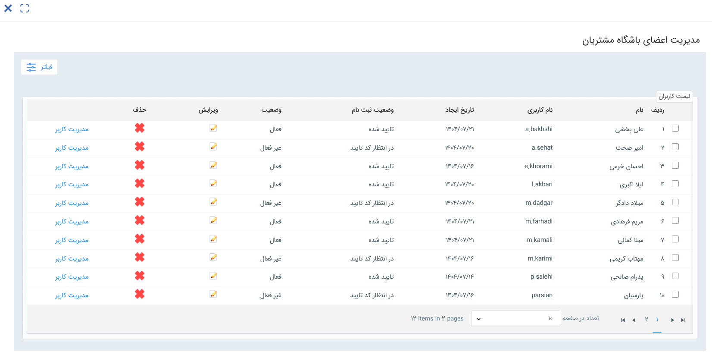

# مدیریت اعضای باشگاه مشتریان
در این صفحه می‌توانید لیست تمامی مشتریانی که در باشگاه حساب کاربری دارند را مشاهده نمایید، اطلاعات آن‌ها را ویرایش کنید، وضعیت آن‌ها را تغییر دهید، به کنسول مدیریتی کاربر دسترسی داشته‌باشید و یا اقدام به ایجاد مشتری جدید نمایید.  

## وضعیت ثبت‌نام و فعال‌سازی
در این بخش می‌توانید وضعیت ثبت‌نام و وضعیت فعال‌سازی حساب کاربری هر مشتری را مشاهده نمایید. به صورت کلی، برای اینکه مشتری بتواند در باشگاه فعالیت داشته‌باشد، باید وضعیتش **تاییدشده** و **فعال** باشد. چنانچه کاربری نیاز به تایید و یا فعال‌سازی داشته‌باشد، از این طریق می‌توانید اقدام به انجام این کار نمایید. 
چنانچه کاربری مشتری از صفحه هویت یا طی چرخه ایجاد شده باشد، فعال‌سازی آن توسط مشتری با استفاده از لینکی که برای او ارسال می‌شود، امکان می‌پذیرد. چنانچه بنا به هر دلیلی نیاز به غیرفعال کردن کاربری یک مشتری و یا فعال‌سازی مجدد آن داشتید می‌توانید از این قسمت اقدام نمایید. کنسول کاربری مشتری این امکان را در اختیار شما قرار می‌دهد. 

## مدیریت کاربر
از طریق مدیریت کاربر می‌توانید به کنسول مدیریت کاربری مشتری وارد شوید. در این صفحه، هم می‌توانید تنظیمات امنیتی لازم را برای حساب کاربری وی شخصی‌سازی کنید و هم می‌توانید حساب او را تعلیق کرده یا از حالت قفل شده خارج نمایید. برای آشنایی با قابلیت‌های این کنسول، راهنمای [کنسول مدیریت کاربر](https://github.com/1stco/PayamGostarDocs/blob/master/Help/Settings/GroupsAndUsersManagement/UserManagementConsole-2.8.7.md) را مطالعه فرمایید. 

## ایجاد کاربر
چنانچه در راهنمای [ثبت‌نام مشتریان در باشگاه](https://github.com/1stco/PayamGostarDocs/blob/master/Help/Club/CustomerClubUser-2.8.6.md) نیز به آن پرداخته شده‌است، شما می‌توانید از این بخش اقدام به ایجاد مشتری نمایید. در این حالت، کافیست که با کلیک بر روی کلید «ایجاد کاربر»، وارد صفحه اطلاعات کاربر جدید شوید و مشخصات مشتری خود را وارد نمایید. پس از ثبت اطلاعات، یک هویت از نوع مشتری، در دسته‌بندی‌ای که به عنوان دسته‌بندی پیش‌فرض مشتری انتخاب شده ایجاد شده و حساب کاربری باشگاه نیز برای او ساخته می‌شود. این حساب به صورت خودکار تایید و فعال شده‌است.