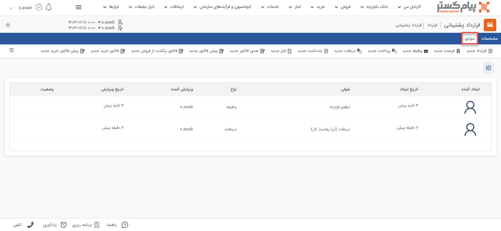

# سوابق قرارداد
در صفحه قرارداد، تب «سوابق» در کنار مشخصات آن مشاهده می‌شود. در این مقاله با کاربرد این تب آشنا می‌شوید: 

## سوابق پیش‌فاکتور فروش
مشابه فرصت، موجودیت‌های مختلفی (از جمله پیش‌فاکتور، فاکتور، قرارداد، دریافت، قرارملاقات و سایر موارد) می‌توانند به پیش‌فاکتور فروش متصل باشند. این آیتم‌‌ها علاوه بر سوابق هویت، در سوابق قراردادی که به آن متصل شده‌اند نیز قابل دسترس هستند. برای دسترسی به آن‌ها کافیست وارد صفحه قرارداد مورد نظر شوید و بر روی تب سوابق کلیک کنید. 

نوار بالایی تب سوابق قرارداد، امکان ثبت سوابق جدید را به شما می‌دهد. سوابقی که از این بخش ثبت شوند، به قرارداد مذکور متصل خواهند‌بود. 