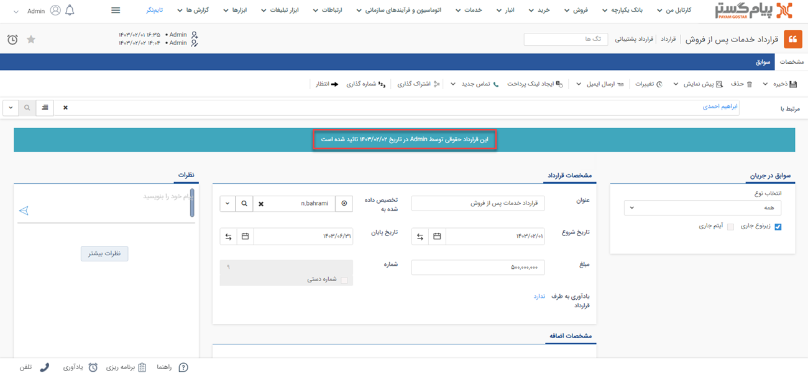
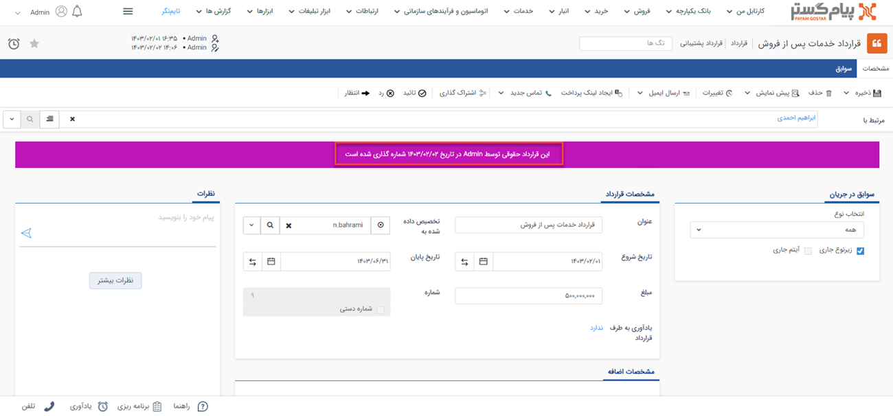
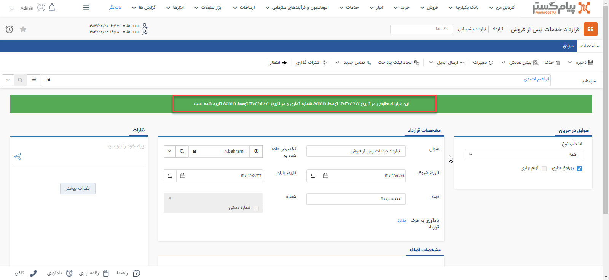
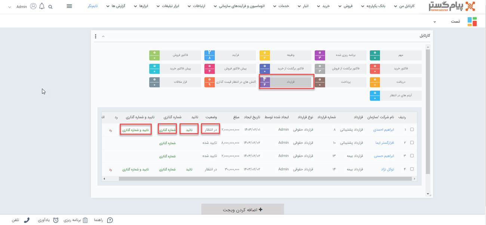
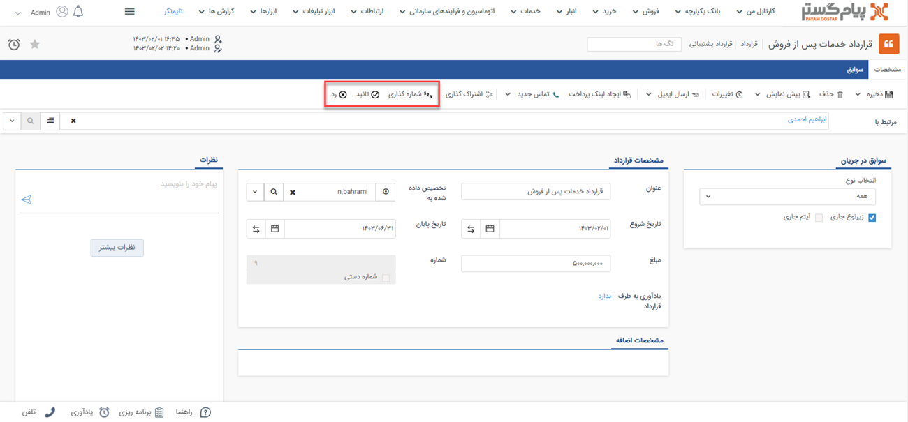

# تایید و شماره‌گذاری قرارداد 
پس از ثبت قرارداد مادامیکه این قرارداد تایید نشود موجودی محصول و بدهی مشتری تغییری نخواهد کرد و قرارداد تایید نشده در پیام‌گستر فاقد اعتبار است.

قراردادها در مرحله تایید و شماره‌گذاری با پیام‌های متفاوت نمایش داده می‌شوند که انواع نمایش آنها به شرح زیر می‌باشد: 
در صورتیکه قرارداد به صورت خودکار تایید شود در قسمت ابتدایی قرارداد این پیغام با نوار آبی نمایش داده می‌شود. 

 

گاهی برای دسترسی بهتر به قراردادها در مرحله ثبت، بهتر است آنها را شماره‌گذاری کنید. در این مرحله پیغام زیر با نوار بنفش رنگ نمایش داده می‌شود. لازم به ذکر است شما می‌توانید قبل از اینکه قرارداد تایید شود آن را شماره‌گذاری نمایید.

می‌توانید دو مرحله قبل را به صورت خودکارانجام دهید. پس از تایید و شماره‌گذاری پیام زیر با نوار سبز رنگ را مشاهده خواهید کرد.

پس از ثبت قرارداد چنانچه مجوز تایید، رد و شماره‌گذاری آیتم را داشته باشید 
در صورتی که قرارداد ثبت‌شده نیازمند تایید و شماره‌گذاری باشند (در قسمت [شخصی‌سازی](https://github.com/1stco/PayamGostarDocs/tree/master/Help/Settings/Personalization-crm/Factor-management/Factor-management.md) گزینه نیاز به تایید و شماره‌گذاری فعال شده باشد) و شما به عنوان مسئول تایید/رد و یا مسئول شماره‌گذاری آن زیرنوع از قرارداد تعیین شده باشید، تمامی قراردادهای ثبت شده از آن زیرنوع برای بررسی در کارتابل شما قرار می‌گیرد. 
قراردادهای ثبت شده که به تایید/رد و یا شماره‌گذاری نیاز داشته باشند، از طریق **کارتابل** به شخص مسئول نمایش داده می‌شوند.
برای رد، تایید و شماره‌گذاری قرارداد از طریق کارتابل می‌توانید از طریق دو مسیر زیر اقدام نمایید:  
- روش اول از طریق **ویجت کارتابل** می‌باشد.
 با  کلیک بر روی کارتابل قرارداد، قراردادهای در انتظار تایید در جدول پایین  نمایش داده می‌شود. در این حالت امکان تایید/رد و شماره‌‌گذاری از طریق کلیدهای نمایش داده شده در هر سطر (در کارتابل)وجود دارد. 
 
 

 - روش دوم از طریق **صفحه اصلی قرارداد** است. بدین منظور با  کلیک بر روی کارتابل قرارداد در انتظار تایید در جدول پایین  نمایش داده می‌شود. با کلیک بر روی هر ردیف، قرارداد مربوط به مخاطب باز خواهد شد. با زدن دکمه‌های شماره‌گذاری، تایید و رد در نوار سفید بالای صفحه، اقدام مورد نیاز را انجام دهید.  

 

> **نکته** 
> اگر برای اطلاع‌رسانی به مسئول تایید و شماره‌گذاری و یا ثبت‌کننده آیتم، پیام تنظیم شده باشد، از طریق [پیام‌های سیستمی](https://github.com/1stco/PayamGostarDocs/blob/master/Help/home/NotificationManagement2.6.0.md) به کاربر مربوطه اطلاع داده می‌شود. در چنین حالتی ورود قرارداد جدید به کارتابل به مسئول تایید و شماره‌گذاری و نتیجه آن شامل تایید،‌رد و شماره‌گذاری پیش‌فاکتور به ثبت‌کننده اطلاع‌ داده می‌شود. 

## نکات مرتبط با تایید و شماره‌گذاری قرارداد 
- پس از **شماره‌گذاری** توسط مسئول، تنها کاربر دارای مجوز «ویرایش شماره پس از شماره‌گذاری» یا «مدیر مالی» قادر به ویرایش شماره‌ی قرارداد خواهد بود.
- پس از تایید/رد و شماره‌گذاری قرارداد توسط مسئول، تنها کاربر دارای مجوز «ویرایش پس از شماره‌گذاری، تایید یا رد» یا «مدیر مالی» امکان ویرایش آن را خواهد داشت.
- پس از تایید/رد و شماره‌گذاری قرارداد توسط مسئول، تنها کاربر دارای مجوز «حذف پس از شماره گذاری، تایید یا رد» یا «مدیر مالی» امکان حذف آن را خواهد داشت.

> **نکته** 
> قراردادهای نیازمند به تایید، پیش از تایید و یا پس از رد،‌ **اعتبار ندارند**. بر این اساس تاثیری بر بدهی مشتری و تعداد موجودی نخواهند داشت. 