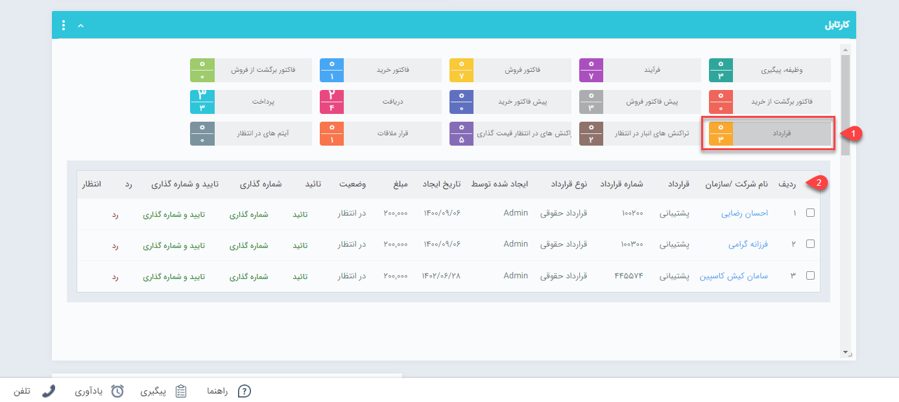

# تایید و شماره گذاری قراردادها
 قراردادهای مالی ثبت شده در سیستم چنانچه در انتظار تایید و شماره گذاری قرارداشته باشند در سیستم های مالی ثبت نخواهند شد و نمی توان از آنها در گزارشات مربوطه استفاده کرد. 
در صورتی که از قسمت [تنظیمات، شخصی سازی](https://github.com/1stco/PayamGostarDocs/tree/master/Help/Settings/Personalization-crm/Factor-management/Factor-management.md) CRM ، تیک مربوط به نیاز به تایید یا نیاز به شماره گذاری قراردادها را انتخاب نموده باشید، بعد از صدور هر کدام از این آیتم ها توسط کارشناسان به تایید/شماره گذاری نیاز خواهند داشت. کاربر دارای مجوز تایید یا شماره گذاری قرارداد شخصی است که می تواند از طریق این صفحه کلیه آیتم های صادر شده را مشاهده، بررسی و تایید و یا شماره گذاری و یا رد نماید.

> **نکته**  پس از تایید قرارداد، این آیتم قابلیت ویرایش یا حذف نخواهد داشت مگر حذف کاربر دارنده مجوز ویرایش  پس از شماره گذاری/ تایید ،  حذف  پس از شماره گذاری/ تایید و یا  " مجوزمدیر فروش".

در این کارتابل امکان شماره گذاری و یا تایید/رد قراردادها وجود دارد و همچنین با کلیک بر روی هر کدام از سطر ها، آیتم مربوط به مشتری بازخواهد شد و با زدن دکمه های شماره گذاری،تایید و رد در بالای صفحه ، همچنین می توانید آن را تایید/شماره گذاری یا رد نمایید .
 

 
 >   **نکته**  می توانید برای اطلاع مسئول و یا ثبت کننده قرارداد از تایید و یا رد آیتم موردنظر، پیامی را از طریق اطلاعات پایه ، [ مدیریت پیام های سیستم](https://github.com/1stco/PayamGostarDocs/blob/master/Help/Basic-Information/Manage-system-messages/Manage-system-messages.md) تنظیم کنید.
>> **نکته**  کاربری که بر روی آیتم مورد نظر مجوز بازگشت به وضعیت در انتظار تایید را داشته باشد، میتواند آیتم را از وضعیت تایید خارج کند .
