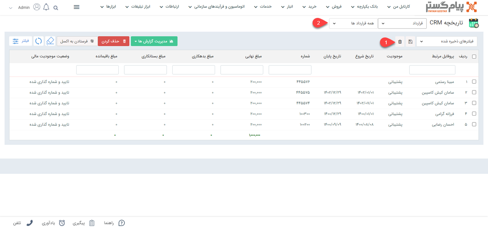
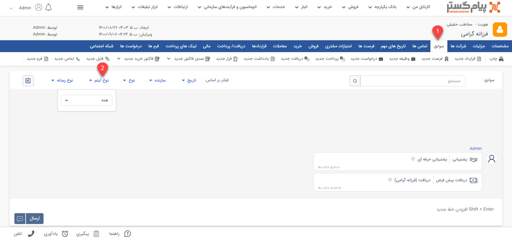

# لیست قراردادها
در این قسمت سابقه قراردادهای مخاطب را می توانید مشاهده کنید و در صورت نیاز قرارداد جدیدی برای هویت ثبت کنید و یا قراردادهای ثبت شده را ویرایش و حذف  نمایید.
- [مشاهده لیست قراردادهای ثبت شده برای تمامی هویت](#AllContractsList)
- [مشاهده لیست قراردادهای ثبت شده برای یک هویت](#CustomerContractsList) 

## مشاهده لیست قراردادهای ثبت شده برای تمامی هویت{#AllContractsList}
برای مشاهده همه قراردادهای ثبت شده دو مسیر اصلی وجود دارد که به شرح زیر است: 
- از طریق **تب خدمات** > **قراردادها**، تمامی قراردادها قابل مشاهده هستند.

- از طریق **تب بانک یکپارچه** > **تاریخچه CRM** می‌توانید با اعمال فیلتر روی "نوع"،تمامی قراردادهای ثبت شده را مشاهده نمایید.

## مشاهده لیست قراردادهای یک هویت{#customerContractsList}
مشاهده لیست قراردادهای ثبت شده برای یک هویت خاص از دو مسیر زیر میسر خواهد بود. 
- از طریق **صفحه پروفایل مشتری** > تب **قراردادها** تمامی قراردادهای ثبت شده برای هویت قابل مشاهده است.

1. **ویرایش:** می‌توانید قرارداد دلخواه را ویرایش کنید.
2. **حذف:** می‌توانید قراردادهای انتخاب شده را حذف نمایید.
3. **قرارداد جدید:** می توانید یک قرار داد جدید برای این مخاطب ایجاد نمایید.
4. **نوع فیلتر:** می توانید  فیلترهای پر کاربرد خود را با یک نام مشخص ذخیره کرد تا بتوان سریع‌تراز آن استفاده کرد.
5. **فیلترهای پیشرفته:** می توانید برای پیدا کردن قرارداد مورد نظر از[ فیلترهای پیشرفته ](https://github.com/1stco/PayamGostarDocs/blob/master/Help/Customer-relationship-management/Advanced-filter/Advanced-filter.md)استفاده کنید.
6. **فرستادن به اکسل:** با استفاده از این دکمه می‌توانید اطلاعات قراردادهای انتخاب شده را در قالب یک فایل اکسل دریافت کنید.
7. **جدول قراردادها:** در این جدول می‌توانید تمامی قراردادهای ثبت شده برای مخاطب را بر اساس فیلدهای مرتبط با قرارداد (ستون های جدول) مشاهده کنید. می‌توانید از بخش تنظیمات روی این جدول انتخاب کنید که چه پارامتر هایی از قرارداد روی این لیست نمایش داده شود.برای آشنایی بیشتر با این پارامتر ها به صفحه راهنمای  قرارداد جدید مراجعه کنید.
8. **مجموع نهایی:** جمع مبالغ وارد شده در قراردادهای مخاطب را نمایش می دهد .

> **نکته**  
در صورتی که **ایجادکننده قرارداد یا مسئول قرارداد** باشید یا یکی از مجوزهای  **ادمین** یا **مشاهده قرارداد** را داشته باشید، می‌توانید تب قرارداد را  در پروفایل مشتری یا در منوی نرم‌افزار مشاهده کنید.
- قراردادهای ثبت شده برای مشتری از طریق **صفحه اصلی پروفایل مشتری**> **تب سوابق** قراردادها را براساس **نوع آیتم** فیلتر کنید.

 برای دسترسی سریع‌تر لیست قراردادها می‌توانید از قسمت فیلتر روی قراردادهای موجود در نرم افزار فیلتر اعمال کنید. 

> **نکته** 
لطفا ابتدا قسمت[ فیلترهای پیشرفته](https://github.com/1stco/PayamGostarDocs/blob/master/Help/Customer-relationship-management/Advanced-filter/Advanced-filter.md) را مطالعه کنید.
