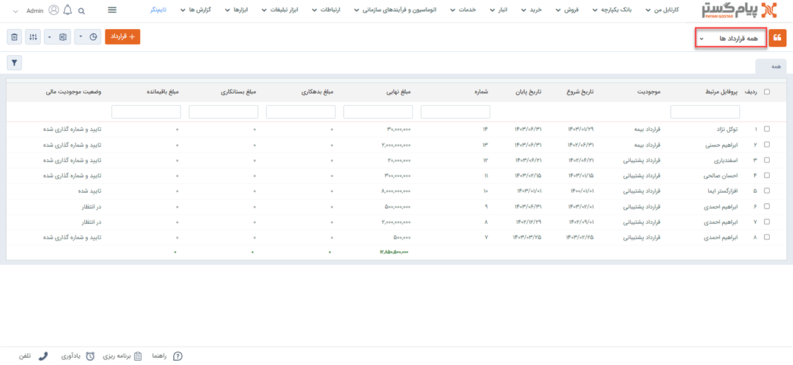
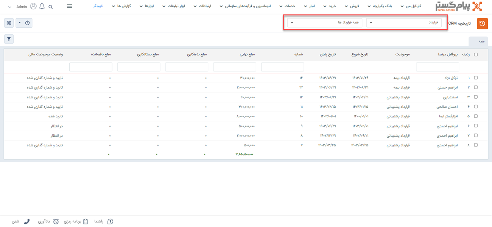
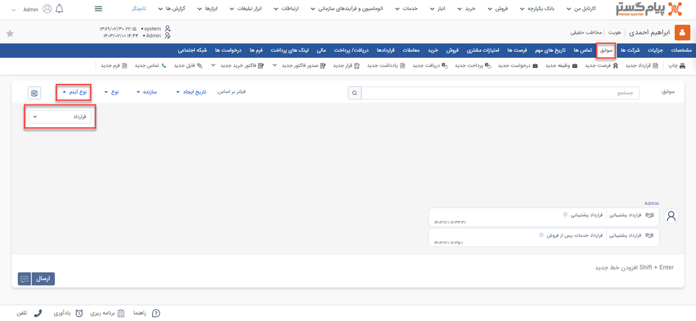
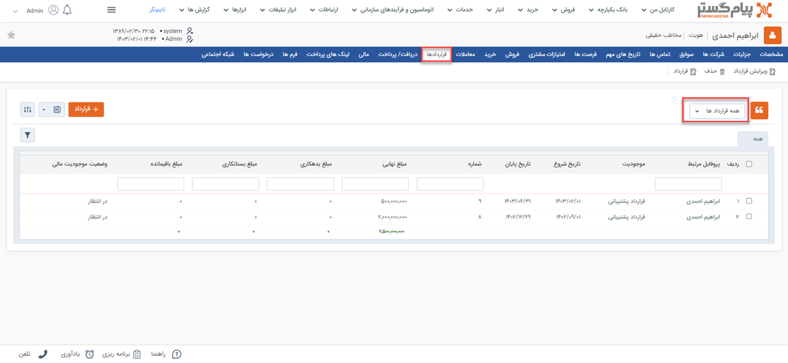
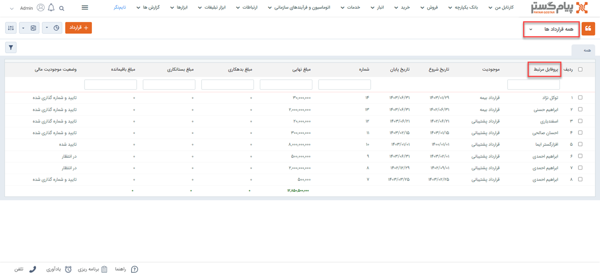
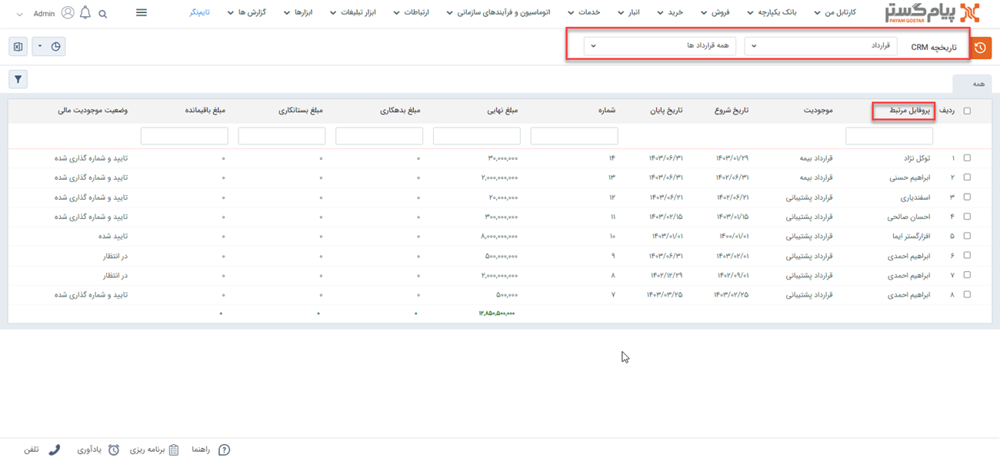

# مشاهده لیست قراردادهای ثبت شده
دراین مقاله روش‌های مشاهده‌ی لیست قراردادها در دو حالت بررسی می‌شود: 
- [مشاهده لیست تمامی قراردادهای ثبت شده](#AllContracts)
- [مشاهده قراردادهای ثبت شده برای یک هویت](#CustomerContracts)

## مشاهده لیست همه قرارداهای ثبت شده{#AllContracts}
برای مشاهده لیست همه قراردادهای ثبت شده دو روش وجود دارد:
- از طریق **تب خدمات** > **قرارداد** 
، تمامی قراردادهای ثبت شده از نوع زیرنوع انتخابی شما،‌ نمایش داده می‌شود.

از قسمت بالای صفحه می‌توانید سایر زیرنوع‌ها و یا همه را برای نمایش انتخاب نمایید. با انتخاب همه، تمامی قراردادها (از همه زیرنوع‌ها) در لیست به شما نمایش داده می‌شود.

- از طریق **تب بانک یکپارچه** > **تاریخچه CRM**  می‌توانید با اعمال فیلتر "نوع" بر روی قرارداد، و انتخاب زیرنوع مورد نظر/همه در فیلتر کناری، تمامی قراردادهای ثبت شده را مشاهده نمایید.

> **نکته** 
> در صورت داشتن مجوز مشاهده لیست و مشاهده آیتم زیرنوع‌های قرارداد، شما می‌توانید تمامی قراردادهای ثبت شده را در این قسمت‌ها مشاهده نمایید. در این صورت تنها مجاز به مشاهده قراردادهایی که خودتان ثبت کرده‌اید خواهید بود. 

## مشاهده لیست قراردادهای ثبت‌شده یک هویت{#CustomerContracts}
برای مشاهده لیست قراردادهای ثبت شده برای یک مخاطب می‌توانید از چهار روش زیر اقدام نمایید: 

- از طریق صفحه **پروفایل مخاطب** > **تب سوابق** می‌توانید به قراردادهای ثبت شده برای مخاطب دسترسی داشته باشید. بدین منظور با استفاده از ویجت جستجوی سریع، صفحه پروفایل هویت مورد نظر را باز کنید. در صفحه اصلی پروفایل هویت از قسمت سوابق  با اعمال فیلتر روی "نوع آیتم" و انتخاب «قرارداد» می‌توانید قرارداد‌های ثبت شده در فرآیند فروش را برای هویت مورد نظر خود را مشاهده نمایید. 

- از طریق صفحه **پروفایل مخاطب** > **قراردادها** می‌توانید به قراردادهای مشتری دسترسی داشته باشید. بدین منظور با استفاده از ویجت جستجوی سریع صفحه پروفایل هویت مورد نظر را باز کنید. در صفحه اصلی پروفایل هویت می‌توانید تمامی قراردادهای مخاطب را مشاهده نمایید. برای مشاهده‌ قراردادها به تنهایی، می‌توانید از فیلتر استفاده نمایید. بدین منظور کافیست در بخش فیلتر، نوع را بر روی قرارداد تنظیم کرده و بر روی اعمال کلیک کنید.  

- از طریق **تب خدمات** > **قراردادها** > **انتخاب زیرنوع مناسب** به صفحه لیست قراردادها رفته و در صورت نیاز زیرنوع قراردادها را به «همه قراردادها» تغییر دهید (از فلش کنار کادر قرمز بالا استفاده کنید). با استفاده از جستجوی «پروفایل مرتبط» قرارداد ثبت شده برای هویت مورد نظر را جدا کنید. بدین منظور کافیست نام هویت را در  قسمت مربوطه نوشته و Enter کنید.
 

- از طریق **تب بانک یکپارچه** > **تاریخچه CRM** با اعمال فیلتر(کادر قرمز بالا)، قراردادها را یافته و با استفاده از جستجوی «پروفایل مرتبط» (کادر قرمز پایین) قرارداد مورد نظر را جدا کنید. بدین منظور کافیست نام هویت را در قسمت مربوطه نوشته و Enter کنید.

> **نکته** 
> برای مشاهده قراردادهای ثبت شده در سابقه یک هویت باید مجوز مشاهده سوابق را بر روی آن زیرنوع هویت و همچنین مشاهده آیتم را در زیرنوع‌های قرارداد داشته باشید.  