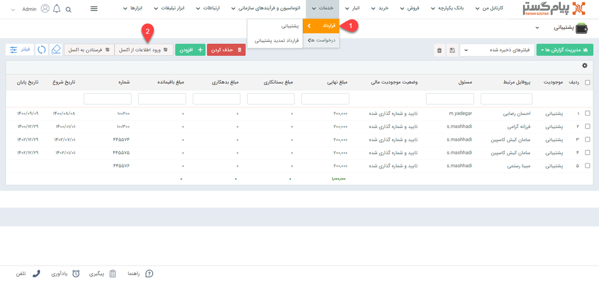
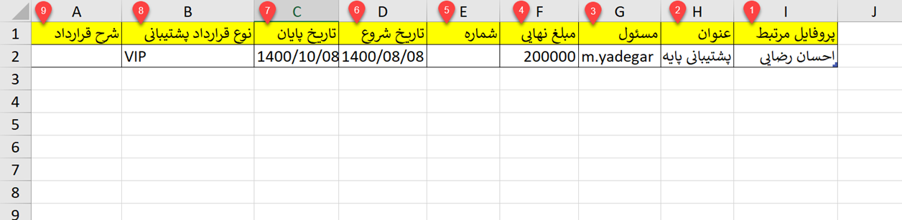
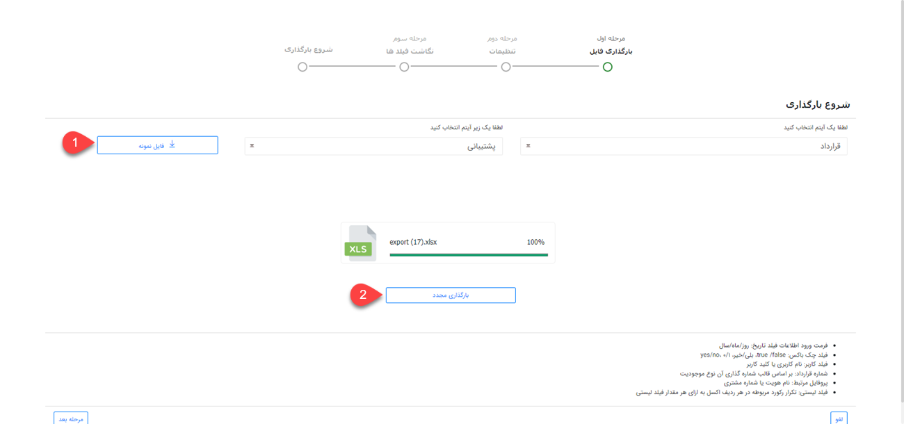
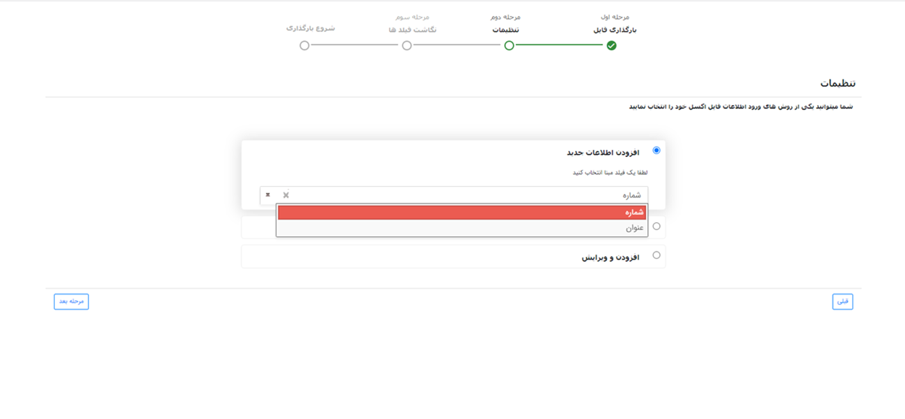
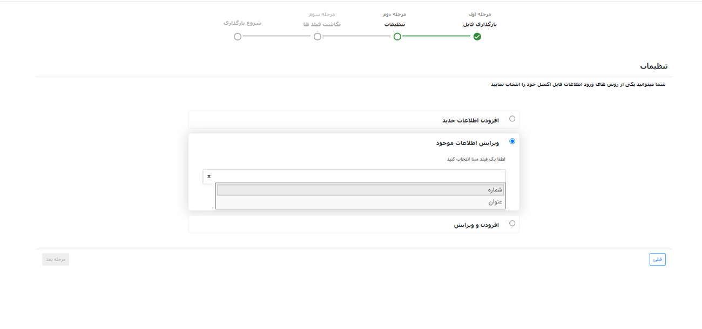
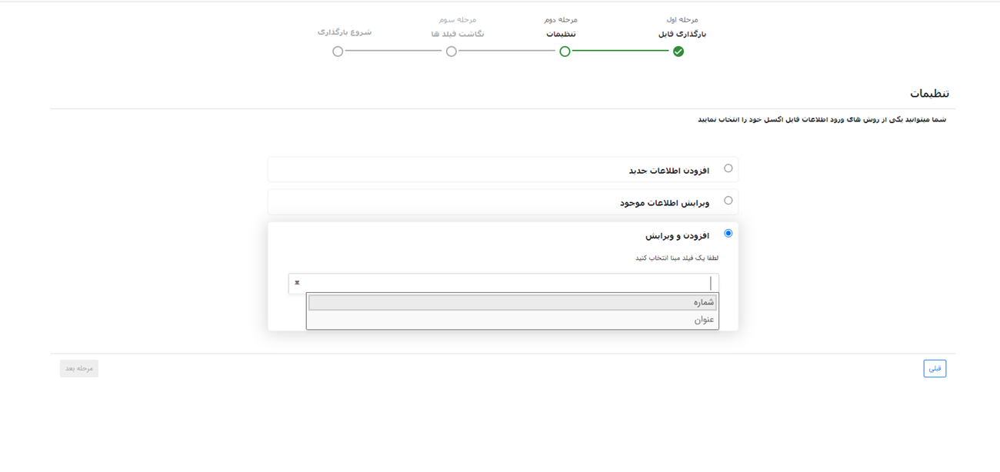
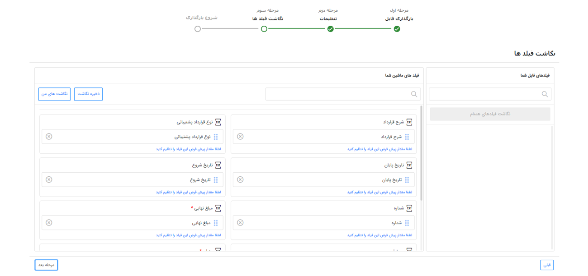
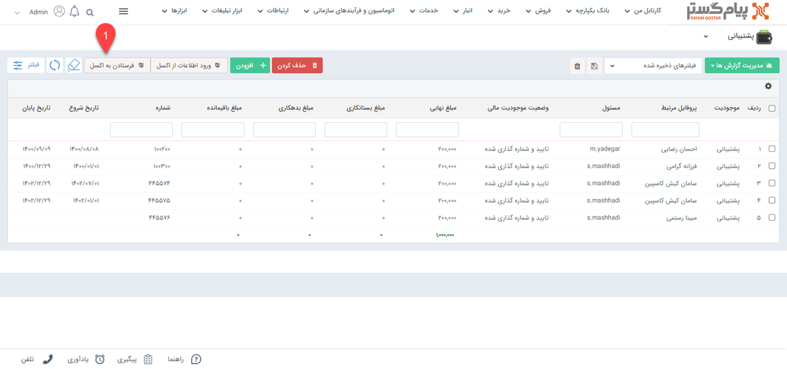

#  ثبت قرادادها از طریق اکسل

زمانی که تعداد قراردادهای در انتظار ثبت زیاد باشد می توانید از طریق اکسل، قراردادها را ثبت نمایید. در این راهنما مراحل ورود اطلاعات، نکات و فرمت صحیح اطلاعات برای ورود از طریق اکسل توضیح داده شده است.
- [تنظیمات مرتبط با فایل اکسل ](#SettingFileExcel)
- [بارگذاری فایل اکسل](#UploadFileExcel)
- [نکات مهم](#ImportantPoints)
- [مجوزهای مورد نیاز برای وروداطلاعات](#PermissionsRequiredToEnterInformation)
- [ویرایش اطلاعات مرتبط با قراردادها](#EditContracts'information) 

>**نکته** 
 [دانلود فایل اکسل نمونه]() و تکمیل اطلاعات براساس  فرمت آن به شما در نگاشت صحیح اطلاعات کمک می کند. 

## تنظیمات فایل اکسل{#SettingFileExcel}
برای ورود اطلاعات می‌توانید در لیست قراردادها، از کلید ورود اطلاعات از طریق اکسل اقدام نمایید.
در گام اول نوع و زیر نوع آیتم انتخاب شده نمایش داده می‌شود. 
اگر لیست آیتم‌ها بر روی نمایش همه(برای مثال همه‌ی قراردادها) باشد، در این گام  زیر نوع بصورت خودکار نمایش داده می‌شود که می‌توان آن را ویرایش کرد. 
فایل اکسل را از مسیر **قرارداد** > **ورود اطلاعات از اکسل** دانلود کنید.

## بارگذاری فایل اکسل{#UploadFileExcel}
برای تکمیل و بارگذاری فایل نمونه باید مراحل زیر انجام گردد.

>**نکته** 
قبل از بارگذاری فایل اکسل نمونه می بایست **نوع** و **زیر نوع آیتم** را مشخص کنید.
>>**نکته**  چنانچه در شخصی سازی CRM فیلدهایی در گروه فیلد تعریف کرده باشید، این فیلد ها به عنوان ستون های اکسل در فایل نمونه درج خواهد شد.

### مرحله اول: تکمیل فایل اکسل  
در این مرحله می‌توانید از فایل اکسل نمونه که در مرحله قبل دانلود کردید استفاده نمایید، این فایل شامل تمامی فیلدهای نوع آیتم انتخاب شده می‌باشد که با وارد کردن اطلاعات خود در فایل نمونه و بارگذاری آن می‌توانید ورود اطلاعات از طریق اکسل را با فرمت صحیح انجام دهید.

برای تکمیل فایل اکسل نمونه به موارد زیر توجه فرمایید:
1. **پروفایل مرتبط**: پروفایل مرتبط همان نام هویت یا شماره مشتری است.
2. **عنوان**: برای ثبت قراردادها می‌توانید عنوان مرتبط با آن قرارداد را ثبت کنید.
3. **مسئول**:   نام کاربری که قرارداد را ثبت می‌نمایید باید در این قسمت درج شود. توجه فرمایید برای فیلد مسئول باید نام کاربری به انگلیسی ثبت گردد.
4. **مبلغ نهایی**: مبلغ نهایی قرارداد را وارد کنید.
5. **شماره**: شماره قرارداد براساس قالب شماره گذاری آن نوع موجودیت ثبت می شود. اگر شماره گذاری براساس الگوی شماره گذاری خودکار انتخاب شده باشد این ستون در فایل اکسل خالی خواهد بود.

>**نکته** 
 می‌توانید یکی از فیلدهای عنوان قرارداد، شماره قرارداد، فیلدهای اضافه‌‎ی (از نوع متن، عدد و شناسه خودکار) روی موجودیت اصلی قرارداد و زیر نوع موردنظر را به عنوان مبنای شناسایی انتخاب کنید.
6. **تاریخ شروع**: تاریخ شروع قراردداد را مطابق با فرمت صحیح روز/ماه/سال وارد کنید.
7. **تاریخ پایان**: تاریخ پایان را براساس فرمت مشخص تایخ وارد کنید.
8. **نوع قرارداد**: در شخصی سازی CRM  می‌توانید زیر نوع آیتم های مربوط به قرارداد را تعریف  کنید.
9. **شرح قرارداد**:  بر اساس نیاز می‌توانید جزئیات هر قرارداد را ثبت نمایید. 
پس از تکمیل فایل اکسل باید فایل را براساس مراحل زیر بارگذاری نمایید:

>**نکته**  
فیلدهای اضافه از نوع Html، برچسب، تصویر، رنگ، فایل، کمپین، فیلدهای لیستی و فیلد آیتم‌های crm (جز فیلد شرکت/شخص) در فایل نمونه قابل مشاهده نیستند.
>>**نکته** 
برای تکمیل فایل اکسل رعایت نکات زیر به عنوان فرمت صحیح ورود اطلاعات الزامی است:
>- **فیلد چک باکس:** true /false، بلی/خیر، yes/no، 0/1
>- **فیلد ساعت:** 00:00
>- **فیلد لیستی:** می بایست به ازای هر مقدار لیست، رکورد مربوطه در فایل اکسل تکرار گردد. همچنین در این حالت، اطلاعات فیلد رکورد آخر به همراه تمام مقادیر فیلد لیستی آن که در رکوردهای مربوطه وارد شده است، در سیستم وارد می‌گردد. مثال فیلد لیستی: لیست عدد، لیست متن 

پس از تکمیل فایل اکسل میتوانید فایل خود را انتخاب یا از طریق drag & drop آپلود کنید، با کلیک بر روی مرحله بعد وارد مرحله دوم شوید.
### مرحله دوم: ویرایش فایل اکسل
برای ویرایش و بارگذاری فایل اکسل باید یکی از سه روش زیر را انتخاب نمایید. 
1. **افزودن اطلاعات جدید:** با انتخاب این روش آیتم‌های موجود در فایل اکسل به نرم‌افزار اضافه می‌شوند.

می‌توانید یکی از فیلدهای موجود در بخش مبنای شناسایی را انتخاب کنید تا براساس آن جستجوی تکراری بودن انجام شود، در صورت تکراری نبودن مقدار مبنای انتخاب شده، آن آیتم به نر‍‌م‌افزار  اضافه می شود.

2. **ویرایش اطلاعات موجود:** در این روش براساس فیلدی که به عنوان مبنا انتخاب شده است، جستجوی تکراری بودن انجام می‌شود و در صورت تکراری بودن مقدار مبنای انتخاب شده، آیتم دارای این اطلاعات ویرایش می شود.

> **نکته**  
با انتخاب چک باکس " فقط فیلد‌های خالی پر شوند " تنها فیلدهای خالی آیتم در حال ویرایش مقداردهی می‌شوند.

3. **افزودن و ویرایش:** در این روش براساس فیلد مبنای انتخاب شده جستجو انجام میشود، در صورت تکراری بودن اطلاعات آن فیلد، آیتم دارای این اطلاعات ویرایش می‌شود و در صورت تکراری نبودن، آیتم جدید به نرم‌افزار  اضافه می شود.

### مرحله سوم: نگاشت فایل اکسل
در مرحله سوم سرستون‌های فایل اکسل در بخش فیلدهای شما نمایش داده می شود.
با drag & drop فیلدها، امکان نگاشت آنها با فیلد‌های سیستم وجود دارد.

فیلدهای هم نام بصورت خودکار نگاشت می‌شوند و همچنین با انتخاب "نگاشت فیلدهای هم نام" امکان نگاشت وجود دارد. 
شما می‌توانید نگاشت مورد نظر خود (به جز نگاشت فیلدهای لیستی) را با استفاده از "ذخیره نگاشت" ذخیره کنید و درصورت نیاز از لیست نگاشت‌ها آن را انتخاب کنید. 
در لیست نگاشت‌های من امکان ویرایش یا حذف  نگاشت ذخیره شده وجود دارد.  
لازم به ذکر است امکان نگاشت "یک" فیلد لیستی در هر بار ورود اطلاعات وجود دارد، برای این کار فیلد لیستی مورد نظر را از لیست انتخاب کرده و نگاشت فیلد را انجام دهید.

>**نکته** 
 در صورتیکه فیلدی در سیستم دارای مقدار پیش فرض باشد در این بخش قابل مشاهده و ویرایش می‌باشد، همچنین می‌توانید برای فیلدها در این بخش  مقدار پیش‌فرض تعریف کنید تا در صورت خالی بودن این فیلد در فایل اکسل، در نرم‌افزار فیلد با این مقدار پیش‌فرض، مقداردهی شوند.

در صورت مشکل در بارگذاری اطلاعات، خطای مرتبط در این گام نمایش داده می‌شود و فایل اکسلی شامل آیتم‌های دارای خطا قابل دریافت می‌باشد، که پس از اصلاح خطاها بارگذاری مجدد فایل انجام شود. 
در منوی گزارش‌ها، بخش **وضعیت عملیات انبوه** می‌توان نتایج ورود اطلاعات را مشاهده کرد، همچنین در صورت بروز خطا، می توان از این بخش فایل اکسلی شامل آیتم‌های دارای خطا و علت خطای رخ داده دریافت نمود.
## نکات مهم(#ImportantPoints)
- در فایل اکسل فیلدهای مبنا باید باهمان نام تعریف شوند، برای نمونه در صورت انتخاب شماره مشتری به عنوان مبنا، در اکسل هم باید نام ستون شماره مشتری  یا نام هویت باشد.
- برای فیلدی که به عنوان مبنا انتخاب شده است و فیلدهای اجباری آن آیتم، می بایست حتما نگاشت انجام شود، در غیر این صورت امکان شروع بارگذاری وجود ندارد.
- لازم به ذکر است فیلد مبنای انتخاب شده در هر روش، باید در فایل اکسل مقدار دهی شده باشد، در غیر این صورت در گام آخر خطا می‌دهد.
توجه داشته باشید آیتم‌های مالی مرتبط با نمی‌تواند سرنخ باشد.
- در ویرایش اطلاعات موجود باید زیر نوع آیتم در حال ویرایش و زیر نوع آیتم انتخاب شده در گام اول یکسان باشد، در غیر این صورت بارگذاری انجام نمی‌شود.
- در صورت انتخاب فیلد از نوع شناسه خودکار به عنوان مبنا برای آیتم‌ها، این فیلد صرفا برای شناسایی آیتم‌ها استفاده می‌شود و مقادیر وارد شده برای آن در اکسل در سیستم وارد نمی‌شود.
- در هنگام ویرایش آیتم‌ها، اگر براساس مبنای انتخاب شده، چندین آیتم در نرم‌افزار وجود داشته باشد و هیچ فیلد لیستی نگاشت نشده باشد، هیچکدام از آیتم‌ها ویرایش نمی‌شوند.
- فیلدهایی که در صورت ثبت یا ویرایش دستی موجودیت‌ها الزامی می‌باشند، هنگام ثبت یا ویرایش از طریق اکسل هم بصورت الزامی می‌باشند و باید نگاشت شوند و دارای مقدار باشند.
- اگر در حین عملیات فیلد اضافه‌ای که به عنوان مبنا در نظر گرفته شده است، از آیتم مربوطه حذف گردد، ورود اطلاعات با خطا مواجه می شود. 
- فیلدهایی از نوع لیست کشویی پیش‌فرض (فیلدهای موجود در مدیریت آیتم‌های سیستم) مانند نوع پرداخت یا روش پرداخت باید مطابق مقادیر موجود در نرم‌افزار مقدار دهی شوند، همچنین اگر در این فیلدها دو مقدار همنام وجود داشته باشد، هنگام بارگذاری اطلاعات اگر این مقدار همنام در اکسل تعریف شده باشد، آن فیلد در نرم‌افزار مقداردهی نمی‌شود و خطا می‌دهد.

## مجوزهای مورد نیاز برای ورود اطلاعات{#PermissionsRequiredTo EnterInformation}
- **مجوز افزودن اطلاعات جدید:**
برای افزودن اطلاعات جدید در مرحله دوم کاربر باید مجوز ذخیره اولیه آیتم را در نوع آیتم انتخاب شده داشته باشد. 
- **مجوز ویرایش اطلاعات موجود:**
برای ویرایش اطلاعات موجود در مرحله دوم کاربر باید مجوز ویرایش آیتم را در نوع آیتم انتخاب شده داشته باشد. 
- **مجوز افزودن و ویرایش:**
برای افزودن و ویرایش اطلاعات در مرحله دوم کاربر باید مجوز ذخیره اولیه آیتم و ویرایش آیتم را روی نوع آیتم انتخاب شده داشته باشد. 
- **مجوز ویرایش مرتبط با:** 
کاربر برای ویرایش پروفایل مرتبط با آیتم علاوه بر مجوز ویرایش آیتم باید مجوز ویرایش مرتبط با را برروی نوع فرم داشته باشد. 

## ویرایش اطلاعات مرتبط با قراردادها{#EditContracts'information}
گاهی براساس سیاست های شرکت نیاز به ویرایش اطلاعات مرتبط با قراردادها خواهیم داشت. برای مثال نام کاربری که قراردادهای مرتبط را ثبت کرده تغییر می کند یا  مبلغ نهایی  قرارداد براساس شرایطی کم یا زیاد خواهد شد. در این مرحله نیاز به ثبت مجدد قرارداد ها نخواهید داشت و تنها با ویرایش  قراردادها می توانید تغییرات مورد نظر را ایجاد نمایید.  
مراحل ویرایش اطلاعات قراردادها به شرح زیر است: 
**مرحله اول:** ابتدا در صفحه قراردادها،روی دکمه فرستادن به اکسل کلیک کرده و فایل قراردادهای ثبت شده را دانلود کنید. 

**مرحله دوم:** پس از دانلود فایل قراردادهای ثبت شده اطلاعاتی که نیاز به تغییر دارند را وارد کنید. 
**مرحله سوم:** در این قسمت با کلیک بر روی دکمه ورورد اطلاعات از اکسل مطابق با قسمت [بارگذاری اطلاعات](#UploadFileExcel)
از طریق اکسل مراحل را به اتمام رسانید.