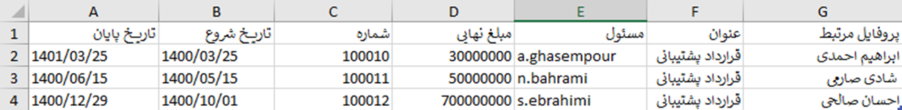
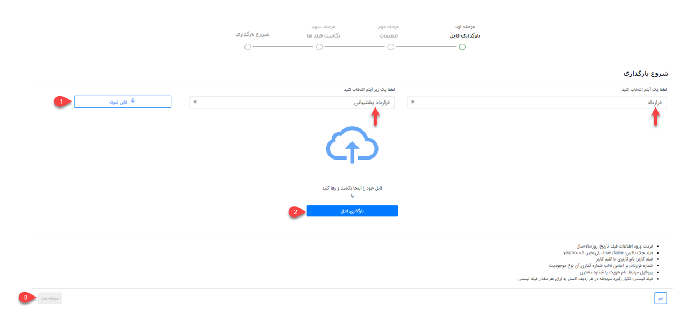
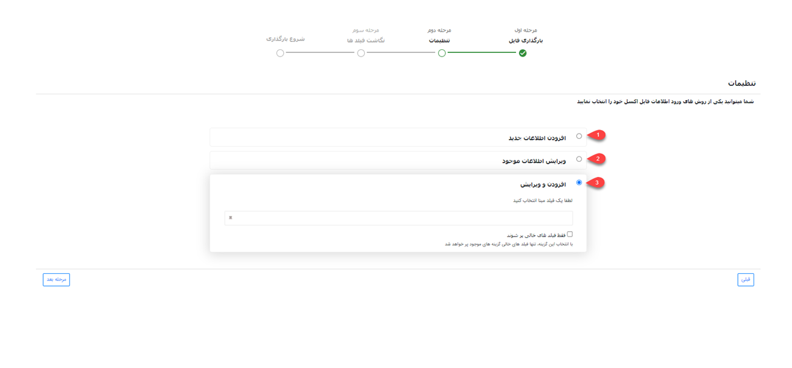
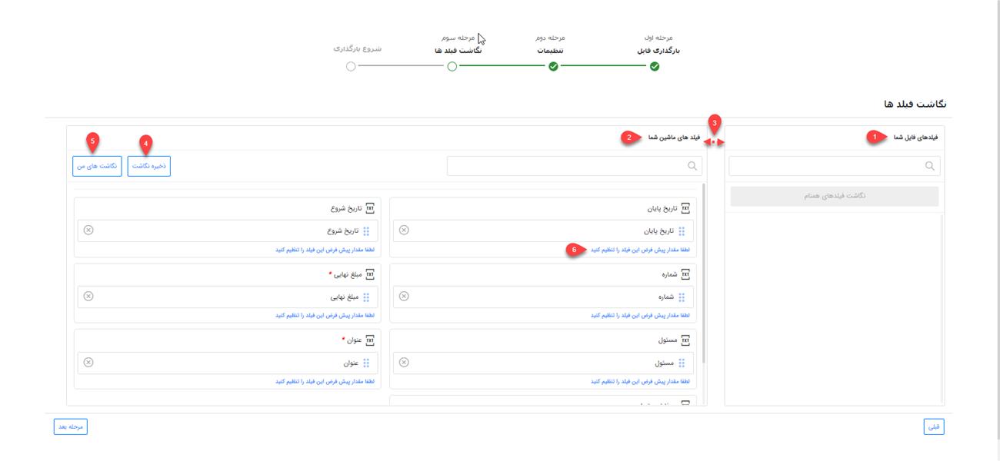

#  بارگذاری قرادادها از طریق اکسل

در صورت نیاز به بارگذاری اطلاعات تعدادی از قراردادها به صورت یکجا می‌توانید از روش ورود اکسلی استفاده نمایید. بدین ترتیب می‌توانید اطلاعات قراردادهای مورد نظر را در اکسل درج نمایید(یا از سایر نرم‌افزارهای خود خروجی بگیرید) و سپس بارگذاری کنید. در این حالت قراردادهای مورد نظر ایجاد شده و اطلاعات آن در فیلدهای مربوطه وارد می‌شود. علاوه بر آن از این روش می‌توانید برای ویرایش قراردادهای موجود استفاده نمایید. به عنوان مثال شماره موبایل‌های مشتریان را طبق آخرین تغییرات سیستم خود ویرایش کنید.
برای اینکه ورود اطلاعات بدون مواجه با خطا و با موفقیت به اتمام برسد، در این مقاله تمامی موارد لازم به همراه شیوه بارگذاری مطرح شده است. اقدامات مورد نیاز شامل عناوین زیر می‌باشد: 
- [شیوه تهیه و تنظیم فایل اکسل قراردادها](#SettingFileExcel)
- [روش بارگذاری فایل اکسل قراردادها](#UploadFileExcel)
- [مجوزهای لازم برای بارگذاری اکسل قراردادها]
برای ورود انواع قراردادها می‌توانید از همین روش اقدام نمایید.

## تنظیمات فایل اکسل{#SettingFileExcel}
برای ورود اطلاعات قراردادها از طریق اکسل، ابتدا باید اکسل مورد نظر را براساس فرمت مورد پذیرش نرم‌افزار تنظیم کنید. بدین منظور می‌توانید از فایل نمونه استفاده نمایید. فایل نمونه را می‌توانید از سایت **پیام‌گستر** دانلود کنید.
برای تکمیل فایل اکسل، به مواد زیرتوجه فرمایید:
در تهیه اکسل توجه داشته باشید که تمامی اطلاعات در یک Sheet ذخیره شده باشد. در غیر این صورت بارگذاری اکسل با موفقیت انجام نخواهد شد.
امکان بارگذاری انواع قرارداد به صورت یکجا (با استفاده از یک اکسل) وجود ندارد.
در صورت استفاده از اکسل نمونه‌ی موجود در سایت،‌ فرمت و کامنت‌های آن را حذف نمایید. بدین منظور جدول را نتخاب کرده و از Clear Comment و Clear Format استفاده نمایید.

برای تکمیل فایل اکسل نمونه به موارد زیر توجه فرمایید:
1. **پروفایل مرتبط**: پروفایل مرتبط همان نام هویت یا شماره مشتری است.
2. **عنوان**: برای ثبت قراردادها می‌توانید عنوان مرتبط با آن قرارداد را ثبت کنید.
3. **مسئول**:   نام کاربری که قرارداد را ثبت می‌نمایید باید در این قسمت درج شود. توجه فرمایید برای فیلد مسئول باید نام کاربری به انگلیسی ثبت گردد.
4. **مبلغ نهایی**: مبلغ نهایی قرارداد را وارد کنید.
5. **شماره**: شماره قرارداد براساس قالب شماره‌گذاری آن نوع موجودیت ثبت می‌شود. اگر شماره‌گذاری براساس الگوی شماره‌گذاری خودکار انتخاب شده باشد این ستون در فایل اکسل خالی خواهد بود.

>**نکته** 
 می‌توانید یکی از فیلدهای عنوان قرارداد، شماره قرارداد، فیلدهای اضافه‌‎ی (از نوع متن، عدد و شناسه خودکار) روی موجودیت اصلی قرارداد و زیر نوع موردنظر را به عنوان مبنای شناسایی انتخاب کنید.
6. **تاریخ شروع**: تاریخ شروع قرارداد را مطابق با فرمت صحیح روز/ماه/سال وارد کنید.
7. **تاریخ پایان**: تاریخ پایان را براساس فرمت مشخص تایخ وارد کنید.

چنانچه قرارداد شما دارای اطلاعاتی بیشتر از فیلدهای موجود در نرم‌افزار است، باید فیلد مورد نیاز آن را از طریق شخصی‌سازی ایجاد نمایید. پس از آن می‌توانید اطلاعات این فیلدها را نیز با استفاده از اکسل وارد کنید. بدین منظور کافی است ستونی هم نام با فیلد خود به ستون‌های موجود در اکسل اضافه نمایید. در این خصوص به نکات زیر توجه داشته باشید:

- امکان ورود اطلاعات فیلدهایی از نوع فایل، تصویر، html، کمپین، برچسب، لیست مرتبط، فیلد آیتم‌های CRM (مثل فیلد دریافت،‌فاکتور و... به جز فیلد شخص/شرکت)، فیلد اضافه از نوع رنگ، فیلد لیستی از نوع فایل و فیلد لیستی از نوع کاربر/گروه از طریق اکسل وجود ندارد.
- در صورت استفاده از فیلد چک باکس،‌ با استفاده از «بلی» چک باکس تیک خورده و در صورت ذکر «خیر» چک باکس بدون تیک لحاظ می‌شود. البته از عبارات yes/no و true/false و همچنین اعداد 1/0 نیز می‌توانید بدین منظور استفاده نمایید.
- در صورت استفاده از فیلد کاربر، از بین کاربران تعریف شده در نرم‌افزار نام کاربر و یا کد کاربر مورد نظر را در این قسمت درج نمایید.
- برای ورود اطلاعات به فیلدهایی از نوع لیست کشویی فقط از عبارات موجود در لیست می‌توانید استفاده نمایید. فیلدهای لیست کشویی پیش‌فرض نرم‌افزار در بخش مدیریت آیتم‌های سیستم و لیست‌های کشویی اضافه‌ شده توسط شما در بخش شخصی‌سازی آن آیتم قابل مشاهده و ویرایش می‌باشند. چنانچه برای یک فیلد لیست کشویی دو گزینه با عنوان مشابه تعریف شده باشد، ورود اطلاعات (مقداردهی) آن از طریق اکسل با خطا مواجه می‌شود.

## مراحل بارگذاری فایل اکسل{#UploadFileExcel}
### بارگذاری فایل

برای ورود اطلاعات می‌توانید در لیست قراردادها، از کلید ورود اطلاعات از طریق اکسل اقدام نمایید.
در گام اول نوع و زیر نوع آیتم انتخاب شده نمایش داده می‌شود. 
اگر لیست آیتم‌ها بر روی نمایش همه(برای مثال همه‌ی قراردادها) باشد، در این گام  زیر نوع بصورت خودکار نمایش داده می‌شود که می‌توان آن را ویرایش کرد. 
فایل اکسل را از مسیر **قرارداد** > **ورود اطلاعات از اکسل** دانلود کنید.

>**نکته** 
قبل از بارگذاری فایل اکسل نمونه می بایست **نوع** و **زیر نوع آیتم** را مشخص کنید.
>>**نکته**  چنانچه در شخصی سازی CRM فیلدهایی در گروه فیلد تعریف کرده باشید، این فیلد ها به عنوان ستون‌های اکسل در فایل نمونه درج خواهد شد.
با کلیک بر روی «فایل نمونه» (شماره ۱) می‌توانید اکسل نمونه برای تهیه اکسل با فرمت صحیح را دریافت نمایید. چنانچه از راهنمای بالا برای تهیه اکسل خود استفاده کرده‌اید نیاز به دانلود این فایل نیست.
در این مرحله فایل اکسل خود را انتخاب (شماره ۲) یا از طریق drag & drop بارگذاری کنید. پس از بارگذاری فایل،‌ کلید «مرحله بعد» (شماره ۳) فعال می‌شود.

### تنظیمات بارگذاری فایل
در این بخش باید تنظیمات لازم جهت تعیین روش ورود اطلاعات را مشخص کنید.

**1. افزودن اطلاعات جدید** 
با انتخاب این گزینه، تمامی قراردادهای جدید موجود در اکسل بر اساس مبنای انتخابی شما شناسایی و بارگذاری می‌شود. در این مرحله باید یکی از فیلدهای شماره قرارداد و عنوان را به عنوان مبنای شناسایی انتخاب کنید. براساس فیلد انتخابی جستجوی تکراری بودن انجام شود. در صورت تکراری نبودن مبنای انتخاب شده، آن آیتم به نر‍‌م‌‌افزار اضافه می‌شود.
با انتخاب گزینه‌ی هیچکدام به عنوان مبنا، تمامی قراردادهای موجود در اکسل (اعم از تکراری و غیرتکراری) به قراردادها اضافه خواهد شد و بررسی تکراری بودن اطلاعات تنها از طریق تنظیمات اعمال شده در تنظیمات کلی انجام خواهد شد. 
**2. ‌ویرایش اطلاعات موجود** 
در این حالت براساس فیلدی که به عنوان مبنا انتخاب شده است، جستجو انجام می‌شود. در صورت وجود هویت با اطلاعات فیلد مبنا، هویت مربوطه ویرایش شده و اطلاعات موجود در اکسل برای آن درج می‌شود. در صورت عدم یافت نشدن هویت بر اساس فیلد مبنا،‌اطلاعات آن سطر از اکسل بارگذاری نخواهد شد.
با انتخاب چک باکس " فقط فیلد‌های خالی پر شوند" تنها فیلدهای خالی هویت مقداردهی شده و فیلدهایی که دارای اطلاعات می‌باشند بدون تغییر باقی می‌مانند.

>**نکته** 
 هنگام ویرایش، باید زیر نوع آیتم در حال ویرایش و زیر نوع آیتم انتخاب شده در گام اول یکسان باشد، در غیر این صورت بارگذاری انجام نمی‌شود.

**3. افزودن و ویرایش** 
در این حالت براساس فیلد مبنای انتخاب شده جستجو انجام می‌شود. در صورت وجود قرارداد با اطلاعات فیلد مبنا، قرارداد مربوطه ویرایش می‌شود و در صورت یافت نشدن قرارداد با این اطلاعات، به عنوان قرارداد جدید به نرم‌افزار اضافه می‌شود.
با انتخاب چک باکس " فقط فیلد‌های خالی پر شوند،‌ در هویت‌هایی که بر اساس فیلد مبنا یافت شده و نیازمند ویرایش می‌باشند، ‌تنها فیلدهای خالی مقداردهی شده و فیلدهایی که دارای اطلاعات می‌باشند بدون تغییر باقی می‌مانند.

>**نکته** 
در حالت ویرایش (حالت ۲ و ۳)، چنانچه بر اساس مبنای جستجو، چند قرارداد با اطلاعات مورد نظر یافت شود، (مثلا در حالتی که مبنا شماره قرارداد است،‌ چند هویت دارای یک شماره قرارداد یکسان باشند) ویرایش بر روی هیچ یک از هویت‌ها انجام نمی‌گیرد.

در زمان ویرایش، مقادیر جایگزین مقادیر قبلی می‌شوند. بنابراین در صورتی که نیاز است مقادیر جدید بدون حذف مقادیر قبلی اضافه شوند، باید مقادیر قبلی موجود هر فیلد که قصد حفظ آن را دارید، در اکسل تکرار گردند.

>**نکته** 
در صورت انتخاب گزینه‌ی «هیچکدام» در قسمت مبنا، گزینه «ورود مقادیر به صورت یکپارچه» به صورت خودکار فعال می‌گردد. چرا که با توجه به عدم وجود مبنای شناسایی، امکان افزودن اطلاعات چندگانه به صورت جداگانه وجود ندارد.

در تمامی حالات فوق توجه داشته باشید هنگامی که ایمیل، تلفن، موبایل یا شماره مشتری به عنوان مبنا انتخاب شوند، باید در اکسل نام آن‌ها به صورت ایمیل پیش فرض، تلفن پیش فرض، موبایل پیش فرض و شماره مشتری درج شده باشند.

>**نکته** 
در صورت انتخاب شیوه ورود مقادیر به صورت یکپارچه و انتخاب یکی از فیلدهای چندگانه (موبایل یا تلفن) به عنوان مبنای جستجو در قسمت‌های ۱، ۲ یا ۳،‌ باید یک ستون تحت عنوان موبایل/تلفن پیش‌فرض اضافه کنید. اولین شماره‌ی درج شده در آن ردیف شماره پیش‌فرض بوده و باید در این ستون تکرار شود.

## نگاشت فیلدها
در مرحله سوم، سرستون‌های فایل اکسل در بخش «فیلدهای فایل شما» (شماره ۱) و فیلدهای موجود در مشخصات هویت در بخش «فیلدهای ماشین شما» (شماره ۲) نمایش داده می‌شود. در واقع در این بخش مشخص می‌شود اطلاعات هر ستون اکسل باید در کدام فیلد وارد شود.

در صورت یکسان بودن نام ستون با نام فیلدها،‌ نگاشت به صورت خودکار انجام می‌گیرد. در غیر این صورت با drag & drop باید نام هر ستون را از بخش فیلدهای فایل شما (سمت راست) به فیلد مربوطه در بخش فیلدهای ماشین شما (سمت چپ) متصل نمایید. در این شرایط برای یافتن عنوان مورد نظر در هر دو بخش می‌توانید از قابلیت جستجو (شماره ۳)‌ استفاده نمایید.
پس از نگاشت (اتصال نام ستون به فیلدها) می‌توانید نگاشت خود را ذخیره نمایید (شماره ۴). در صورت استفاده مجدد از این اکسل/اکسل مشابه برای بارگذاری با کلیک بر روی نگاشت‌های من (شماره ۵)، نگاشت به صورت خودکار انجام می‌شود.شما می‌توانید نگاشت‌های پرکاربرد خود را در سیستم ذخیره نمایید. در لیست نگاشت‌های من امکان ویرایش یا حذف نگاشت ذخیره شده وجود دارد.
برای هر فیلد می‌توانید مقدار پیش‌فرض تعیین نمایید (شماره ۶). در صورت خالی بودن مقدار فیلد در اکسل، فیلد با مقدار پیش‌فرض که در این قسمت تعریف کرده‌اید پر می‌شود.

## شروع بارگذاری
در صورت بارگذاری موفق اکسل،‌ انجام موفقیت آمیز آن در این صفحه اعلام می‌شود. در صورت عدم موفقیت در بارگذاری اطلاعات، پیغام زیر نمایش داده می‌شود.

### بارگذاری ناموفق فایل اکسل

در منوی گزارش‌ها، بخش وضعیت عملیات انبوه می‌توانید نتایج ورود اطلاعات را مشاهده کنید. همچنین در صورت بروز خطا با دانلود فایل اکسل از این بخش می‌توانید خطا و علت خطا را مشاهده نمایید. برای دانلود فایل، بر روی جزئیات رکورد مربوطه کلیک کرده و خروجی اکسل دریافت کنید. در اکسل دریافتی، سطرهای دارای مشکل با رنگ قرمز مشخص شده و در ستون آخر دلیل بروز خطا درج شده است.

>**نکته** 
اگر جلوگیری از ثبت اطلاعات تکراری در تنظیمات کلی انجام شده باشد (برای مثال جلوگیری از ثبت تلفن تکراری) در هنگام ورود اطلاعات از طریق اکسل علاوه بر فیلد مبنا، این اطلاعات هم بررسی می‌گردد و در صورت تکراری بودن، ورود اطلاعات انجام نمی‌شود.

## مجوزهای مورد نیاز برای ورود اطلاعات از طریق اکسل
برای ورود اطلاعات از طریق اکسل،‌ کاربر باید دارای مجوزهای زیر باشد:

- **افزودن شماره قرارداد** 
برای افزودن و ویرایش شماره قرارداد، کاربر باید مجوز تغییر شماره قرارداد را روی زیرنوع هویت مربوطه داشته باشد. در غیر این صورت، مقدار این فیلد افزوده یا ویرایش نمی‌شود.
- **افزودن و ویرایش رنگ هویت** 
برای افزودن و ویرایش رنگ، کاربر باید مجوز ویرایش رنگ را روی زیر نوع قرارداد داشته باشد.
ویرایش اطلاعات موجود
برای ویرایش اطلاعات موجود (حالت ۲ و ۳ در تنظیمات بارگذاری) کاربر باید مجوز ویرایش آیتم را در زیرنوع هویت انتخاب شده داشته باشد.

>**نکته** 
برای افزودن و ویرایش اطلاعات (حالت ۳ در تنظیمات بارگذاری) باید مجوز ذخیره اولیه آیتم و ویرایش آیتم را روی زیرنوع هویت انتخاب شده داشته باشد.

در صورت داشتن مجوز مدیر سیستم و یا مجوز مدیر بانک اطلاعاتی می‌توانید بارگذاری اکسل در تمامی حالت‌ها را به انجام برسانید.

