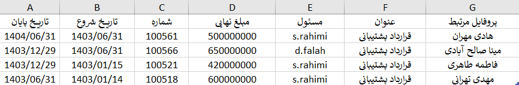
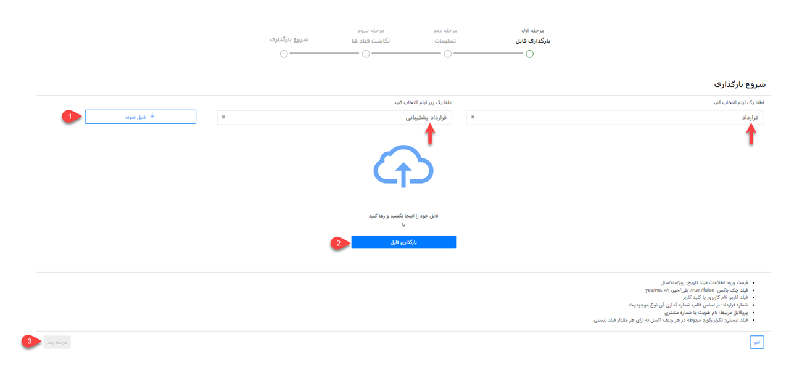
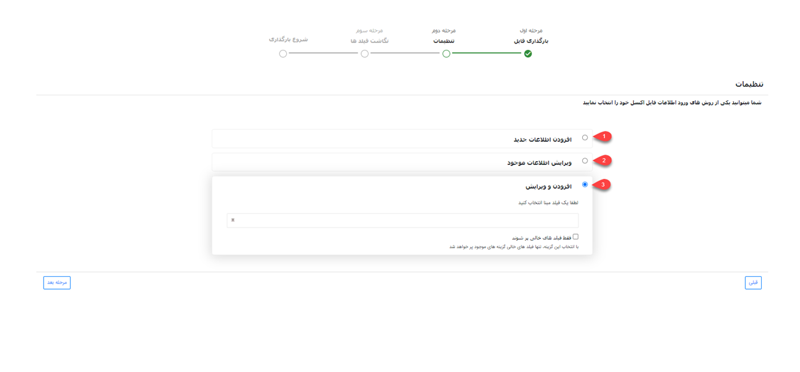
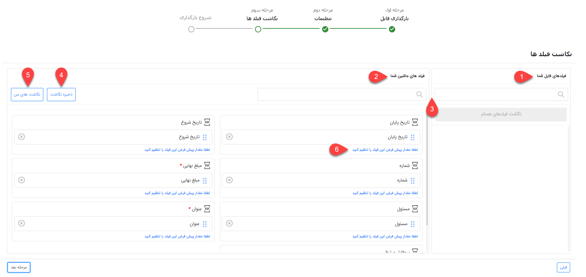
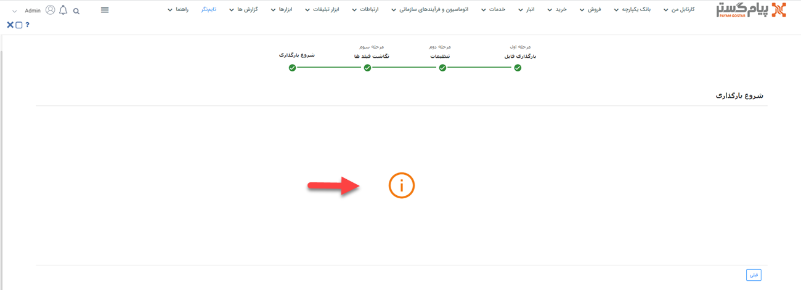

#  بارگذاری قرادادها از طریق اکسل

در صورت نیاز به بارگذاری اطلاعات تعدادی از قراردادها به صورت یکجا، می‌توانید از روش ورود اکسلی استفاده نمایید. بدین ترتیب می‌توانید اطلاعات قراردادهای مورد نظر را در اکسل درج کرده (یا از سایر نرم‌افزارهای خود خروجی بگیرید) و سپس در پیام‌گستر بارگذاری کنید. در این حالت قراردادهای مورد نظر ایجاد شده و اطلاعات آن در فیلدهای مربوطه وارد می‌شود. علاوه بر ایجاد قرارداد، از این روش می‌توانید برای ویرایش قراردادهای موجود نیز استفاده نمایید. 
برای اینکه بارگذاری قراردادها بدون مواجهه با خطا و با موفقیت به اتمام برسد، لازم است که قوانین تهیه و بارگذاری اکسل را رعایت کنید. در این راهنما تمامی موارد لازم برای تنظیم صحیح فایل اکسل، به همراه شیوه بارگذاری آن مطرح شده‌است. بدین منظور در این مقاله به موارد زیر می‌پردازیم: 
- [شیوه تهیه و تنظیم فایل اکسل قراردادها](#ContractExcelSetting)
- [روش بارگذاری فایل اکسل قراردادها](#ContractExcelUpload)
- [مجوزهای لازم برای بارگذاری اکسل قراردادها](#ContractExcelPermission)

## تنظیمات فایل اکسل{#ContractExcelSetting}
برای ورود اطلاعات قراردادها از طریق اکسل، ابتدا باید اکسل مورد نظر را بر اساس فرمت مورد پذیرش نرم‌افزار تنظیم کنید. بدین منظور می‌توانید اکسلی با ستون‌هایی که در تصویر می‌بینید (فیلدهای آیتم قرارداد) ایجاد کنید و یا از فایل نمونه استفاده نمایید. فایل نمونه در مرحله‌ی اول بارگذاری به شما ارائه می‌شود (جلوتر به آن می‌رسیم). 

تصویر فوق،‌ ستون‌های مورد نیاز برای بارگذاری قرارداد را بر اساس فیلدهای پیش‌فرض آیتم قرارداد نشان می‌دهد. در صورت افزودن فیلدهای اضافه (در شخصی‌سازی)، برای هر فیلد یک ستون با نام مشابه آن ایجاد نمایید. چنانچه از فایل نمونه‌ای که نرم‌افزار به شما می‌دهد استفاده می‌کنید، این فیلدها به صورت خودکار در فایل اکسل قرار داده‌می‌شود. 
برای تکمیل اطلاعات مربوط به فیلدهای پیش‌فرض به راهنمایی‌های زیر توجه داشته‌باشید: 
- **پروفایل مرتبط**: نام هویت مرتبط قرارداد (هویتی که قرارداد باید ب نامش ثبت شود) را درج کنید. توجه داشته‌باشید که این پروفایل این هویت باید پیش‌تر در نرم‌افزار ثبت شده‌باشد. چنانچه هویت مربوطه شماره مشتری دارد، از شماره مشتری نیز می‌توانید به جای نام وی در این ستون استفاده کنید.
- **عنوان:** عنوان قرارداد را وارد نمایید. به صورت پیش‌فرض، نام زیرنوع موجودیت (مثلاً قراداد پشتیبانی) به در بخش عنوان ثبت می‌شود. در صورت تمایل می‌توانید عنوان مناسب‌تری را برای قراردادهای خود در نظر بگیرید. درج عنوان تکراری برای رکوردهای مختلف بلامانع می‌باشد.
- **مسئول:** برای هر قرارداد می‌توانید یک کاربر را به عنوان مسئول پیگیری در نظر بگیرید. برای تعیین مسئول از نام کاربری (انگلیسی) و یا کد کاربری کاربر مورد نظر استفاده کنید.
- **مبلغ نهایی:** مبلغ نهایی قرارداد را وارد کنید.
- **شماره:** شماره قرارداد را در این ستون درج نمایید. توجه‌داشته‌باشید که این شماره باید با الگوی شماره‌گذاری تعریف شده برای آیتم مطابقت داشته‌باشد. اگر شماره‌گذاری آیتم در حالت خودکار تنظیم شده‌باشد، نیازی به درج شماره در این ستون نمی‌باشد. چرا که قرارداد پس از ثبت به صورت خودکار شماره‌گذاری می‌شود.
- **تاریخ شروع:** تاریخ شروع قرارداد را مطابق با فرمت صحیح روز/ماه/سال وارد کنید.
- **تاریخ پایان:** تاریخ پایان را بر اساس فرمت مشخص تاریخ وارد کنید.

چنانچه قرارداد شما دارای اطلاعاتی بیشتر از فیلدهای پیش‌فرض باشد، باید فیلد مورد نیاز آن را از طریق شخصی‌سازی در زیرنوع قرارداد مورد نظر ایجاد نمایید. پس از آن کافی است برای هر فیلد، ستونی هم نام با آن به ستون‌های موجود در اکسل اضافه نمایید. در این خصوص به نکات زیر توجه داشته‌باشید: 
- امکان ورود اطلاعات فیلدهایی از نوع فایل، تصویر، html، کمپین، برچسب، لیست مرتبط، فیلد آیتم‌های CRM (مثل فیلد دریافت،‌فاکتور و... به جز فیلد شخص/شرکت)، فیلد اضافه از نوع رنگ، فیلد لیستی از نوع فایل و فیلد لیستی از نوع کاربر/گروه از طریق اکسل وجود ندارد.
- در صورت استفاده از فیلد چک‌باکس،‌ برای فعال کردن (تیک زدن) آن از «بلی» و برای غیرفعال بودن آن (درج بدون تیک) از «خیر» در ستون مربوطه استفاده کنید. البته از عبارات yes/no و true/false و همچنین اعداد 1/0 نیز می‌توانید بدین منظور استفاده نمایید.
- در صورت استفاده از فیلد کاربر (مشابه ستون مسئول)، از بین کاربران تعریف شده در نرم‌افزار نام کاربر و یا کد کاربر مورد نظر را در این قسمت درج نمایید.
- برای ورود اطلاعات به فیلدهایی از نوع لیست کشویی فقط از عبارات موجود در لیست می‌توانید استفاده نمایید. چنانچه برای یک فیلد لیست کشویی دو گزینه با عنوان مشابه تعریف شده‌باشد، ورود اطلاعات (مقداردهی) آن از طریق اکسل با خطا مواجه می‌شود.
- در صورت اضافه کردن فیلد لیستی (مثل لیست عدد یا لیست متن) باید رکورد قرارداد را با اطلاعات مشابه تکرار و در هر ردیف، ‌صرفاً مقدار مندرج در لیست را تغییر دهید.

>**نکته** 
> توجه داشته‌باشید که امکان بارگذاری چند نوع قرارداد (زیرنوع‌های مختلف) به صورت یکجا وجود ندارد. برای بارگذاری قرارداد، برای هر زیرنوع قرارداد به یک اکسل جداگانه نیاز دارید. 
 
## مراحل بارگذاری فایل اکسل{#ContractExcelUpload}
بارگذاری اکسل در پیام‌گستر، چهار مرحله‌ی اصلی دارد: 
### بارگذاری فایل
برای بارگذاری فایل اکسل از مسیر تب **خدمات** > **قرارداد** > **زیرنوع قرارداد** مورد نظر را انتخاب کنید و وارد صفحه لیست قراردادها شوید. بر روی کلید «ورود اطلاعات از اکسل» کلیک کنید تا صفحه بارگذاری به شما نمایش داده‌شود. 
در گام اول **نوع** و **زیرنوع** آیتم انتخاب شده نمایش داده‌می‌شود. توجه داشته‌باشید که زیرنوع قراردادی که قصد بارگذاری آن را دارید در قسمت زیرنوع انتخاب شده‌باشد. در غیر این صورت، چنانچه زیرنوع قرارداد به درستی انتخاب نشده‌است، آن را به زیرنوع مورد نظر تعییر دهید. 

با کلیک بر روی کلید فایل نمونه (شماره ۱) می‌توانید قالب نمونه اکسل را دریافت نمایید. همان طور که پیش‌تر به آن اشاره شد، در این قالب ستون‌هایی برای درج اطلاعات فیلدهای پیش‌فرض قرارداد تعبیه شده‌است و در صورت اضافه شدن فیلدهای اضافه طی شخضی‌سازی، برای وارد کردن اطلاعات آن‌ها نیز ستون‌هایی به فایل افزوده می‌شود. 
پس از تنظیم فایل اکسل، با کلیک بر روی کلید بارگذاری فایل (شماره ۲)، فایل مورد نظر را انتخاب و بارگذاری کنید. پس از اتمام بارگذاری، کلید مرحله‌ی بعد (شماره ۳) در پایین صفحه برای شما فعال می‌شود. با کلیک بر روی این کلید، برای اعمال تنظیمات به مرحله‌ی بعدی می‌روید. 
### تنظیمات بارگذاری فایل
در این بخش باید تنظیمات لازم جهت تعیین روش ورود اطلاعات را مشخص کنید.

**1. افزودن اطلاعات جدید** 
با انتخاب این گزینه، تمامی قراردادهای جدید موجود در اکسل بر اساس مبنای انتخابی شما شناسایی و بارگذاری می‌شود. در این مرحله باید یکی از فیلدهای «شماره» یا «عنوان» یا یکی از فیلدهای افزوده شده را به عنوان مبنای شناسایی انتخاب کنید. براساس فیلد انتخابی، جستجو برای شناسایی رکوردهای جدید و تکراری (قراردادهای موجود در نرم‌افزار) انجام می‌شود. در صورت تکراری نبودن مبنای انتخاب شده، آن قرارداد به نر‍‌م‌‌افزار اضافه می‌شود. 

> **نکته** 
> توجه‌داشته‌باشید که اگر عنوان را مبنای جستجو قرار دهید، در فایل اکسل خود باید برای هر ردیف (هر قرارداد) یک عنوان منحصر به فرد تعریف کرده‌باشید. در غیر این صورت رکوردها تکراری تشخیص داده‌شده و بارگذاری نمی‌شود. 

**2. ‌ویرایش اطلاعات موجود** 
در این حالت بر اساس فیلدی که به عنوان مبنا انتخاب شده‌است، جستجو انجام می‌شود. در صورت وجود قرارداد با اطلاعات فیلد مبنا، قرارداد مربوطه ویرایش شده و اطلاعات موجود در اکسل برای آن درج می‌شود. اگر قراردادی با عنوان یا شماره‌ی یکسان (بر اساس فیلد مبنا) در نرم‌افزار یافت نشود، اطلاعات آن سطر از اکسل بارگذاری نخواهدشد. 
با فعال کردن چک باکس "فقط فیلد‌های خالی پر شوند" تنها فیلدهای خالی قرارداد مقداردهی شده و فیلدهایی که دارای اطلاعات می‌باشند بدون تغییر باقی می‌مانند. 

>**نکته** 
> هنگام ویرایش، جستجو فقط در بین قراردادهای موجود از زیرنوع انتخابی انجام می‌شود. فلذا اگر قراردادی با شماره یا عنوان یکسان در زیرنوع‌های دیگر یافت شود، قرارداد مذکور ویرایش نخواهدشد. 

**3. افزودن و ویرایش** 
در این حالت بر اساس فیلد مبنای انتخاب شده جستجو انجام می‌شود. در صورت وجود قرارداد با اطلاعات فیلد مبنا، قرارداد مربوطه ویرایش می‌شود و در صورت یافت نشدن قرارداد با عنوان یا شماره یکسان (فیلد مبنا)، آن رکورد به عنوان قرارداد جدید به نرم‌افزار اضافه می‌شود. 
با انتخاب چک باکس "فقط فیلد‌های خالی پر شوند"،‌ در قراردادهایی که بر اساس فیلد مبنا یافت شده (قراردادهای موجود) و نیازمند ویرایش می‌باشند، ‌تنها فیلدهای خالی مقداردهی شده و فیلدهایی که دارای اطلاعات می‌باشند بدون تغییر باقی می‌مانند. 

>**نکته** 
> در حالت ویرایش (حالت ۲ و ۳)، چنانچه بر اساس مبنای جستجو، چند قرارداد با اطلاعات مورد نظر یافت شود، (مثلا در حالتی که مبنا عنوان قرارداد است،‌ چند قرارداد دارای یک عنوان یکسان باشند) ویرایش بر روی هیچ یک از قراردادها انجام نمی‌گیرد. 

به این موضوع توجه داشته‌باشید که در زمان ویرایش، مقادیر مندرج در اکسل جایگزین مقادیر قبلی می‌شوند. بنابراین در صورتی که نیاز است مقادیر جدید بدون حذف مقادیر قبلی به آن‌ها اضافه شوند، باید مقادیر قبلی موجود هر فیلد که قصد حفظ آن را دارید، در اکسل تکرار شوند. به عنوان مثال، اگر در بخش توضیحات، عبارت «نیازمند تمدید» درج شده و شما قصد دارید توضیحات را با ویرایش به «نیازمند تمدید قرارداد پیش از اتمام» تغییر دهید، لازم است که عبارت دوم را به صورت کامل در اکسل خود درج کنید تا طی ویرایش جایگزین قبلی شود. 
برای ادامه‌ی فرآیند بارگذاری، بر روی کلید مرحله بعدی کلیک کنید. 
### نگاشت فیلدها
در مرحله سوم، سرستون‌های فایل اکسل در بخش «فیلدهای فایل شما» (شماره ۱) و فیلدهای موجود در مشخصات قرارداد در بخش «فیلدهای ماشین شما» (شماره ۲) نمایش داده‌می‌شود. در واقع در این بخش مشخص می‌شود که اطلاعات هر ستون اکسل باید در کدام فیلد قرارداد وارد شود. 
در صورت یکسان بودن نام ستون با نام فیلد مربوطه،‌ نگاشت به صورت خودکار انجام می‌گیرد. در غیر این صورت باید با drag & drop نام هر ستون را از بخش فیلدهای فایل شما (سمت راست) به فیلد مربوطه در بخش فیلدهای ماشین شما (سمت چپ) متصل نمایید. در این شرایط برای یافتن عنوان مورد نظر در هر دو بخش می‌توانید از قابلیت جستجو (شماره ۳)‌ استفاده کنید. 

اگر نگاشت خود را به صورت دستی انجام داده‌اید، می‌توانید نگاشت خود را ذخیره نمایید (شماره ۴). در صورت استفاده مجدد از این اکسل یااکسل مشابه برای بارگذاری، با کلیک بر روی نگاشت‌های من (شماره ۵)، نگاشت به صورت خودکار انجام می‌شود. شما می‌توانید نگاشت‌های پرکاربرد خود را در سیستم ذخیره نموده و در وقت خود صرفه‌جویی کنید. در لیست نگاشت‌های من امکان ویرایش یا حذف نگاشت ذخیره شده نیز وجود دارد. 
شما این امکان را دارید که برای هر فیلد مقداری را به عنوان مقدار پیش‌فرض (شماره ۶) در نظر بگیرید تا در صورت خالی بودن مقدار فیلد در اکسل، فیلد با مقدار پیش‌فرض که در این قسمت تعریف کرده‌اید پر می‌شود. 
برای شروع بارگذاری، روی کلید مرحله بعدی کلیک کنید.  
### شروع بارگذاری
بارگذاری فایل ممکن است لحظاتی زمان ببرد. پس از اتمام فرآیند بارگذاری، در صورت بارگذاری موفق اکسل،‌ انجام موفقیت‌آمیز آن در این صفحه اعلام می‌شود. پیشنهاد می‌شود که پس از آن به صفحه‌ی لیست قراردادها بروید و نتیجه را بررسی کنید. افزوده شدن قراردادهای جدید را با مقایسه تعداد قراردادها با سطرهای اکسل و ویرایش قراردادها را با بررسی چند نمونه‌ی تصادفی می‌توانید به راحتی چک کنید. 
در منوی گزارش‌ها، بخش وضعیت عملیات انبوه می‌توانید نتایج ورود اطلاعات را مشاهده کنید. اگر فرآیند بارگذاری آغاز شود اما به هر دلیلی امکان بارگذاری برخی سطرها وجود نداشته‌باشد، با دانلود فایل اکسل از این بخش می‌توانید خطا و علت خطا را مشاهده نمایید. برای دانلود فایل، بر روی جزئیات رکورد مربوطه کلیک کرده و خروجی اکسل دریافت کنید. در اکسل دریافتی، سطرهای دارای مشکل با رنگ قرمز مشخص شده و در ستون آخر دلیل بروز خطا درج شده‌است. 

چنانچه بارگذاری فایل با خطا مواجه شده‌باشد و بارگذاری انجام نشود، پیغامی مشابه تصویر فوق به شما نمایش داده‌می‌شود. توجه داشتّ‌باشید که در این حالت، به سبب آغاز نشدن فرآیند بارگذاری، امکان دریافت فایل خطا از بخش گزارشات انبوه وجود ندارد. در چنین شرایطی فایل اکسل خود را مجدد بررسی و با فرمت راهنما مطابقت دهید. پس از رفع خطاهای فایل، مجدد اقدام به بارگذاری نمایید.  

## مجوزهای مورد نیاز برای ورود اطلاعات از طریق اکسل{#ContractExcelPermission}
برای ثبت قرارداد از طریق اکسل،‌ کاربر باید دارای مجوزهای زیر باشد:
- **برای افزودن اطلاعات جدید** 
برای افزودن اطلاعات جدید (مورد ۱ در تنظیمات بارگذاری فایل) باید مجوز **ذخیره اولیه** زیرنوع قرارداد انتخابی را داشته‌باشد.
- **برای ویرایش اطلاعات موجود** 
برای ویرایش اطلاعات موجود (مورد ۲ در تنظیمات بارگذاری فایل) باید مجوز **ویرایش** زیرنوع قرارداد انتخابی را داشته‌باشد.
- **برای افزودن و ویرایش** 
برای افزودن و ویرایش اطلاعات (مورد ۳ در تنظیمات بارگذاری فایل) باید مجوز **ذخیره اولیه** و همچنین مجوز **ویرایش** زیرنوع قرارداد انتخابی را داشته‌باشد. 
کاربری که مجوز **مدیر سیستم** و یا مجوز **مدیر قراردادها** را داشته‌باشد، امکان ایجاد و ویرایش قرارداد از طریق اکسل را در تمامی زیرنوع‌‌های قرارداد خواهدداشت.  
> **نکته** 
> اگر زیرنوع قراردادی که قصد بارگذاری اکسل آن را دارید، در حالت نیازمند تایید تنظیم شده‌است، به صورت موقت گزینه‌ی نیازمند تایید بودن آن را غیرفعال نموده، قراردادهای خود را بارگذاری و سپس آن را به حالت نیازمند تایید تغییر دهید. چرا که در غیر این صورت، تمامی قراردادهای بارگذاری برای تایید به کارتابل مسئول تایید منتقل می‌شوند. به طور مشابه، اگر چرخه‌ای بر روی آیتم قرارداد فعال است که نیاز نیست قراردادهای بارگذاری‌شده آن را طی کنند، چرخه را پیش از بارگذاری فایل به صورت موقت غیرفعال نمایید. 