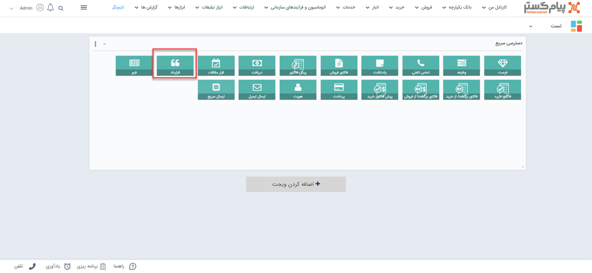
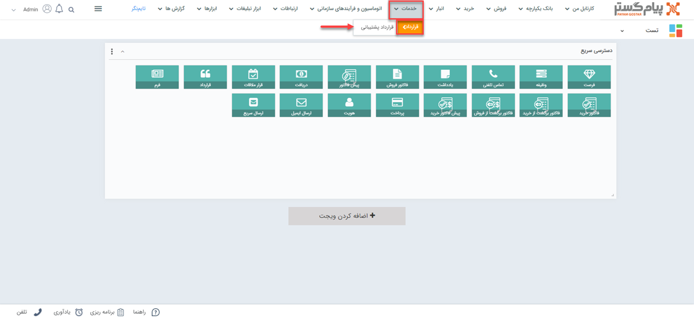
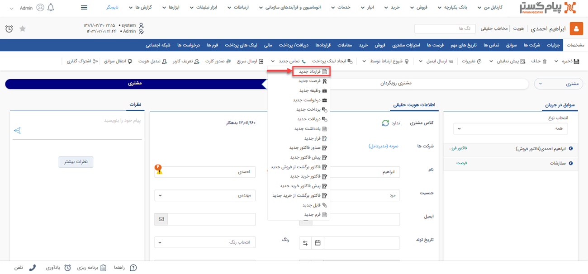
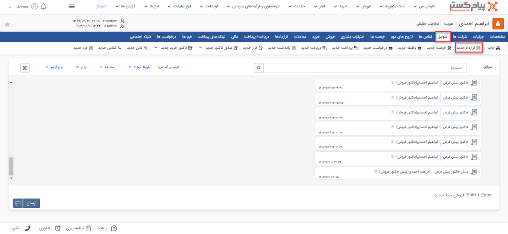
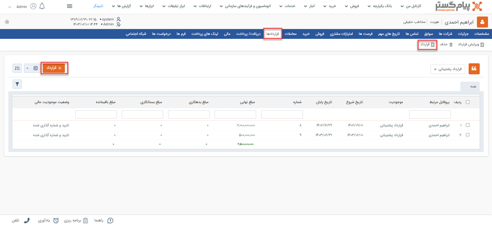
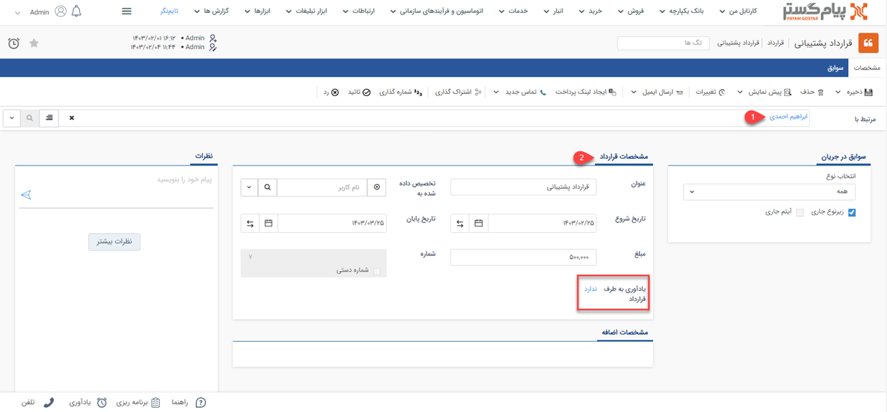

# قرارداد جدید 
چنانچه نیاز به ثبت قرارداد برای مشتری خود دارید می‌توانید از آیتم قرارداد استفاده نمایید. قرارداد در پیام‌گستر شامل اطلاعاتی نظیر عنوان قرارداد، تاریخ شروع و پایان قرارداد و مبلغ قرارداد می باشد.

## مسیر‌های ثبت  قرارداد
شما از طریق مسیرهای زیر می‌توانید برای مشتری خود یک قرارداد جدید ثبت کنید. 
- **ویجت دسترسی سریع** > **قررداد**

- **تب خدمات** > **قرارداد** > **زیرنوع قرارداد** > **افزودن قرارداد**

- **صفحه اصلی پروفایل مخاطب** > **آیتم جدید** > **قرارداد جدید** 
برای مشاهده لیست «آیتم‌های جدید» بر روی فلش کنار «تماس جدید» (قابل مشاهده در نوار سفید بالای صفحه) مراجعه نمایید.

- **صفحه اصلی پروفایل مخاطب** > **تب سوابق** > **قرارداد جدید**

- **صفحه اصلی پروفایل مخاطب** > **تب قراردادها** 

## شیوه‌ی ثبت قرارداد
در صورت داشتن چند قرارداد، به انتخاب صحیح آن توجه داشته باشید. زیرنوع آیتم در قسمت بالای صفحه قابل مشاهده و قابل تغییر می‌باشد. در تصویر زیر، «قرارداد پشتیبانی» برای ثبت نمونه انتخاب شده است. 
برای ثبت قراردادد لازم است فیلدهای مورد نیاز آیتم را با اطلاعات موجود تکمیل و سپس ذخیره نمایید. مشخصات قراردادها در پیام‌گستر به شرح زیر می‌باشد: 

>**نکته** " قرارداد مالی" پس از ایجاد و تایید، مشتری را به میزان مبلغ قرارداد بدهکار می‌کند و این مبلغ در سوابق مشتری لحاظ خواهد شد اما در قراردادهای حقوقی اینگونه نیست.

**1. مرتبط با** 
نام هویتی که این قرارداد برای او ثبت شده را در این قسمت درج کنید. بدین منظور کافیست بخشی از نام هویت مورد نظر را تایپ نمایید تا لیست هویت‌های مشابه آن برای انتخاب به شما نمایش داده شود.

**2. مشخصات** 
در این قسمت می‌بایست مشخصات مرتبط با قرارداد را در این قسمت ثبت نماید.

- **عنوان**: برای قراردادی که می‌خواهید ثبت کنید باید عنوانی را انتخاب کنید. ثبت کردن عنوان برای قراردادها به شما کمک می‌کند در گزارش‌‌ها بتوانید قراردادها را براساس عنوانشان فیلتر کنید.
- **تخصیص‌داده شده به**: در این قسمت می‌توانید کارشناس مرتبط با این قرارداد را تعیین کنید.
- **تاریخ شروع**: برای قرارداد مورد نظر تاریخ شروع تعیین کنید. ثبت تاریخ شروع قرارداد به شما کمک می‌کند بتوانید چند روز قبل از شروع یا پایان قرارداد برای مشتری خود پیام یادآوری ثبت کنید.
- **تاریخ پایان**: برای قرارداد مورد نظر تاریخ پایان تعیین کنید. ثبت تاریخ پایان به شما در یادآوی کردن تاریخ تمدید قرارداد کمک می‌کند.
- **مبلغ**: مبلغ مورد نظر که برای این قرارداد را تعیین کنید. در صورتی که در تنظیم قرارداد گزینه قرارداد مالی را فعال کرده باشید، ارزش مالی این قرارداد در حساب مالی مخاطب تاثیر داده خواهد شد. 
- **شماره**: شماره قرارداد به صورت خودکار نمایش داده می‌شود و در صورت نیاز می‌توانید آن را عوض کنید. توجه داشته باشید برای شماره گذاری دستی قرارداد باید مجوز مربوطه را داشته باشید.
- **یادآوری به طرف قرارداد**:در تاریخ مشخص قبل از تاریخ سررسید می‌توان برای قرارداد یادآوری تنظیم گرد.
