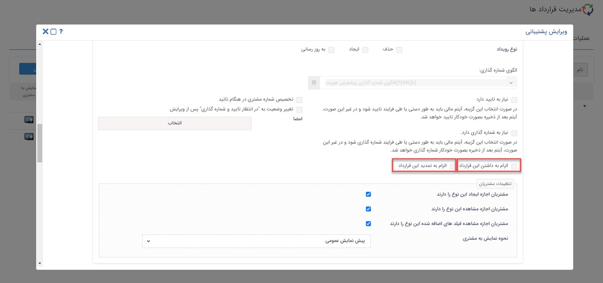

# قرارداد چیست؟
به طور کلی **قرارداد**، توافقی بین خریدار و فروشنده است که طرفین را متعهد به اجرای اصولی می کند. قرارداد در پیام گستر، نوعی تعهد است که به صورت الکترونیکی در اختیار خریدار و فروشنده قرار می گیرد و شامل عنوان، کارشناس مبلغ، تاریخ شروع و پایان قرارداد و ... است. شما براساس نوع کسب و کار خود امکان اضافه کردن و تغییر فیلدها را خواهید داشت.

> **نکته** 
 در  پیام گستر قبل از ایجاد قرارداد جدید باید در قسمت شخصی سازی CRM برای قرارداد خود، زیرنوع مناسب  تعریف کنید. 
>> **مدیریت یادآوری انبوه** برای تمامی موجودیت های موجود در CRM تعریف شده است و به شما در ثبت و یادآوری آیتم های مالی نظیر قرارداد، فاکتور، پیش فاکتور ، دریافت و پرداخت کمک شایانی می کند. به عنوان مثال یکی از مهم ترین قابلیت های این قسمت به این صورت است که شما چند روز قبل از تایید، شروع و پایان قرارداد می توانید برای مشتری خود پیامی در قالب چاپ تعریف و ارسال کنید.  
در تنظیمات شخصی سازی CRM اگر تیک چک باکس "الزام به داشتن این قرارداد" فعال باشد، هنگامی که وارد صفحه مشتری شوید این الزام به صورت نوار رنگی در پروفایل مشتری قابل مشاهده خواهد بود. علاوه براین، اگر چک باکس "الزام به تمدید این قرارداد" فعال باشد، با ورود به پروفایل مشتری نوار رنگی مربوط به زمان تمدید قرارداد قابل مشاهده است.

 
## انواع قرارداد
در پیام گستر قراردادها در دو نوع **حقوقی** و **مالی** ثبت خواهند شد. قرارداد مالی مشتری را به شما بدهکار می کند مانند قرارداد فروش سالیانه در حالی که قرارداد حقوقی برای مشتری جنبه مالی نخواهد داشت مانند قرارداد پشتیبانی ماهیانه.

>**نکته** 
 در شخصی سازی CRM  و زیر نوع مورد نظر برای قرارداد اگر چک باکس آیتم جنبه مالی دارد فعال باشد، قرارداد به عنوان "قرارداد مالی" ثبت خواهد شد و در غیر اینصورت قرارداد از نوع " حقوقی" ثبت خواهد شد.
## گزارشات مرتبط با قرارداد
برای تحلیل و بررسی قرارداد ها  می توانید از گزارشات مرتبط با قراردادها در پیام گستر استفاده کنید. این گزارشات به شرح زیر است:
- مجموع مبلغ قراردادها
- لیست قراردادها
- لیست پیگیری های قرارداد
- تعداد قراردادها به تفکیک کارشناس، وضعیت، ماه و کمپین
- مبلغ قرارداد به تفکیک کارشناس، مشتری و ماه
