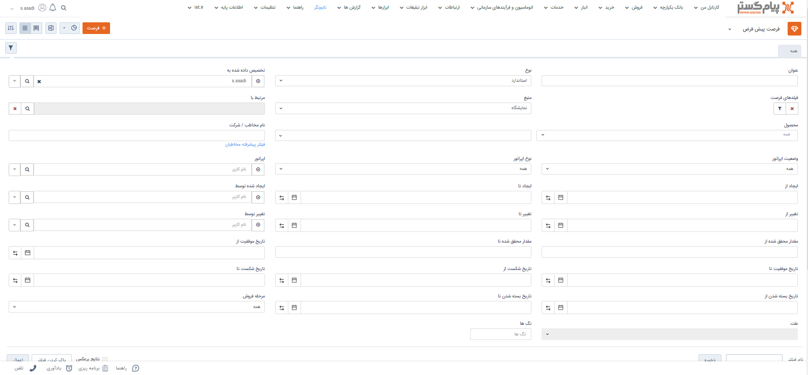

# اطلاعات مشترک آیتم‌ها براساس عملکرد
در پیام‌گستر برای مشاهده لیست آیتم مختلف اعم از فاکتور و پیش‌فاکتور ، دریافت، پرداخت  و ... اطلاعات مشترک برای ثبت آیتم‌های مختلف اطلاعات مشترکی وجود دارد که در این مقاله با این اطلاعات مشترک به منظور فیلترکردن راحت‌تر سوابق بهره‌مند خواهید شد.
برای فیلتر کردن آیتم‌ها براساس عملکرد هر یک از آنها اطلاعات مشترکی برای فیلتر کردن وجود دارد.

اطلاعات مشترک برای فیلتر کردن لیست هنگام نمایش شامل موارد زیر می‌باشد:
عنوان، نوع، تخصیص داده شده به، نام و نوع اپراتور و.... می‌باشد.
- **اطلاعات مشترک بریا آیتم‌های مالی**: در آیتم‌های مالی نظیر فاکتور، پیش‌فاکتور، دریافت و پرداخت و ...علاوه بر موارد بالا فیلدهای مرتبط با مبلغ هم اضافه می‌شوند. فیلدهای مرتبط با آیتم‌های مالی عبارتند از: مقدار محقق شده، مبلغ، تاریخ صدور،شماره‌گذاری، تایید و رد و... .
- **اطلاعات مشترک برای آیتم‌های دریافت و پرداخت**: علاوه بر اطلاعات مشترک، برای دریافت و پرداخت و سایر آیتم‌های مالی ، مبلغ و تایید و شماره‌گذاری قابل مشاهده است.
- **اطلاعات مشترک برای مشاهده آیتم‌هایی که تایید یا رد دارند**: برای فیلتر کردن این آیتم‌ها مواردی نظیر تایید، رد و انقضا قابل مشاهده است.
 - **آیتم‌هایی که شامل محصول هستند** آیتم‌هایی نظیر فرصت مواردی همچون محصول، تاریخ موفقیت و شکست نیز مشهود است.
