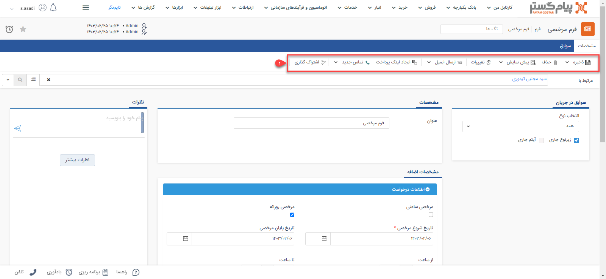

# نکات مشترک در مورد ثبت سوابق

ثبت سوابق مختلف از جمله یادداشت، فایل، انواع فاکتور، قرارداد و سایر موارد در پیام‌گستر، بخش‌های مشترک بسیاری دارند. با آشنایی با این اجزا و کلیدها به راحتی می‌توانید هر نوع سند و سابقه‌ای که نیاز دارید را ثبت کنید. کلیدهای مشترکی که در همه سوابق مشاهده می‌کنید به شرح زیر است:

**۱.نوار ابزار آیتم‌ها**

- **ذخیره/ذخیره و خروج:** با کلیک بر روی دکمه ذخیره تمامی اطلاعات ثبت شده و یا ویرایش‌های اعمال شده در آیتم ثبت می‌شود. با کلیک بر روی فلش کناری می‌توانید از گزینه‌ی ذخیره و خروج استفاده کنید. با انتخاب این کلید، اطلاعات ثبت شده و از آیتم خارج می‌شوید.

- **حذف:** در صورت داشتن مجوز حذف می‌توانید این آیتم را حذف نمایید.

- **پیش نمایش/چاپ:** در صورتی که برای آیتم مورد نظر قالب چاپ تنظیم شده باشد، می‌توانید با کلیک بر روی کلید پیش‌نمایش آن را دانلود کنید. فایل PDF و یا Word قالب چاپ (بنابر تنظیمات انجام گرفته) برای شما دانلود می‌شود. 
چنانچه اتصال شما با چاپگر برقرار باشد، با کلیک بر روی کلید چاپ می‌توانید از آن نسخه کاغذی دریافت نمایید.

- **تغییرات:** لیست تغییرات (ایجاد، ویرایش و مشاهده) انجام شده بر روی این آیتم را نمایش می‌دهد. 
*******

- **ارسال ایمیل/ارسال فکس:** می‌توانید قالب چاپی که برای این آیتم تعیین کرده‌اید را مستقیماً برای هویت مرتبط ایمیل یا فکس کنید. در صورتی که تمایل به ارسال آن از طریق فکس دارید،‌ بر روی فلش کناری کلیک کنید تا گزینه ارسال فکس به شما نمایش داده‌شود.

- **ایجاد لینک پرداخت:** اگر از قابلیت لینک پرداخت در پیام‌گستر استفاده می‌کنید، می‌توانید از طریق این گزینه برای مشتری لینک پرداخت ارسال کنید. نحوه‌ی تنظیم و ارسال لینک پرداخت  در راهنمای [ایجاد لینک پرداخت](https://github.com/1stco/PayamGostarDocs/blob/master/Help/Integrated-bank/Database/Payment-links/Payment-links.md) به صورت کامل توضیح داده شده است. 
توجه داشته باشید که اگر، از صفحه یک آیتم مالی از این کلید استفاده کنید، مبلغ مندرج در آن به صورت خودکار به عنوان مبلغ قابل پرداخت لینک ارسالی در نظر گرفته می‌شود. با این وجود می‌توانید به صورت دستی آن را ویرایش نمایید.

>**نکته** 
> در صورتی که چرخه کاری روی این آیتم فعال باشد قسمت **مشاهده گردش کار** را نیز در این بخش مشاهده می‌کنید. به صورت پیش‌فرض مشاهده گردش کار فقط روی آیتم وظیفه فعال است. 

- **اشتراک‌گذاری:** از طریق این قسمت، قابلیت اشتراک گذاری قالب چاپ (پیش نمایش) آیتم‌ها به صورت لینک امکان پذیر است. 
برای این منظور، با کلیک بر روی اشتراک گذاری در صورتیکه آیتم دارای قالب چاپ باشد، لینک اشتراک گذاری آن قالب ایجاد می¬گردد.
همچنین، امکان مشاهده‌ی قال چاپ( پیش نمایش) آیتم مورد نظر، با فرمت pdf میسر می‌باشد.

>**نکته** 
 در نظر داشته باشید، لینک ایجاد شده در این قسمت مدت انقضا دارد و تا 2 ماه قابل استفاده است و بعد از اتمام مدت انقضا، آن لینک اعتباری ندارد و می‌بایست لینک اشتراک گذاری جدید ایجاد کنید.
لازم به ذکر است، امکان استفاده از پارامتر هوشمند لینک اشتراک گذاری برای استفاده در پیام‌های سیستمی‌و پیش نمایش وجود دارد.

**2. مرتبط با:** دراین بخش نام هویت و همچنین نام آیتمی‌ که این آیتم در سوابق آن ذخیره می‌شود را نشان می‌دهد ( به طور مثال اگر یک سابقه از نوع تماس تلفنی در سوابق آیتم فرصت ثبت کنید در این قسمت نام هویت مرتبط به همراه عنوان فرصت نمایش داده خواهد شد). می‌توانید با کلیک کردن بر روی آیکون حذف، هویت و یا آیتم دیگری را برای ذخیره این سابقه انتخاب کنید. توجه داشته باشید که اگر به هویت مرتبط با این آیتم، رنگ اختصاص داده باشید، این رنگ در این قسمت نشان داده می‌شود.

**3.جستجو،بانک اطلاعاتی**:  از این بخش می‌توانید هویت مورد نظر را بعنوان مرتبط با، از بانک اطلاعاتی انتخاب کنید .

>**نکته** 
 هنگام انتخاب مرتبط با در صورت تایپ نام و یا قسمتی از نام هویت مورد نظر، اگر هویت مورد نظر در لیست هویت‌ها یافت نشد می‌توانید با استفاده از کلید افزودن، هویت جدید ایجاد کنید .

**4. مشاهده و انتخاب سوابق:** اگر هویت انتخاب شده باشد، با استفاده از این آیکون می‌توانید سوابق او را مشاهده کنید یا در صورت نیاز این آیتم را به یک سابقه خاص آن (مثلا فرم را به یک قرارداد) وصل کنید.

**5. اطلاعات تماس**: اگر هویت انتخاب شده باشد از این بخش میتوانید اطلاعات تماس هویت را مشاهده کنید.

>**نکته** 
برای مشاهده اطلاعات تماس هویت مورد نظر، بایستی دارای مجوز مشاهده هویت انتخاب شده باشید در غیر این صورت امکان مشاهده اطلاعات تماس هویت وجود ندارد.
در این قسمت اطلاعات تماس مرتبط با مشتری همچون شماره تلفن پیش‌فرض، شماره موبایل پیش فرض، فکس و آدرس ایمیل، نام مدیر مجموعه و نام رابط نمایش داده می‌شود.
>>**نکته** 
در صورتی که کاربر مجوز مشاهده آیتم هویت را نداشته باشد هیچ یک از اطلاعات تماسی هویت به کاربر نمایش داده نمی‌شود

**6. برنامه‌ریزی و یادآوری:** می‌توانید برای این آیتم پیگیری و یادآور تنظیم نمایید. (برای اطلاعات بیشتر در این خصوص  به[ یادآوری و پیگیری  ](https://github.com/1stco/PayamGostarDocs/blob/master/Help/Integrated-bank/Database/General-specifications/Reminder-and-follow-up/Reminder-and-follow-up.md)مراجعه کنید.)
- **مهم:** در این قسمت می‌توانید آیت ثبت شده مورد نظر را مهم کنید. آیتم‌های مهم در کارتابل به صورت الویت‌بندی دسته‌بندی می‌شوند.

نوع پیش‌فرض هویت در شخصی سازی هر آیتم روی فیلد "هویت مرتبط پیش فرض" به صورت جدا مشخص می‌شود و زمان ایجاد نمایش داده می‌شود.
دسته‌بندی هویت در تنظیمات کلی قسمت دسته‌بندی کاربران تعریف می‌شود. (برای اطلاعات بیشتر به دسته‌بندی کاربران مراجعه کنید.)
هویت ایجاد شده در بانک اطلاعاتی ایجاد شده و به عنوان مرتبط با آیتم ثبت می‌شود.

 

