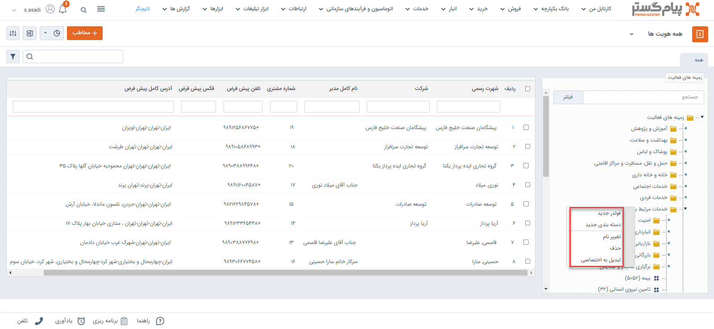
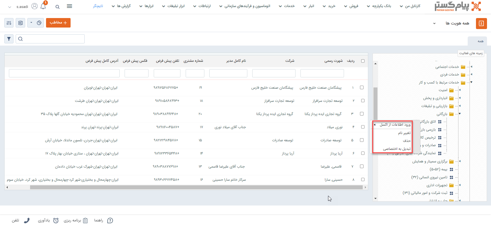
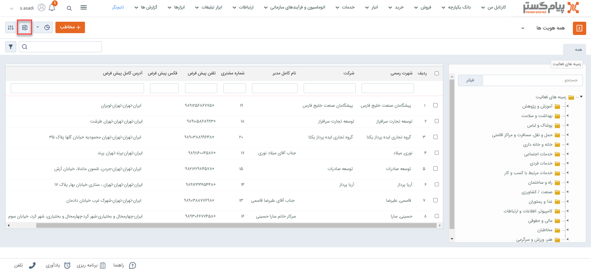
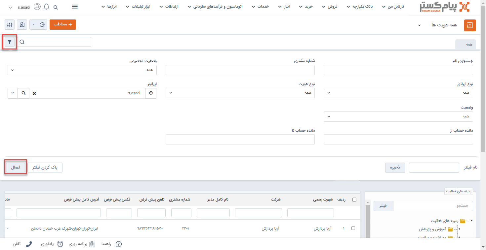

# دسته‌بندی بانک اطلاعاتی
برای ذخیره انواع هویت‌ها در بانک اطلاعاتی می‌توانید از دسته‌بندی‌های مختلفی استفاده کنید. به عبارت دیگر با ایجاد فولدر و دسته‌بندی‌های مناسب، می‌توانید هویت‌های خود را به صورت سازماندهی شده در بانک اطلاعاتی ذخیره کنید. 
از طریق تب «بانک یکپارچه» و گزینه «بانک اطلاعاتی» می‌توانید به این قسمت دسترسی داشته‌باشید. لیست فولدرها و دسته‌بندی‌های ایجاد شده، همراه با تعداد زیر شاخه‌ها و اعضای آن در این بخش قابل مشاهده است. 
بهتر است که دسته‌بندی‌هایی که ایجاد می‌کنید از لحاظ نام‌گذاری و تعداد زیر دسته‌بندی به گونه‌ای باشند که برای کاربران سردرگمی ایجاد نکنند. 
در حالت پیش‌فرض، دسته‌بندی اولیه شامل پنج زیرشاخه مشتری، نماینده، تامین‌کننده، اپراتور و رقیب می‌باشد. شما می‌توانید فولدرهای پیش‌فرض را ویرایش/حذف نمایید و دسته‌بندی مورد نظر خود را ایجاد نمایید. 

> **نکته** 
> چنانچه ماژول فهرست مشاغل اول را خریداری کرده‌باشید، اطلاعات مشاغل ثبت شده در پرتال اول (1st.ir) در ۱۵ فولدر اصلی به شما نمایش داده می‌شود که بیش از ۲۰۰ هزار هویت مختلف از مشاغل سراسر کشور را شامل می‌شود. می‌توانید به عنوان سرنخ از این اطلاعات استفاده نمایید. 

## فولدر و دسته‌بندی در بانک اطلاعاتی
برای ثبت و ذخیره هویت در نرم‌افزار ابتدا فولدرها و دسته‌بندی‌های مورد نظر را در بانک اطلاعاتی ایجاد نمایید. با کلیک راست روی فولدر «زمینه‌ فعالیت» می‌توانید فولدر یا دسته‌بندی جدید ایجاد کنید. برای ایجاد زیرشاخه برای هر فولدر، کافیست روی فولدر مورد نظر راست کلیک کنید و مورد نظر را در آن ایجاد نمایید. 
احتمالاً در این قسمت چنین سوالی در ذهنتان شکل گرفته‌است: چه تفاوتی بین فولدر و دسته‌بندی وجود دارد؟ در چه شرایطی فولدر بسازم و در چه شرایطی دسته‌بندی ایجاد کنم؟ 
دسته‌بندی‌ها در حقیقت محل ذخیره هویت‌ها و آخرین زیرلایه ممکن در بانک اطلاعاتی هستند. در واقع شما نمی‌توانید فولدر یا دسته‌بندی دیگری را داخل (زیرشاخه) یک دسته‌بندی قرار دهید. اما فولدرها لایه‌های بالاتر هستند و می‌توانند چند فولدر و دسته‌بندی را داخل خود داشته‌باشند. 

برای یافتن دسته‌بندی مورد نظر، می‌توانید نام آن را در قسمت جستجوی کادر سمت راست، فیلتر نمایید. با این کار تمام دسته‌بندی‌هایی که عبارت مذکور در نام آن‌ها وجود داشته‌باشد، برای شما نمایش داده‌می‌شود.  
با کلیک بر روی فلش کنار هر فولدر می‌توانید زیر مجموعه‌های آن فولدر (فولدرها و دسته‌بندی‌هایی که داخل آن وجود دارند) را در لیست سمت راست مشاهده کنید.  
با دو بار کلیک (دبل کلیک) کردن روی هر فولدر،‌ شما می‌توانید تمامی هویت‌های موجود در فولدرها و دسته‌بندی‌های مختلفی که در آن فولدر وجود دارد را در جدول سمت چپ مشاهده نمایید. به عبارتی، انتخاب هر فولدر، فولدرها و دسته‌بندی‌های موجود در آن را در جدول به شما نشان نمی‌دهد؛ بلکه هویت‌های داخل آن زیرشاخه‌ها را نمایش می‌دهد. 

### ویرایش دسته‌بندی بانک اطلاعاتی
با Drag & drop می‌توانید به سادگی دسته‌بندی‌ها و فولدرهای خود را در ساختار بانک اطلاعاتی جابجا کنید. با این کار، فولدرها و دسته‌بندی‌ها با هویت‌های داخلشان از فولدری به فولدر دیگر جابجا می‌شوند. توجه داشته باشید که نمی‌توانید یک فولدر را زیرمجموعه یک دسته‌بندی قرار دهید. 
برای ویرایش نام فولدر یا دسته‌بندی‌ها از راست کلیک و گزینه «تغییر نام» استفاده کنید. از همین طریق می‌توانید فولدرها و دسته‌بندی‌های اضافی را حذف نمایید. توجه داشته‌باشید که اگر فولدر یا دسته‌بندی شامل زیر مجموعه باشد (یعنی فولدر دارای فولدر زیرمجموعه، دسته‌بندی یا هویت باشد و یا یک دسته‌بندی که شامل هویت است) ابتدا باید زیرمجموعه‌ها را حذف نمایید. 

> **نکته** 
> در آخرین لایه (دسته‌بندی) می‌توانید هویت‌های خود را ذخیره نمایید. 

## قابلیت‌های تکمیلی بانک اطلاعاتی
چنانچه در بخش بالا به آن پرداخته شد، با راست کلیک بر روی هر فولدر می‌توانید:
- داخل آن فولدر دیگری ایجاد کنید.
- داخل آن یک دسته‌بندی ایجاد کنید.
- نام آن را تغییر دهید.
- آن فولدر را حذف کنید.
- فولدر را اختصاصی کنید.

از سری قابلیت‌های بانک اطلاعاتی دسترسی بهتر و راحت‌تر به هویت‌های ایجاد شده می‌باشد. بدین منظور **دریافت لیست هویت‌ها از اکسل** و **فیلتر کردن هویت‌ها** از ویژگی‌های مهم بانک اطلاعاتی به شمار می‌رود.
-  **دریافت لیست هویت‌ها از اکسل** 
برای دریافت لیست هویت‌های ثبت شده به صورت یکجا می‌توانید از قابلیت گرفتن خروجی از اکسل اقدام نمایید.

- **فیلتر کردن هویت‌ها** 
براساس نیاز می‌توانید هویت‌ها را در بانک اطلاعاتی فیلتر کنید. از طریق این بخش می‌توان  با فیلتر براساس نوع هویت، هویت‌ها با نوع مورد نظر را در بانک اطلاعاتی جستجو کرد.این دسته‌بندی می‌تواند براساس شماره مشتری، اپراتور ثبت کننده، مانده حساب و ... صورت گیرد.

ثبت هویت در بانک اطلاعاتی از طریق مسیر زیر امکان‌پذیر می‌باشد: 
**۱. بانک‌ یکپارچه > بانک اطلاعاتی > راست کلیک روی دسته‌بندی**  
برای ثبت هویت جدید در بانک اطلاعاتی ابتدا روی زمینه فعالیت موردنظر کلیک کنید و با راست کلیک روی دسته بندی مشخص می‌توانید چندین هویت را از طریق اکسل و به صورت یکجا در دو قالب حقیق و حقوقی وارد کنید.