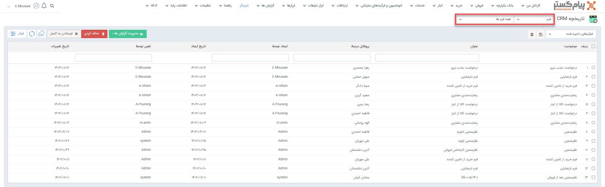

# مشاهده لیست همه فرم‌ها

 برای مشاهده لیست همه فرم‌های ثبت شده می‌توانید از دو مسیر زیر اقدام نمایید: 
- از طریق **تب اتوماسیون و فرآیندهای سازمانی** > **فرم‌ها**، تمامی فرم‌های ثبت شده قابل مشاهده هستند. با انتخاب یکی از زیرنوع‌های فرم، وارد صفحه فرم‌ها می‌شوید. در این حالت، تمامی فرم‌های ثبت شده از زیر نوع انتخابی به شما نمایش داده می‌شود. در این قسمت می‌توانید با اعمال فیلتر روی فرم‌ها را براساس نوع‌ فرم فیلتر کنید.

- از مسیر **تب بانک یکپارچه** > **تاریخچه CRM**  می‌توانید با اعمال فیلتر «نوع» بر روی فرم و انتخاب زیرنوع مورد نظر/همه در فیلتر کناری، تمامی فرم‌های ثبت شده را مشاهده نمایید.

> **نکته** 
هر کاربر در این لیست فرم‌های ثبت شده توسط خود را مشاهده می‌کند و اگر مجوز مشاهده لیست فرم‌ها را داشته‌باشد می‌تواند فرم‌های ثبت شده توسط سایر کاربران را نیز مشاهده کند .
