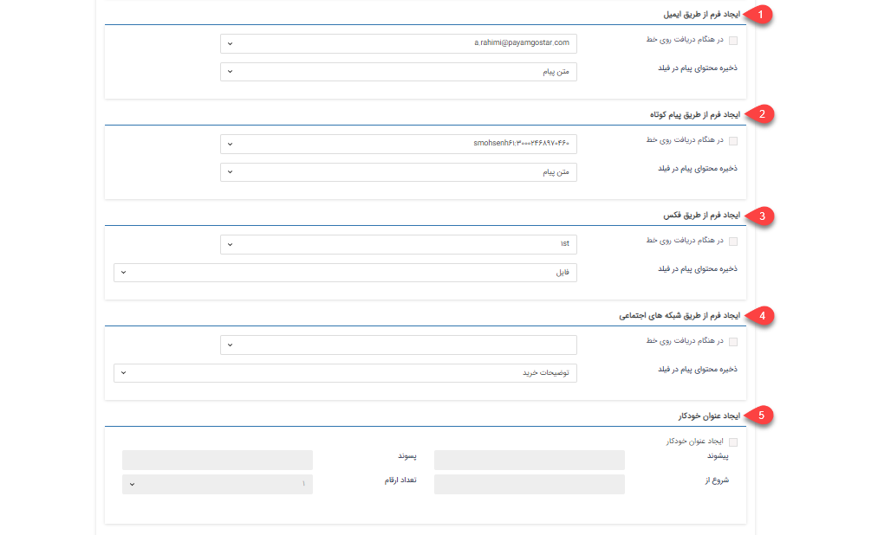

# تنظیمات ایجاد فرم از طریق ابزارهای ارتباطی

در شخصی سازی هر نوع فرم با فعال کردن چک باکس "ایجاد فرم از طریق ایمیل / پیام‌کوتاه / فکس" و تعیین خط دریافتی برای آن‌ها با دریافت هر ایمیل، فکس و یا پیام کوتاه بر روی خط مورد نظر،  فرم مربوطه در پروفایل شخص ارسال کننده‌ی پیام ایجاد می‌گردد. 
همچنین در این بخش باید فیلدی برای ذخیره محتوای ایمیل، فکس و یا پیام کوتاه ارسال شده انتخاب گردد: 

**1. ایجاد فرم از طریق ایمیل**: برای ایجاد فرم از طریق ایمیل ابتدا باید یک آدرس ایمیل تعریف کنید و
برای ذخیره محتوای ایمیل در یک فیلد، نوع فیلد باید Html یا فیلد متنی انتخاب شود. 
**2. ایجاد فرم از طریق پیام‌کوتاه**: برای ایجاد فرم خودکار از طریق پیام‌کوتاه ابتدا یک خط برای دریافت پیامک‌ها باید تعریف کنید و برای ذخیره محتوای پیام کوتاه در یک فیلد، نوع فیلد باید متن انتخاب شود. 
**3. ایجاد فرم از طریق فکس**: چنانچه بخواهید فرم به صورت خودکار از طریق فکس ایجاد شود باید ابتدا خط تلفن تعریف‌شده در تنظیمات کلی انتخاب کنید و برای ذخیره محتوای فکس در یک فیلد، نوع فیلد باید فایل یا تصویر انتخاب شود. 
**4. ایجاد فرم از طریق شبکه‌های اجتماعی**: برای ذخیره محتوای شبکه‌های اجتماعی در یک فیلد، نوع فیلد باید متن انتخاب شود. 
**5. ایجاد عنوان خودکار**: عنوان خودکار به شما کمک می‌کنید برای ذخیره فرم‌هایی از این زیرنوع مشخص پیشوندها و پسوندهایی تعریف کنید .در صورت نیاز برای ایجاد شدن عنوان خودکار بعد از ذخیره فرم، چک باکس را فعال کرده و اطلاعات مورد نظر را وارد کنید.  

> **نکته** 
در صورتی که مشخصات ارسال کننده مانند شماره فکس، ایمیل و یا موبایل آن در پروفایل ثبت نشده باشد، هیچ فرمی فعال نخواهد شد و تنها از طریق لیست‌های فرم قابل پیگیری خواهد بود. اما در صورتی که ماژول مخاطبان ناشناس را تهیه نموده باشید و از قسمت تنظیمات > تنظیمات کلی > مخاطبان ناشناس آن را فعال نموده باشید (برای اطلاعات بیشتر به لینک مخاطبان ناشناس  مراجعه نمایید). دریافت‌های ایمیل، فکس و پیام کوتاه که از شماره ناشناس صورت گرفته شده باشد به صورت یک مخاطب، در دسته بندی مشخص شده در تنظیمات [مخاطبان ناشناس](https://github.com/1stco/PayamGostarDocs/blob/master/Help/Settings/General-settings/Anonymous-audience/Anonymous-audience.md) ثبت می‌شوند و فرمی در سابقه آن مخاطب ایجاد می‌گردد.

