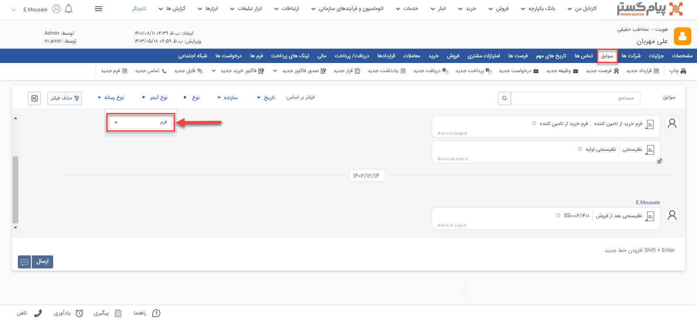

# مشاهده لیست فرم‌های ثبت‌شده برای یک هویت

برای مشاهده لیست فرم‌های صادر شده برای یک هویت خاص می‌توانید از طریق روش‌های زیر اقدام نمایید.

- از طریق صفحه **پروفایل مخاطب** > **تب فرم‌ها** می‌توانید به فرم‌های ثبت‌شده برای یک مشتری دسترسی داشته‌باشید. بدین منظور با استفاده از ویجت جستجوی سریع، وارد صفحه پروفایل هویت مورد نظر شوید. در صفحه اصلی پروفایل هویت از قسمت «فرم‌ها» می‌توانید تمامی فرم‌های مخاطب را مشاهده نمایید.  
توجه داشته‌باشید که در این صفحه همه‌ی انواع فرم‌ها (زیرنوع فرم‌هایی که در شخصی‌سازیCRM ایجاد کرده‌اید) به شما نمایش داده‌می‌شود. برای اینکه فقط فرم‌های  با عنوان «فرم نظرسنجی» را مشاهده نمایید، با استفاده از فیلتر بالای صفحه، در قسمت عنوان، «فرم نظرسنجی» را انتخاب نمایید.   

- از طریق صفحه **پروفایل مخاطب** > **تب سوابق** نیز می‌توانید به فرم‌های ثبت شده برای مخاطب دسترسی داشته‌باشید. بدین منظور با استفاده از ویجت جستجوی سریع، وارد صفحه پروفایل هویت مورد نظر شوید. در صفحه اصلی پروفایل هویت، در تب سوابق، گزینه «فرم» را در لیست «نوع آیتم» انتخاب نمایید تا فرم‌های ثبت‌شده در سوابق هویت مورد نظر را مشاهده کنید. 

- از طریق **تب اتوماسیون و فرآیندهای سازمانی** > **فرم‌ها**  به صفحه لیست فرم‌ها رفته و در صورت نیاز زیرنوع فرم‌ها را به «همه فرم‌ها» تغییر دهید (از فلش کنار کادر قرمز بالا استفاده کنید). با استفاده از جستجوی «پروفایل مرتبط» فرم‌های ثبت شده برای هویت مورد نظر را جدا کنید. بدین منظور کافیست نام هویت را در  قسمت مربوطه نوشته و Enter کنید. 
 

- از طریق **تب بانک یکپارچه** > **تاریخچه CRM** با اعمال فیلتر(کادر قرمز بالا)،  فرم‌ها را یافته  و با استفاده از جستجوی «پروفایل مرتبط» (کادر قرمز پایین) فرم‌های متبط با هویت مورد نظر را جدا کنید. بدین منظور کافیست نام هویت را در قسمت مربوطه نوشته و Enter کنید. 

> **نکته** 
> برای مشاهده فرم‌ها در سابقه یک هویت باید مجوز مشاهده سوابق را بر روی آن زیرنوع هویت و همچنین مشاهده آیتم را در زیرنوع‌های فرم داشته‌باشید.  

