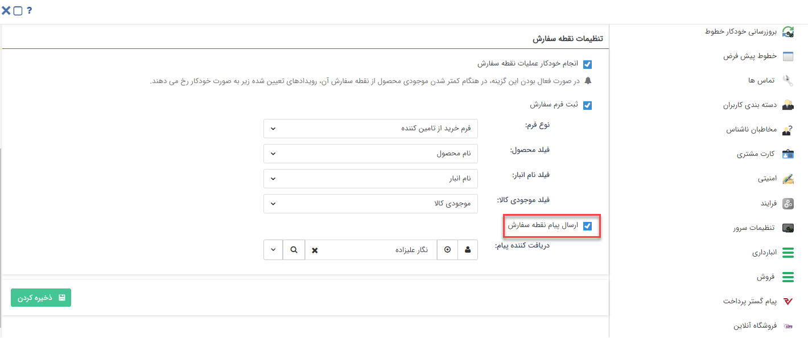

# تنظیمات ایجاد فرم‌های سیستمی

علاوه‌بر روش‌های ارتباطی‌ می‌توانید از روش‌های دیگری برای ایجاد فرم‌‌ها به صورت خودکار استفاده کنید که به شرح زیر می‌باشد:

## ایجاد فرم خودکار به کمک نقطه سفارش
با تعیین نقطه سفارش برای محصولات، می‌توانید تنظیماتی را اعمال کنید که در صورت رسیدن به نقطه سفارش به صورت خودکار برای محصول یک فرم در نرم‌افزار ایجاد شود. این فرم به منظور سفارش‌گذاری و تامین موجودی ایجاد می‌گردد و در هر دو انبار تعدادی و سریالی قابل استفاده می‌باشد. برای فعال کردن این بخش می‌نوانید از مسیر  **تنظیمات کلی** > **انبارداری** > **تنظیمات نقطه سفارش** اقدام به فعال‌کردن این فرم خودکار نمایید.(برای مطالعه بیشتر به بخش [مدیریت نقطه سفارش](https://github.com/1stco/PayamGostarDocs/blob/master/Help/Settings/sefaresh/sefaresh.md) مراجعه کنید.)

> **نکته** 
> تفاوت نقطه سفارش در انبارداری تعدادی و سریالی به این صورت است که چنانچه انبارداری تعدادی فعال باشد می‌بایست برای هر یک از محصولات در بخش مدیریت محصولات **نقطه سفارش** تعیین کنید و اگر انبارداری سریالی فعال باشد برای ایجاد نقطه سفارش باید از طریق **تنظیمات** >**مدیریت انبارها**> **مدیریت محصولات انبار** اقدام نمایید. 

## ایجاد فرم خودکار به کمک یادآوری تماس
در یادآوری تماس‌ها با فعال‌کردن تنظیمات مربوط به آیتم‌های‌ CRM می‌توانید برای درصدی از تماس‌هایی که انتخاب کرده‌اید یک فرم ایجاد نمایید. با انتخاب این گزینه مشخص می‌کنید که برای درصدی از تماس های انتخابی یک فرم از فرم‌های نرم‌افزار ایجاد شود. (برای مطالعه بیشتر به بخش [مدیریت رویداد تماس ](https://github.com/1stco/PayamGostarDocs/blob/master/Help/Basic-Information/Telephone-systems/Call-reminder-settings/CallReminderSetting_2.8.5.md)مراجعه کنید.)
