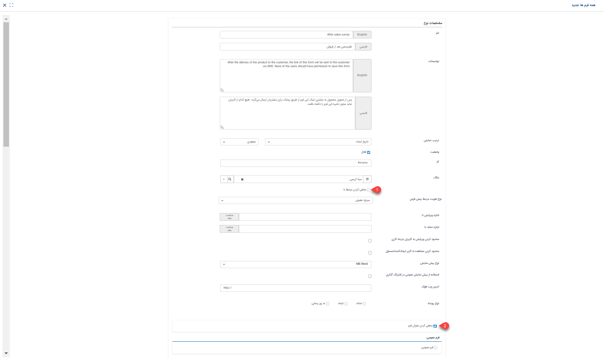

# شخصی سازی فرم‌ها

 فرم‌ها یک قالب خام در نرم‌افزار هستند که در صفحه شخصی‌سازی می‌توانید فرم جدیدی را تنظیم یا ویرایش کنید. در نرم‌افزار پیام‌گستر می‌توانید تمامی فرم‌های سازمان مانند مرخصی، رضایت‌سنجی، ثبت سفارش و ... را در نرم‌افزار پیاده‌سازی کنید 
در صفحه شخصی‌سازی فرم‌ها می‌توانید فرم جدیدی را تنظیم و فرم‌های ساخته شده را ویرایش نمایید. 
 
 لطفا ابتدا قسمت[ اطلاعات کلی ](https://github.com/1stco/PayamGostarDocs/blob/master/Help/Settings/Personalization-crm/Overview/General-information/General-information.md) را در این خصوص مطالعه فرمایید.

## فرم جدید

برای ایجاد فرم جدید از مسیر **شخصی‌سازی CRM** > **فرم**  می‌توانید زیرنوع موردنظر فرم را ایجاد کنید. با ایجاد یک فرم جدید علاوه بر[ تنظیمات مشترک آیتم‌های سیستم  ](https://github.com/1stco/PayamGostarDocs/blob/master/Help/Settings/Personalization-crm/CustomizationCommonSettings/ItemsCommonCustomizationSettings_2.7.5.3.md)می‌توانید تنظیماتی اعمال کنید.  
برای ایجاد زیرنوع جدید از فرم می‌بایست اطلاعات زیر را تکمیل کنید:

علاوه‌بر موارد بالا که در شخصی‌های آیتم‌های سیستم بررسی کردید می‌بایست تنظیمات شخصی‌سازی شده مرتبط با فرم را نیز درنظر بگیرید که عبارتند از: 
**1. مخفی کردن مرتبط با:** در صورت فعال‌کردن چک باکس مرتبط با مخفی می‌شود. 
**2. مخفی کردن عنوان فرم:** در صورت فعال‌کردن چک باکس عنوان فرم مخفی می‌شود. 
همچنین می‌توانید تنظیماتی اعمال کنید که این فرم توسط مخاطبان شما ثبت شود، ثبت فرم توسط مخاطبان می‌تواند از طریق [فرم‌عمومی ](https://github.com/1stco/PayamGostarDocs/blob/master/Help/Settings/Personalization-crm/Form-management/General-form.md)یا [دریافت پیام از طریق رسانه‌های مختلف (پیام کوتاه، ایمیل و فکس) ](https://github.com/1stco/PayamGostarDocs/blob/master/Help/Settings/Personalization-crm/Form-management/Create-forms-through-incoming-message.md)باشد.

